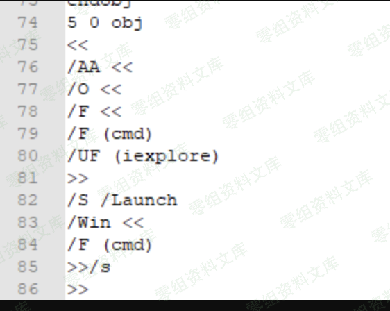
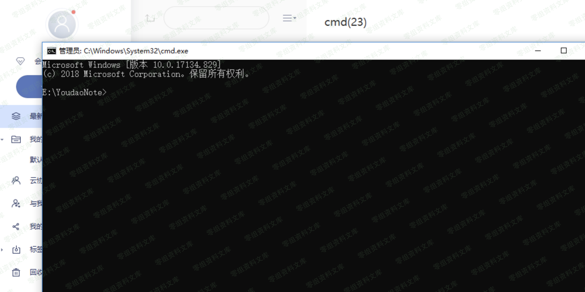
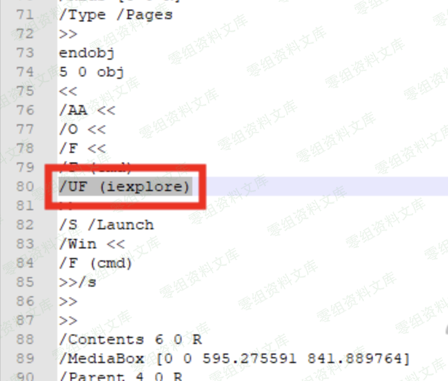

# 有道云笔记_印象笔记 windows客户端代码执行&本地文件读取

<!-- vulwiki-editorial-rebuild:system-misc -->
## 条目范围与校订

- 本文对象：有道云笔记与印象笔记Windows客户端
- 文献类型：仅截图的PDF客户端案例
- 版本、权限及部署边界：上传/处理含特定PDF文件说明符的文件；客户端及嵌入PDF组件版本未知
- 核验状态：仅重建文本校订；未执行文中代码、PoC 或扫描，未把截图或转载声明记为本站复现

### 具体结论与待核项

以下为原归档的逐项勘误与证据缺口；可由文本确定的问题已在下文订正，仍缺来源的事实保持待核。

1. 简介与影响章节空白，两个产品未分别给测试版本和行为，不能确认两者同根因
2. 标题包含本地文件读取但正文只有iexplore/cmd启动说法，无读取链或结果
3. PDF内容全在截图、无附件/哈希，UF说明符本身不足以解释执行，需要完整Action/查看器策略与用户交互
4. 原作者明确不说技术细节，不能据关键词补成可复现PoC；T00ls原文链接保留

### 操作风险

原文技术操作的实际副作用未复现核验；按其请求/代码评估状态变更、凭据暴露和业务影响

技术请求、代码与实验方法按原文保留；其中的破坏性动作仅限授权、可恢复的隔离环境。缺失代码、参数或版本事实不猜补。

### 来源追溯

- 原文参考链接（未重新核验）：<https://www.t00ls.net/thread-54303-1-1.html>
- 原始披露 URL 未确认；既有归档来源标签保留，不能替代原始公告

### 归档技术正文

一、漏洞简介
------------

二、漏洞影响
------------

三、复现过程
------------

构造一个pdf，UF处是执行的地方，输入iexplore表示打开ie

在客户端上传就会触发：

打开cmd

用到的pdf：

改/UF (iexplore)即可：

/F（cmd）不用理会，这个是我测试的时候乱插的

具体技术详情不说了，感兴趣的搜索关键字"pdf漏洞""pdf脚本执行"

四、参考链接
------------

> <https://www.t00ls.net/thread-54303-1-1.html>
