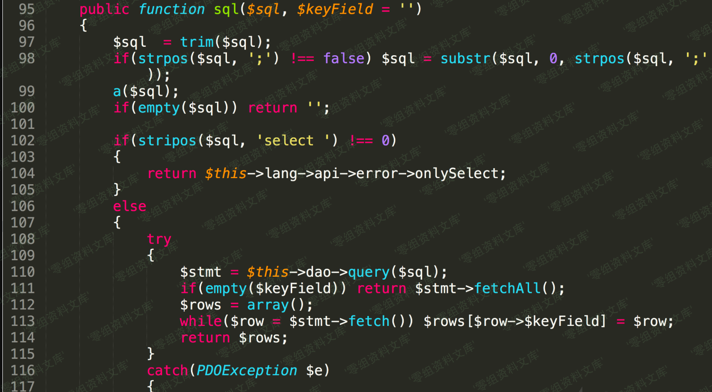
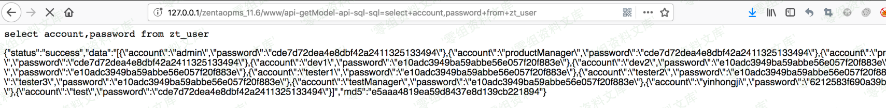

禅道 11.6 sql注入漏洞
=====================

一、漏洞简介
------------

禅道项目管理软件是一款国产的，基于LGPL协议，开源免费的项目管理软件，它集产品管理、项目管理、测试管理于一体，同时还包含了事务管理、组织管理等诸多功能，是中小型企业项目管理的首选，基于自主的PHP开发框架──ZenTaoPHP而成，第三方开发者或企业可非常方便的开发插件或者进行定制。
厂商官网：<https://www.zentao.net/>
而此次发现的漏洞正是ZenTaoPHP框架中的通用代码所造成的的，因此禅道几乎所有的项目都受此漏洞影响

二、漏洞影响
------------

禅道 11.6

禅道开源版 9版本

三、复现过程
------------

禅道的注入在9版本当时也出现过，原理是limit后的参数采用了直接拼接，但是现在这个版本的禅道对所有的sql语句都做了转义处理，并且get参数都有严格的限制，不能出现\"()\"等特殊符号，所以说要想要通过get去注入获得数据，会显得非常困难，另外要提到的一点就是禅道很多参数都会有base64的解码，这其实也是一个比较不错的突破口，但是这里发现了一个更明显的sql注入漏洞。
漏洞代码位于module/api/model.php文件的sql函数

这里其实是由很多限制的，比如说只能用select语句，并且其中可能还不能出现"()"这样的符号，因此这里只能采用最古老的的select语句去读数据库信息，虽然简单但是十分有效。
漏洞url:

    http://www.0-sec.org/zentaopms_11.6/www/api-getModel-user-getRealNameAndEmails-users=admin

    http://www.0-sec.org/zentaopms_11.6/www/api-getModel-api-sql-sql=select+account,password+from+zt_user

这里简单说下禅道目前最新版所采用的pathinfo模式，首先通过传参确定进入的control文件为api，对应的method为getModel，接着开始对参数进行赋值，其中moduleName为api，methodName=sql，最后的param为sql=select+account,password+from+zt\_user，那么调用了call\_user\_func\_array函数后，会进入到api目录下的model文件，对应调用其中的sql函数，并通过赋值，将sql变量赋值为select+account,password+from+zt\_user，最后执行query语句
