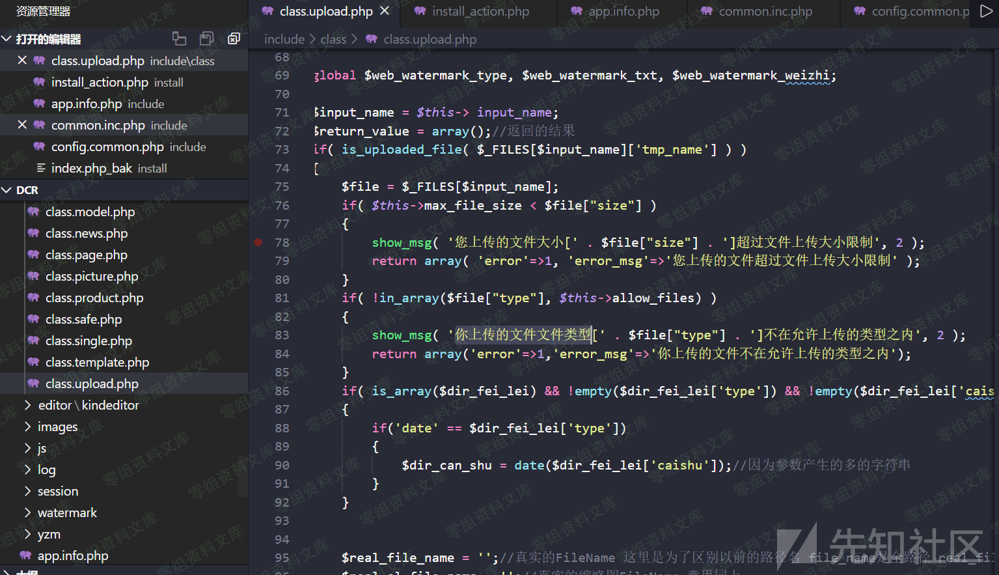
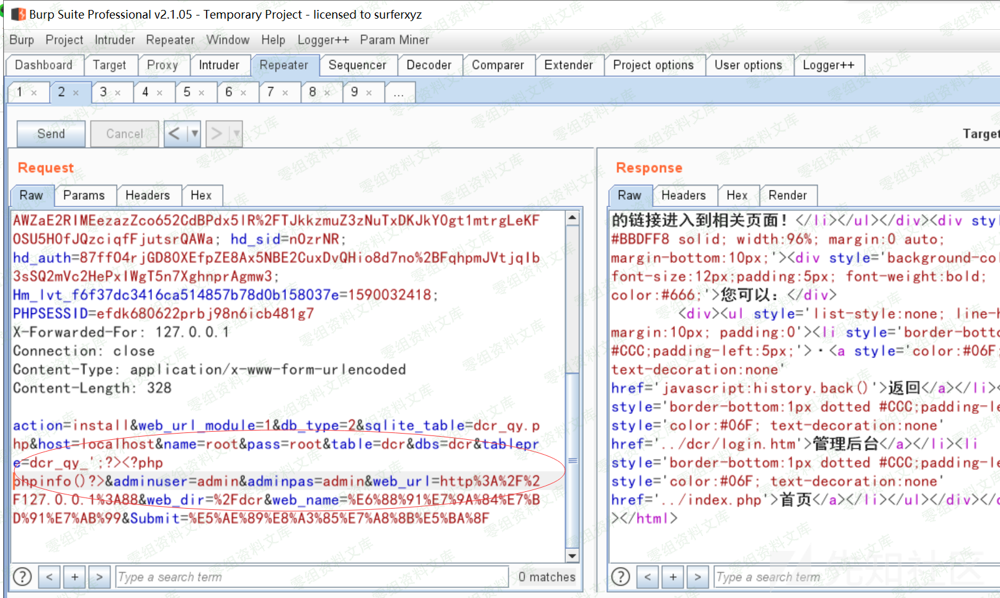
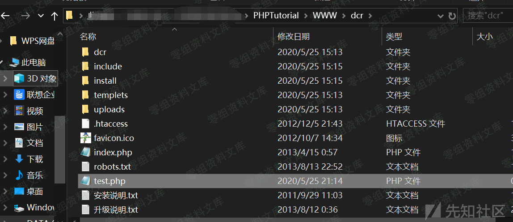

稻草人cms 1.1.5 后台任意文件上传导致getshell
============================================

一、漏洞简介
------------

二、漏洞影响
------------

稻草人cms 1.1.5

三、复现过程
------------

首先进去后台，我们黑盒测试一下上传点，这里很多图片上传点我们随便找一个上传php文件这个好像是只对**Content-Type:** 做了判断，我们来验证一下

这里回显正常而且前端直接暴露了我们上传的地址，直接上蚁剑连接：成功getshell。事实上后台所有能上传图片的地方都是通过这种方式验证，导致我们可以在多处getshell。我们看一下代码include/class/class.upload.php这里仅仅对文件类型通过allow\_files
这个数组中的白名单检测，导致我们可以轻松绕过\--

参考链接
--------

> https://xz.aliyun.com/t/7904\#toc-1
