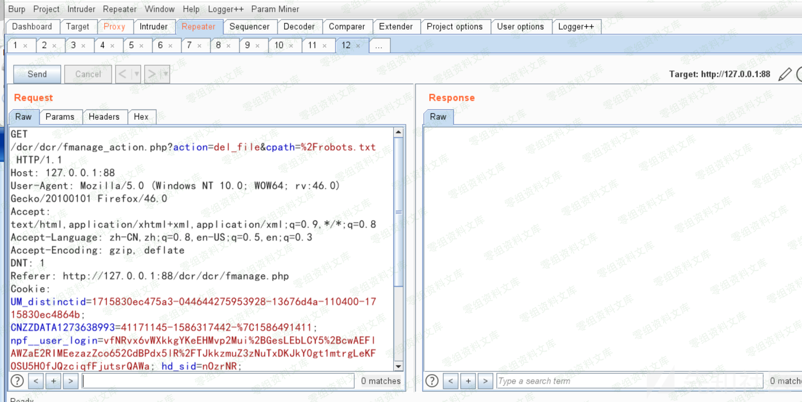

稻草人cms 1.1.5 后台任意文件删除
================================

一、漏洞简介
------------

二、漏洞影响
------------

稻草人cms 1.1.5

三、复现过程
------------

关于后台功能点任意文件删除这个严格来讲我认为不算漏洞，后台管理员赋予你的高权限使得你这里可以达到任意文件删除。。网上有的师傅认为后台文件任意文件删除是漏洞，这里拿出来写一下吧233

先创建一个文件测试

我们将当前目录下的robots.php修改成test.php试试

删除文件成功。

我们来看代码

这里cpath变量可控，当?action=del\_file时导致我们达成任意文件删除

参考链接
--------

> https://xz.aliyun.com/t/7904\#toc-1
