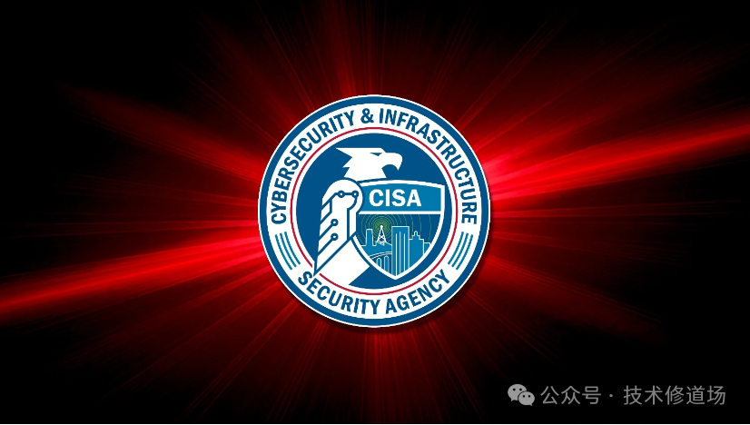

#  Array Networks SSL VPN 产品曝严重漏洞，已被黑客利用   

<!-- article-review:devices:begin -->
## 技术校订与证据边界（2026-10-02）

- 产品/组件：Array Networks AG/vxAG ArrayOS SSL VPN
- 本文讨论：CVE-2023-28461
- 版本、权限与配置前提：正文称9.4.0.481及以前、无认证；9.4.0.484修复
- 资料类型：新闻通告；本次仅核对归档正文，未执行 PoC、未请求目标，未把原作者的“复现成功”继承为本库验证结果

### 逐项校订

- CISA在野利用、修复版本及12月16日期限未附官方链接，日期依赖2024年新闻上下文
- 来源页尾称原文见文首但文首没有原文URL

### 操作风险与恢复

- 本篇未提供足以确认无副作用的完整验证流程；应依正文所述配置、权限与交互前提评估，不能把通告或截图当成可直接运行的检测脚本

### 待核与来源

- 官方版本边界、KEV时间及远程代码执行前提待核验
- 引用图片未查看，截图内容及有效性待核验
- 文内原始链接和图片引用继续保留；未检查图片像素、未下载或执行外部附件。版本边界、修复/在野状态及厂商归属若缺一手依据，均不能视为本次已确认
- 下方保留原技术正文与载荷；其中历史时间表述和成功主张应按本节限定阅读
<!-- article-review:devices:end -->

原创 技术修道场  技术修道场   2024-12-09 00:39  
  
美国网络安全和基础设施安全局 (CISA) 警告称，黑客正在积极利用 Array Networks AG 和 vxAG ArrayOS SSL VPN 产品中的一个远程代码执行漏洞。  
  
  
  
图片来源于网络  
  
**漏洞细节**  
  
该漏洞编号为 CVE-2023-28461，CVSS 严重性评分为 9.8，已被列入 CISA 的“已知被利用漏洞”（KEV）目录。  
  
该漏洞可通过易受攻击的 URL 进行利用，是一个身份验证不当问题，允许在 Array AG 系列和 vxAG 9.4.0.481 及更早版本中执行远程代码。  
  
Array Networks 在一份安全公告中表示：“（CVE-2023-28461）是一个 Web 安全漏洞，允许攻击者在无需身份验证的情况下，使用 HTTP 标头中的 flags 属性浏览文件系统或在 SSL VPN 网关上执行远程代码。”  
  
该漏洞于去年 3 月 9 日披露，Array Networks 大约一周后发布了 Array AG 9.4.0.484 版本修复了该漏洞。  
  
**受影响产品和用户**  
  
Array Networks AG 系列（硬件设备）和 vxAG 系列（虚拟设备）是 SSL VPN 产品，可提供对企业网络、企业应用程序和云服务的安全远程和移动访问。  
  
据该供应商称，全球超过 5,000 家客户使用这些产品，包括企业、服务提供商和政府机构。  
  
**CISA 的建议**  
  
CISA 没有提供有关谁在利用该漏洞以及目标组织的任何详细信息，但“根据活跃利用的证据”将其添加到了 KEV 目录中。  
  
该机构建议所有联邦机构和关键基础设施组织在 12 月 16 日之前应用安全更新和可用的缓解措施，或者停止使用该产品。  
  
**修复和缓解措施**  
  
受影响产品的安全更新可通过 Array 支持门户获得。如果无法立即安装更新，该供应商还在安全公告中提供了一组用于缓解该漏洞的命令。  
  
但是，组织应首先测试这些命令的效果，因为它们可能会对客户端安全功能、VPN 客户端自动升级功能以及门户用户资源功能产生负面影响。  
  

---

> 来源：gelusus/wxvl（微信公众号漏洞文章自动归档，原文见文首链接）
