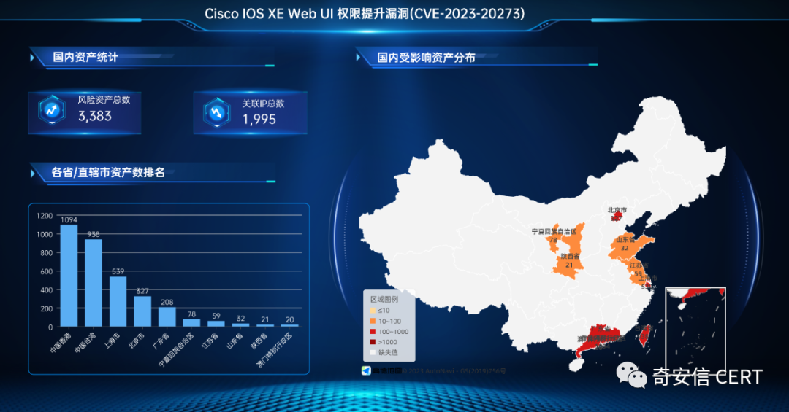

#  Cisco IOS XE Web UI 命令执行漏洞(CVE-2023-20273)安全风险通告   

<!-- article-review:devices:begin -->
## 技术校订与证据边界（2026-10-02）

- 产品/组件：Cisco IOS XE Web UI
- 本文讨论：CVE-2023-20273 / QVD-2023-30546
- 版本、权限与配置前提：已具管理员权限且HTTP(S) Web UI启用；active-session-modules none可阻断对应协议
- 资料类型：历史风险通告；本次仅核对归档正文，未执行 PoC、未请求目标，未把原作者的“复现成功”继承为本库验证结果

### 逐项校订

- 2023-10-21的暂无修复、POC未公开与影响版本暂无应标历史状态
- 检测段把启用HTTP服务直接等同受影响，缺版本/补丁核验
- 关闭命令用斜杠拼接，易被误当单条CLI命令
- HTML样式、广告和空箭头污染；风险资产计数不能等同确认漏洞数

### 操作风险与恢复

- 本篇未提供足以确认无副作用的完整验证流程；应依正文所述配置、权限与交互前提评估，不能把通告或截图当成可直接运行的检测脚本

### 待核与来源

- 现行版本修复矩阵未核验；IOC需保留观测时间
- 引用图片未查看，截图内容及有效性待核验
- 文内原始链接和图片引用继续保留；未检查图片像素、未下载或执行外部附件。版本边界、修复/在野状态及厂商归属若缺一手依据，均不能视为本次已确认
- 下方保留原技术正文与载荷；其中历史时间表述和成功主张应按本节限定阅读
<!-- article-review:devices:end -->

 奇安信 CERT   2023-10-21 14:05  
  
●   
点击↑蓝字关注我们，获取更多安全风险通告  
  
  
<table><tbody><tr><td valign="middle" align="center" rowspan="1" colspan="4" style="background-color: #4676d9;border-color: #4676d9;">
<strong>漏洞概述</strong> 
</td></tr><tr><td valign="middle" align="left" style="border-color: #4676d9;">
<strong>漏洞名称</strong>
</td><td valign="middle" align="left" rowspan="1" colspan="3" style="border-color: #4676d9;">
Cisco IOS XE Web UI 命令执行漏洞
</td></tr><tr><td valign="middle" align="left" rowspan="1" colspan="1" style="border-color: #4676d9;">
<strong>漏洞编号</strong>
</td><td valign="middle" align="left" rowspan="1" colspan="3" style="border-color: #4676d9;">
QVD-2023-30546、CVE-2023-20273
</td></tr><tr><td valign="middle" align="left" colspan="1" rowspan="1" style="border-color: #4676d9;">
<strong><strong style="max-inline-size: 100%;margin: 0px;padding: 0px;box-sizing: border-box !important;overflow-wrap: break-word !important;outline: none 0px !important;cursor: text;color: #000000;font-size: 13px;text-align: -webkit-left;caret-color: #ff0000;text-decoration-thickness: initial;font-family: 微软雅黑, &#34;Microsoft YaHei&#34;, sans-serif;">公开时间</strong></strong>
</td><td valign="middle" align="left" colspan="1" rowspan="1" style="border-color: #4676d9;">
2023-10-21
</td><td valign="middle" align="left" colspan="1" rowspan="1" style="border-color: #4676d9;">
<strong><strong style="max-inline-size: 100%;margin: 0px;padding: 0px;box-sizing: border-box !important;overflow-wrap: break-word !important;outline: none 0px !important;cursor: text;color: #000000;font-size: 13px;text-align: -webkit-left;caret-color: #ff0000;text-decoration-thickness: initial;font-family: 微软雅黑, &#34;Microsoft YaHei&#34;, sans-serif;">影响对象数量级</strong></strong>
</td><td valign="middle" align="left" colspan="1" rowspan="1" style="border-color: #4676d9;">
十万级
</td></tr><tr><td valign="middle" align="left" style="border-color: #4676d9;">
<strong style="max-inline-size: 100%;margin: 0px;padding: 0px;box-sizing: border-box !important;overflow-wrap: break-word !important;outline: none 0px !important;cursor: text;color: #000000;font-size: 17px;text-align: -webkit-left;caret-color: #ff0000;text-decoration-thickness: initial;font-family: 微软雅黑, &#34;Microsoft YaHei&#34;, sans-serif;">奇安信评级</strong>
</td><td valign="middle" align="left" style="border-color: #4676d9;">
<strong style="max-inline-size: 100%;margin: 0px;padding: 0px;box-sizing: border-box !important;overflow-wrap: break-word !important;outline: none 0px !important;cursor: text;color: #ff0000;font-size: 17px;text-align: -webkit-left;caret-color: #ff0000;text-decoration-thickness: initial;font-family: 微软雅黑, &#34;Microsoft YaHei&#34;, sans-serif;">高危</strong>
</td><td valign="middle" align="left" style="border-color: #4676d9;">
<strong>CVSS 3.1分数</strong>
</td><td valign="middle" align="left" style="border-color: #4676d9;">
7.4
</td></tr><tr><td valign="middle" align="left" colspan="1" rowspan="1" style="border-color: #4676d9;">
<strong>威胁类型</strong>
</td><td valign="middle" align="left" colspan="1" rowspan="1" style="border-color: #4676d9;">
命令执行
</td><td valign="middle" align="left" colspan="1" rowspan="1" style="border-color: #4676d9;">
<strong style="max-inline-size: 100%;margin: 0px;padding: 0px;box-sizing: border-box !important;overflow-wrap: break-word !important;outline: none 0px !important;cursor: text;color: #000000;font-size: 17px;text-align: -webkit-left;caret-color: #ff0000;text-decoration-thickness: initial;font-family: 微软雅黑, &#34;Microsoft YaHei&#34;, sans-serif;">利用可能性</strong>
</td><td valign="middle" align="left" colspan="1" rowspan="1" style="border-color: #4676d9;">
<strong style="max-inline-size: 100%;margin: 0px;padding: 0px;box-sizing: border-box !important;overflow-wrap: break-word !important;outline: none 0px !important;cursor: text;font-size: 17px;text-align: -webkit-left;caret-color: #ff0000;text-decoration-thickness: initial;color: #ff0000;font-family: 微软雅黑, &#34;Microsoft YaHei&#34;, sans-serif;">高</strong>
</td></tr><tr><td valign="middle" colspan="1" rowspan="1" align="left" style="border-color: #4676d9;">
<strong>POC状态</strong>
</td><td valign="middle" colspan="1" rowspan="1" align="left" style="border-color: #4676d9;">
未公开
</td><td valign="middle" colspan="1" rowspan="1" align="left" style="border-color: #4676d9;">
<strong>在野利用状态</strong>
</td><td valign="middle" colspan="1" rowspan="1" align="left" style="border-color: #4676d9;">
<strong>已发现</strong>
</td></tr><tr><td valign="middle" colspan="1" rowspan="1" align="left" style="border-color: #4676d9;">
<strong>EXP状态</strong>
</td><td valign="middle" colspan="1" rowspan="1" align="left" style="border-color: #4676d9;">
未公开
</td><td valign="middle" colspan="1" rowspan="1" align="left" style="border-color: #4676d9;">
<strong>技术细节状态</strong>
</td><td valign="middle" colspan="1" rowspan="1" align="left" style="border-color: #4676d9;">
未公开
</td></tr><tr><td valign="middle" colspan="4" rowspan="1" align="left" style="border-color: #4676d9;">
<strong>危害描述：</strong>需要启用HTTP Server或者HTTPS Server。
</td></tr></tbody></table>  
  
  
**0****1**  
  
**漏洞详情**  
  
**>**  
**>**  
**>**  
**>**  
  
**影响组件**  
  
Web UI 是一种基于 GUI 的嵌入式系统管理工具，能够提供系统配置、简化系统部署和可管理性以及增强用户体验。它带有默认映像，因此无需在系统上启用任何内容或安装任何许可证。Web UI 可用于构建配置以及监控系统和排除系统故障，而无需 CLI 专业知识。  
  
  
**>**  
**>**  
**>**  
**>**  
  
**漏洞描述**  
  
近日，奇安信CERT监测到**Cisco IOS XE Web UI 权限提升漏洞(CVE-2023-20273)**  
存在在野利用。当Cisco IOS XE 软件的web UI 暴露于互联网或不受信任的网络时，具有管理员权限的攻击者可以利用该漏洞在目标系统上执行任意命令。  
  
  
**鉴于该产品用量较多且存在在野利用，建议客户尽快做好自查及防护。**  
  
  
  
**02**  
  
**影响范围**  
  
**>**  
**>**  
**>**  
**>**  
  
**影响版本**  
  
暂无  
  
  
**>**  
**>**  
**>**  
**>**  
  
**其他受影响组件**  
  
无  
  
  
  
**03**  
  
**受影响资产情况**  
  
奇安信鹰图资产测绘平台数据显示，Cisco IOS XE Web UI 权限提升漏洞(CVE-2023-20273)关联的国内风险资产总数为3383个，关联IP总数为1995个。国内风险资产分布情况如下：  
  
  
  
  
  
**04**  
  
**处置建议**  
  
目前官方暂未发布安全更新，受影响用户可以禁用 HTTP/HTTPS 服务器功能，如果业务需要可以将这些功能部署于受信任网络。  
  
**>**  
**>**  
**>**  
**>**  
  
**检测方案**  
  
登录系统并在 CLI 中使用“show running-config | include ip http server|secure|active”命令检查全局配置中是否存在"ip http server"或"ip http secure-server"命令。如果存在任一命令，则系统将启用 HTTP 服务器功能，代表该系统受影响。  
  
  
如果存在ip http server命令并且配置还包含ip http active-session-modules none，则无法通过 HTTP 利用该漏洞。  
  
  
如果存在ip http secure-server命令并且配置还包含ip http secure-active-session-modules none，则无法通过 HTTPS 利用该漏洞。  
  
  
**>**  
**>**  
**>**  
**>**  
  
**缓解措施**  
  
如果启用HTTP Server或者HTTPS Server可以使用以下命令进行关闭：  
  
no ip http server/no ip http secure-server  
  
  
**>**  
**>**  
**>**  
**>**  
  
**产品解决方案**  
  
1、检查系统日志中是否存在以下任何日志消息，其中“用户”可能是“cisco_tac_admin”、“cisco_support”、”cisco_sys_manager”或网络管理员未知的任何已配置本地用户：  
  
%SYS-5-CONFIG_P: Configured programmatically by process SEP_webui_wsma_http from console as user on line  
  
%SEC_LOGIN-5-WEBLOGIN_SUCCESS: Login Success [user: user] [Source: source_IP_address] at 03:42:13 UTC Wed Oct 11 2023  
  
  
2、检查系统日志中是否有以下消息，其中filename是与预期文件安装操作不相关的未知文件名：  
  
%WEBUI-6-INSTALL_OPERATION_INFO: User: username, Install Operation: ADD filename  
  
  
IOCs：  
  
5.149.249[.]74   
  
154.53.56[.]231  
  
154.53.63[.]93  
  
  
  
**05**  
  
**参考资料**  
  
[1]https://sec.cloudapps.cisco.com/security/center/content/CiscoSecurityAdvisory/cisco-sa-iosxe-webui-privesc-j22SaA4z  
  
[2]https://blog.talosintelligence.com/active-exploitation-of-cisco-ios-xe-software/  
  
  
  
**06**  
  
**时间线**  
  
2023年10月21日，奇安信 CERT发布安全风险通告。  
  
  
  
**07**  
  
**漏洞情报服务**  
  
奇安信ALPHA威胁分析平台已支持漏洞情报订阅服务：  
  
  
  
  
  
  
  
  
  
  
**奇安信 CERT**  
  
**致力于**  
第一时间为企业级用户提供**权威**漏洞情报和**有效**  
解决方案。  
  
  
点击↓**阅读原文**，到  
**ALHA威胁分析平台**  
订阅更多漏洞信息。  
  

---

> 来源：gelusus/wxvl（微信公众号漏洞文章自动归档，原文见文首链接）
