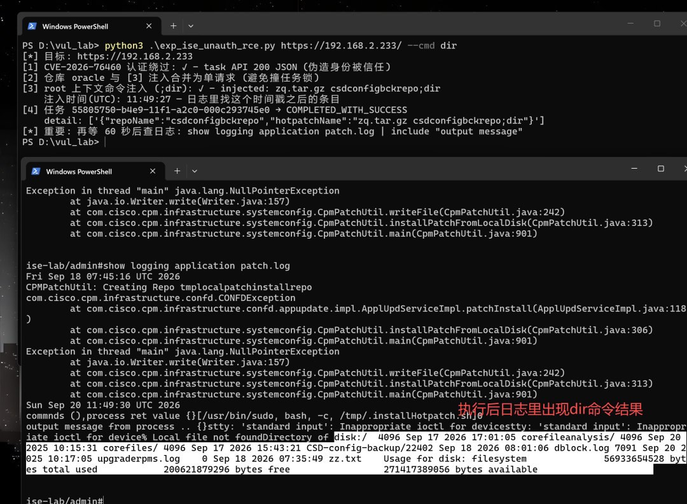

#  【已复现】Cisco ISE 认证绕过漏洞（CVE-2026-76460）  

<!-- article-review:devices:begin -->
## 技术校订与证据边界（2026-10-02）

- 产品/组件：Cisco ISE / ISE-PIC
- 本文讨论：CVE-2026-76460
- 版本、权限与配置前提：无认证身份头信任；实测3.5GA管理权限，root CLI有未公开配置条件；修复分支表完整
- 资料类型：复现结论与通告；本次仅核对归档正文，未执行 PoC、未请求目标，未把原作者的“复现成功”继承为本库验证结果

### 逐项校订

- 无请求/响应，截图依赖，不能当可复现PoC
- 把完整root形态推断为组合利用已标合理推断，应保留与实测事实区别
- 凡受影响版本都获得相同管理权限的表述超出单一3.5GA实测；3.1及更早表行与3.0终止维护注释需规范

### 操作风险与恢复

- 本篇未提供足以确认无副作用的完整验证流程；应依正文所述配置、权限与交互前提评估，不能把通告或截图当成可直接运行的检测脚本

### 待核与来源

- KEV日期、各版本行为及完整RCE链待核验
- 引用图片未查看，截图内容及有效性待核验
- 文内原始链接和图片引用继续保留；未检查图片像素、未下载或执行外部附件。版本边界、修复/在野状态及厂商归属若缺一手依据，均不能视为本次已确认
- 下方保留原技术正文与载荷；其中历史时间表述和成功主张应按本节限定阅读
<!-- article-review:devices:end -->

源影网安
                    源影网安  源影安全团队   2026-09-20 12:08  
  
Cisco Identity Services Engine（简称 ISE）是思科推出的企业级身份认证与访问控制平台，部署在组织的网络准入（NAC）核心位置，负责对员工、访客和设备进行身份认证、权限下发与策略执行，并与交换机、无线控制器联动实现动态隔离。作为整个网络的"身份检查站"，几乎所有终端的接入凭据、设备指纹和访问策略都经过它——一旦被攻陷，攻击者等于拿到了整张网络的通行证签发权，这正是它成为高价值攻击目标的原因。  
  
CVE-2026-76460 是影响该产品的最高危漏洞，CVSS 3.1 评分   
**10.0（满分）**  
，已被 CISA 列入已知被利用漏洞目录（KEV，2026-09-16 收录，修复期限 09-19）。漏洞源于 ISE 的 API 网关（Kong）对部分内部接口未强制执行 JWT 校验，且后端认证组件无条件信任网关转发的身份标识请求头：攻击者只需向受影响接口发送一个携带伪造身份头的请求——不需要任何账号或密码——即可被系统当作管理员，绕过 Web 管理界面的认证。实测确认，攻击者无需任何凭据即可：  
**查看任务详情与已安装补丁信息**  
、  
**导入并替换系统证书**  
（包括管理界面自身使用的证书，可直接替换为攻击者证书）、  
**发起补丁/热补丁的安装与回滚任务**  
等管理操作。  
  
该漏洞源自一起真实的思科 TAC 支持案例，官方公告指出成功利用"可获得 root 权限命令执行"，且  
**不存在任何临时绕过方案**  
，升级是唯一修复手段。  
  
需要说明的是，我们在 3.5 GA 版本上的实测确认：  
**认证绕过本身完全可复现**  
——单个未认证请求即可获得上述管理员级别的接口访问与操作权限；并且通过本漏洞可以进一步触达设备底层的命令执行环境，实测观察到了以 root 权限执行 CLI 命令的效果，  
**但该命令执行是有条件且受限的**  
：其一，触发依赖目标设备上存在特定的配置前提，并非所有环境默认可达成（出于负责任披露考虑，具体前提条件本文不展开）；其二，受目标构建中多层输入校验与命令行解析机制的约束，攻击者无法直接执行任意多参数命令、无法获得交互式 shell，命令输出也不会直接回传给攻击者。因此公告所述"root 权限命令执行"的完整形态，我们实测未在本版本上直接达成，合理推断为攻击者将本漏洞与其他漏洞或攻击手法  
**组合利用**  
的结果。换言之：  
**凡是受影响版本，攻击者拿到的是"未认证管理员"，并可能在满足特定条件时触达受限的 root 命令执行；是否进一步到完整 root，取决于目标版本还带着哪些同批漏洞。**  
  
  
  
## 影响版本与修复矩阵  
  
<table><thead><tr style="box-sizing: border-box;"><th style="box-sizing: border-box;">Cisco ISE Release</th><th style="box-sizing: border-box;">First Fixed Release</th></tr></thead><tbody><tr style="box-sizing: border-box;"><td style="box-sizing: border-box;">3.1 及更早</td><td style="box-sizing: border-box;">3.1 Patch 12</td></tr><tr style="box-sizing: border-box;"><td style="box-sizing: border-box;">3.2</td><td style="box-sizing: border-box;">3.2 Patch 11</td></tr><tr style="box-sizing: border-box;"><td style="box-sizing: border-box;">3.3</td><td style="box-sizing: border-box;">3.3 Patch 12</td></tr><tr style="box-sizing: border-box;"><td style="box-sizing: border-box;">3.4</td><td style="box-sizing: border-box;">3.4 Patch 7</td></tr><tr style="box-sizing: border-box;"><td style="box-sizing: border-box;">3.5</td><td style="box-sizing: border-box;">3.5 Patch 4</td></tr></tbody></table>  

注：3.0 及更早版本已停止软件维护，需迁移至受支持版本；ISE-PIC 3.4/3.5 同样受影响。  
  
## 参考  
  
https://sec.cloudapps.cisco.com/security/center/content/CiscoSecurityAdvisory/cisco-sa-ISE-ABP-VNSW7Tn5  
  
  

---

> 来源：gelusus/wxvl（微信公众号漏洞文章自动归档，原文见文首链接）
