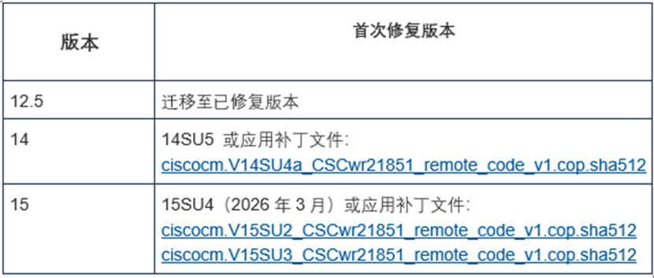
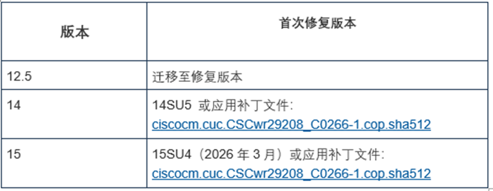

#  思科修复已遭利用的 Unified CM RCE 0day漏洞  

<!-- article-review:devices:begin -->
## 技术校订与证据边界（2026-10-02）

- 产品/组件：Cisco Unified CM/SME/IM&amp;Presence/Unity/Webex Calling Dedicated
- 本文讨论：CVE-2026-20045
- 版本、权限与配置前提：Web管理HTTP请求链先用户级再root；补丁分支在图片
- 资料类型：新闻通告；本次仅核对归档正文，未执行 PoC、未请求目标，未把原作者的“复现成功”继承为本库验证结果

### 逐项校订

- 所有版本表仅图片，文本缺可索引范围和修复号
- 缺Cisco/CISA直接链接；2月11日期限需保持2026历史语境
- 标题未覆盖所有产品，但正文足以多实体索引

### 操作风险与恢复

- 本篇未提供足以确认无副作用的完整验证流程；应依正文所述配置、权限与交互前提评估，不能把通告或截图当成可直接运行的检测脚本

### 待核与来源

- 补丁表、认证前提和KEV状态未核验
- 引用图片未查看，截图内容及有效性待核验
- 文内原始链接和图片引用继续保留；未检查图片像素、未下载或执行外部附件。版本边界、修复/在野状态及厂商归属若缺一手依据，均不能视为本次已确认
- 下方保留原技术正文与载荷；其中历史时间表述和成功主张应按本节限定阅读
<!-- article-review:devices:end -->

Lawrence Abrams
                    Lawrence Abrams  代码卫士   2026-01-23 10:36  
  
  
    
聚焦源代码安全，网罗国内外最新资讯！  
  
**编译：代码卫士**  
  
****  
**思科已修复位于 Unified Communications 和 Webex Calling中一个严重的RCE漏洞CVE-2026-20045。该漏洞已遭利用。**  
  
  
  
  
  
  
  
  
  
  
  
  
  
  
  
  
  
****  
该漏洞影响思科 Unified CM、Unified CM SME、Unified CM IM & Presence、思科 Unity Connection和 Webex Calling Dedicated Instance。  
  
思科在安全公告中提到，“该漏洞是因为对 HTTP 请求中用户提供的输入验证不当造成的。攻击者可将一系列构造的HTTP请求发送到受影响设备基于 web 的管理接口，利用该漏洞。成功利用该漏洞可导致攻击者获得对底层操作系统的用户级访问权限并提权至 root。”  
  
虽然该漏洞的CVSS 评分为8.2，但由于利用该漏洞可获得服务器的根访问权限，思科将其研判为“严重”级别。思科已发布软件更新和修复文件修复该漏洞，涵盖Unified CM、Unified CM SME、Unified CM IM & Presence、思科 Unity Connection和 Webex Calling Dedicated Instance。  
  
  
  
                                             
  
Cisco Unity Connection 发布：  
  
  
  
  
思科表示补丁对应不同的版本，因此在应用补丁前应先查看 README 文件。思科产品安全事件响应团队已证实称该漏洞已遭在野利用，因此督促客户尽快更新至最新软件版本。另外，思科提到不存在缓解该漏洞的应变措施，因此须立即安装更新。  
  
美国网络安全和基础设施安全局 (CISA) 已将该漏洞纳入其必修清单，并督促联邦机构在2026年2月11日前部署更新。本月早些时候，思科还修复了一个已存在利用代码的 ISE 漏洞，以及一个自11月起就遭利用的 AsyncOS 0day漏洞。  
  
  
 开源  
卫士试用地址：  
https://oss.qianxin.com/#/login  
  
  
 代码卫士试用地址：https://sast.qianxin.com/#/login  
  
  
  
  
  
  
  
  
  
**推荐阅读**  
  
[思科：速修复已出现 exp 的身份服务引擎漏洞](https://mp.weixin.qq.com/s?__biz=MzI2NTg4OTc5Nw==&mid=2247524828&idx=1&sn=d0696191628f6b13a09be6edecbbec4d&scene=21#wechat_redirect)  
  
  
[思科修复 Contact Center Appliance 中的多个严重漏洞](https://mp.weixin.qq.com/s?__biz=MzI2NTg4OTc5Nw==&mid=2247524343&idx=2&sn=54f09a81eb6da8e9b06f5a17b8b70644&scene=21#wechat_redirect)  
  
  
[速修复！思科ASA 两个0day漏洞已遭利用，列入 CISA KEV 清单](https://mp.weixin.qq.com/s?__biz=MzI2NTg4OTc5Nw==&mid=2247524078&idx=1&sn=a668c49a8bfda90e1da60201307dc79b&scene=21#wechat_redirect)  
  
  
[思科修复影响路由器和交换机的 0day 漏洞](https://mp.weixin.qq.com/s?__biz=MzI2NTg4OTc5Nw==&mid=2247524071&idx=1&sn=31248d9d535baaa71b2ec67ceef617e8&scene=21#wechat_redirect)  
  
  
[思科 Nexus 交换机中存在高危DoS 漏洞](https://mp.weixin.qq.com/s?__biz=MzI2NTg4OTc5Nw==&mid=2247523927&idx=1&sn=f6c3c875a12b2af4c8e6c00c06bc60d9&scene=21#wechat_redirect)  
  
  
  
  
  
**原文链接**  
  
https://www.bleepingcomputer.com/news/security/cisco-fixes-unified-communications-rce-zero-day-exploited-in-attacks/  
  
  
题图：Pixa  
bay Licens  
e  
  
  
**本文由奇安信编译，不代表奇安信观点。转载请注明“转自奇安信代码卫士 https://codesafe.qianxin.com”。**  
  
  
  
  
  
  
  
  
**奇安信代码卫士 (codesafe)**  
  
国内首个专注于软件开发安全的产品线。  
  
     
  
   
觉得不错，就点个 “  
在看  
” 或 "  
赞  
” 吧~  
  

---

> 来源：gelusus/wxvl（微信公众号漏洞文章自动归档，原文见文首链接）
