## 2026-10-03 缺失内容恢复

本轮已按公开原文逐段恢复原有 23 处空代码块中的 16 处，仍有 7 处无法确认原文对应内容。恢复只填入已有空围栏，原有正文、解释、代码和公开测试值均保留；原归档已经存在的占位符不猜补。下文早期校订中关于代码缺失的描述属于恢复前状态，本次逐块处理结果见仓库审计清单 docs/reviews/20261003-empty-block-dispositions.json。本库未执行这些代码，也未据恢复内容将文章标记为已复现。

#  CVE-2018-17066复现（D-Link命令注入漏洞）   

<!-- article-review:devices:begin -->
## 技术校订与证据边界（2026-10-02）

- 产品/组件：D-Link DIR-816
- 本文讨论：CVE-2018-17066
- 版本、权限与配置前提：未标固件版本；本地patch鉴权/网络环境后测试日期设置注入
- 资料类型：固件仿真教程/复现；本次仅核对归档正文，未执行 PoC、未请求目标，未把原作者的“复现成功”继承为本库验证结果

### 逐项校订

- 大量关键命令/代码块为空，仿真、补丁、HTTP请求均靠图片，无法完整文本复现
- 把-M递归和-e提取含义颠倒
- 本地改strcmp与空NVRAM密码是实验处理，不证明真实设备认证绕过
- 不理解MIPS延迟槽不宜表述为fopen后才传参或混淆证据

### 操作风险与恢复

- 本篇未提供足以确认无副作用的完整验证流程；应依正文所述配置、权限与交互前提评估，不能把通告或截图当成可直接运行的检测脚本

### 待核与来源

- 测试固件/原始未patch设备鉴权、截图及空代码待补
- 引用图片未查看，截图内容及有效性待核验
- 文内原始链接和图片引用继续保留；未检查图片像素、未下载或执行外部附件。版本边界、修复/在野状态及厂商归属若缺一手依据，均不能视为本次已确认
- 下方保留原技术正文与载荷；其中历史时间表述和成功主张应按本节限定阅读
<!-- article-review:devices:end -->

Loserme  看雪学苑   2024-06-08 17:59  
  
CVE-2018-17066漏洞概述：  
在该路由的前端页面中存在时间设置页面，但是我们手动输入的时间并没有被过滤，就会直接将数据传输到后端处理，经过一段函数调用后会将参数传入system作为参数从而实现命令注入！  
（任意命令执行）  
  
  
环境准备：kali2023因为自带bp不用安装了！  
  
  
利用链：前端发送post请求将时间数据发送给后端-》websOpenListen监听请求-》收到请求后使用sub_4572A4函数进行时间设置-》由于未进行任何过滤导致doSystem("date -s \"%s\"", Var);  
会直接将传入的参数作为system的参数-》从而实现命令注入！  
  
  
  

  
  
  
固件下载地址：  
D-Link Technical Support (dlink.com.cn)  
  
（http://www.dlink.com.cn/techsupport/ProductInfo.aspx?m=DIR-816）  
  
  
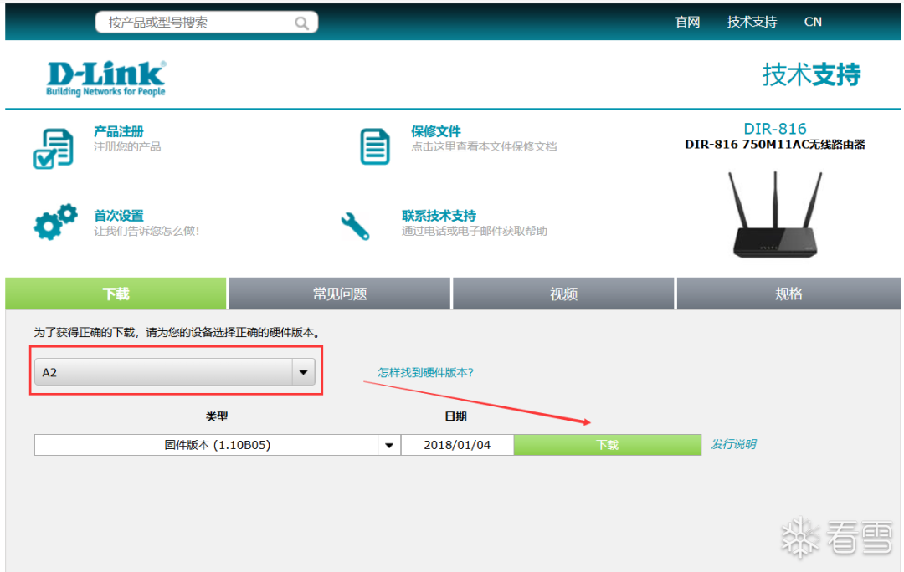  
  
  
下载后就可以检查一下文件的属性了：  
  
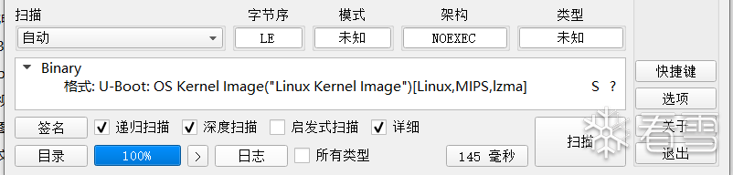  
  
  
文件属性:U-Boot: OS Kernel Image("Linux Kernel Image")[Linux,MIPS,lzma]  
  
  
直接到Ubuntu里面提取一下固件文件：  
  
  

```
~/Pwn_CVE/CVE-2018-17066$ binwalk -Me DIR-816.img
DECIMAL       HEXADECIMAL     DESCRIPTION
--------------------------------------------------------------------------------
4280396       0x41504C        Linux kernel version 2.6.36
4280496       0x4150B0        CRC32 polynomial table, little endian
4327552       0x420880        CRC32 polynomial table, little endian
4348800       0x425B80        SHA256 hash constants, little endian
4350160       0x4260D0        AES Inverse S-Box
4350928       0x4263D0        AES S-Box
4642928       0x46D870        xz compressed data
4675640       0x475838        Unix path: /var/run/goahead.pid
4764032       0x48B180        Unix path: /etc/Wireless/RT2860AP/RT2860AP.dat
4789596       0x49155C        XML document, version: "1.0"
4819148       0x4988CC        HTML document header
4819285       0x498955        HTML document footer
4839035       0x49D67B        Neighborly text, "neighbor %.2x%.2x.%pM lostd_delay_timer"
5018336       0x4C92E0        CRC32 polynomial table, little endian
5021872       0x4CA0B0        AES S-Box
```  
  
  
·binwalk 是一种常用于数字取证和二进制分析的工具。你提供的命令 binwalk -Me DIR-816.img 是用来执行 binwalk 的特定操作的。下面解释一下命令中每个部分的含义：  
  
  
◆binwalk：这是命令本身，表示你想要使用 binwalk 工具。  
  
◆-Me：这些是修改 binwalk 行为的选项或标志。具体来说，-M 告诉 binwalk 在发现文件时自动提取它们，-e 告诉它递归地从其他文件中提取文件。  
  
◆DIR-816.img ：这是你想要 binwalk 分析并从中提取文件的文件或目录的名称。  
  
  
提取出来的文件：  
  
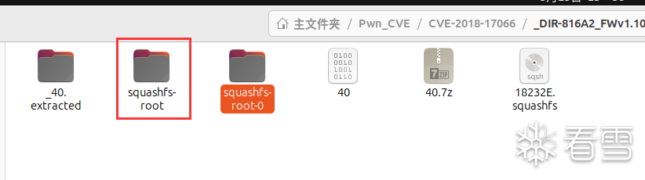  
  
  
SquashFS 是一套基于Linux内核使用的压缩只读文件系统。该文件系统能够压缩系统内的文档,inode以及目录，文件最大支持2^64字节，简介：  
squashfs介绍和安装_unsquashfs-CSDN博客（https://blog.csdn.net/mayue_web/article/details/105682004）  
  
squashfs-root就是我们需要找到的根目录！  
  
  
  

  
  
  
我们主要分析的是goahead：  
  
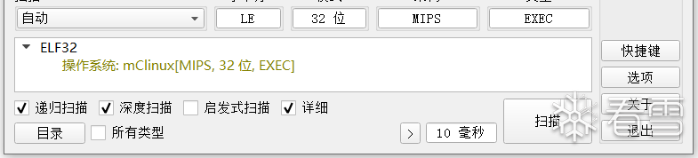  
  
  
查看一下goahead的属性和链接：  
  
  

```
brinmon@brinmon-virtual-machine:
~/Pwn_CVE/CVE-2018-17066/_DIR-816.img.extracted/squashfs-root$ file ./bin/goahead
./bin/goahead: ELF 32-bit LSB executable, MIPS, MIPS-II version 1 (SYSV), dynamically linked, interpreter /lib/ld-uClibc.so.0, stripped
```  
  
  
  
两种启动方法：  
  
  

```
1. **动态版本 (`qemu-mipsel`)**：适合在有所有必要共享库的系统上使用，可以节省磁盘空间。
注：通过-L设置根目录
sudo qemu-mipsel -L ./ ./bin/goahead

2.- **静态版本 (`qemu-mipsel-static`)**：由于不依赖外部库，它更便于分发和在各种环境中运行。
注：chroot . 设置根目录
cp $(which qemu-mipsel-static) ./
sudo chroot . ./qemu-mipsel-static ./bin/goahead
```  
  
##   
## goahead.pid未找到报错  
  
  
运行后发现报错！  
  
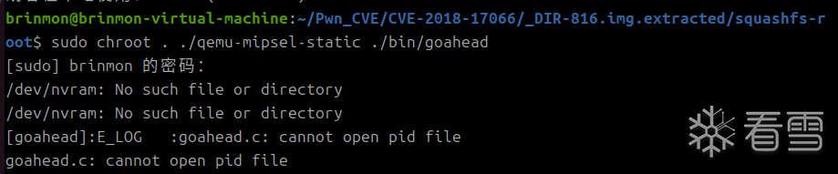  
  
  
在ida找到该字符串：  
  
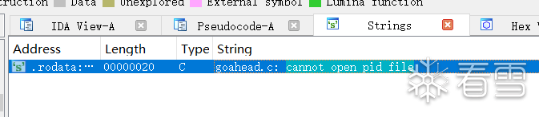  
  
  
分析该文件的报错原因是因为没有"/var/run/goahead.pid"  
  
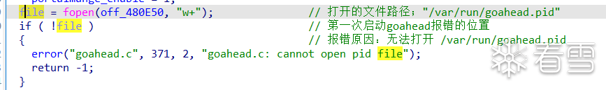  
  
  
解决方案手动创建一个：  
  
  

```
注：删除文件夹：rm -rf ./var/run

mkdir ./var/run
touch ./var/run/goahead.pid
```  
  
##   
## var/run/nvramd.pid未找到报错  
  
  
完成第一个报错修复后重新仿真程序，程序继续执行时出现错误："waiting for nvram_daemon"，如下图所示。  
  
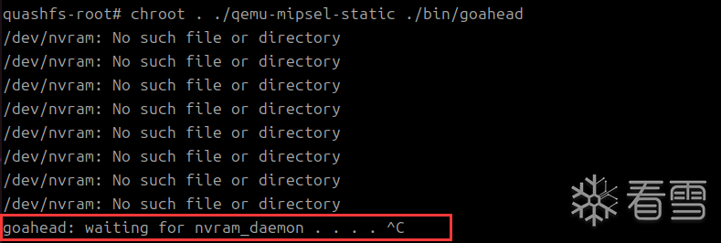  
  
  
根据ida继续找到字符串，发现不可以使用交叉引用，大概率是因为进行了混淆！  
  
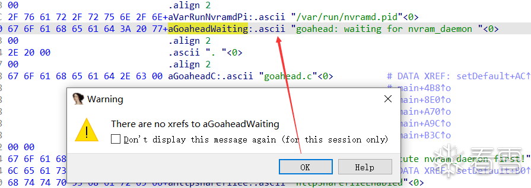  
  
  
根据下面的字符串"goahead.c"的交叉引用找到了目标位置！还可以通过动态调试来定位！  
  
分析发现原因,这两个字符串是通过偏移来定位的，还发现个问题这里的fopen的第二个参数是再调用fopen后才传入的不理解：  
  
  

```
li      $s3, dword_480000                # 定位字符串的基址1
li      $s2, aEttimeoutDocum             # 定位字符串的基址2
...
loc_45C72C:                              # CODE XREF: setDefault+98↓j
la      $t9, fopen                       # 传入要调用的函数fopen地址
addiu   $a0, $s3, -0x3124                # 定位字符串"/var/run/nvramd.pid"
jalr    $t9 ; fopen                      # 调用fopen函数
addiu   $a1, $s2, 0x4CDC                 # 根据偏移发现地址474CDC，是一个单词的字母"r"
```  
  
  
  
这里就算IDA的伪代码了！  
  
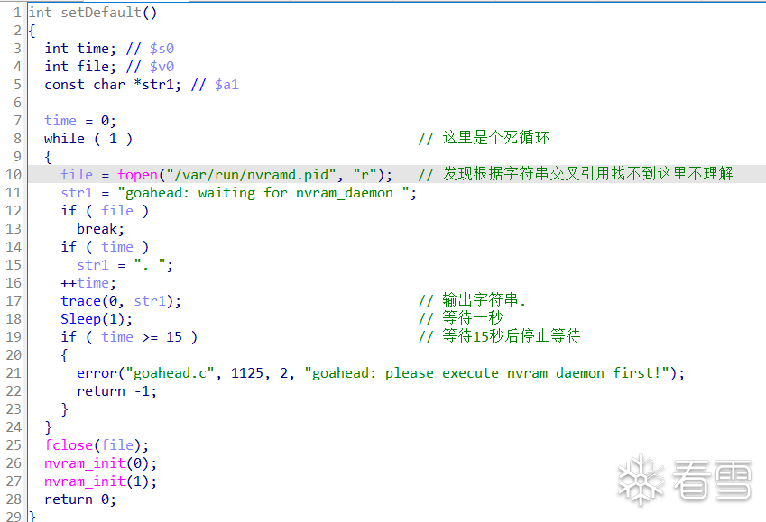  
  
  
解决方案继续手动创建文件。  
  

```
touch ./var/run/nvramd.pid
```  
  
##   
## 缺少二进制ip数据报错  
  
  
继续运行发现有很多东西不存在继续创建，再看下最主要的报错是：  
  
initWebs: failed to convert to binary ip data，缺少二进制ip数据。  
  
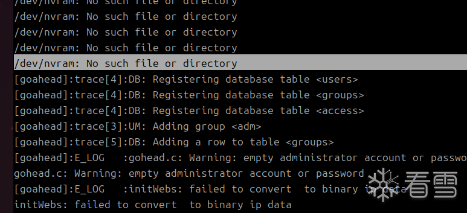  
  
  
根据字符串锁定位置：  
  
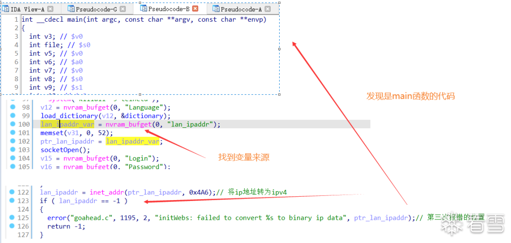  
  
  
报错原因：nvram_bufget函数无法读取lan_ipaddr，而nvram_bufget是从/dev/nvram中读取数据。  
  
  

```
知识的拓展：
在Linux操作系统中，硬件设备也被看做文件来处理，/dev/nvram是非易失性存储器nvram设备_（具体概念在5.3.2章节进行介绍）_。

`/dev/nvram` 提供了一种方便的方式来访问和管理系统的非易失性存储器，可以用于存储系统配置、启动参数和硬件设置等重要信息，是其他硬件用来存储信息的地方
```  
  
  
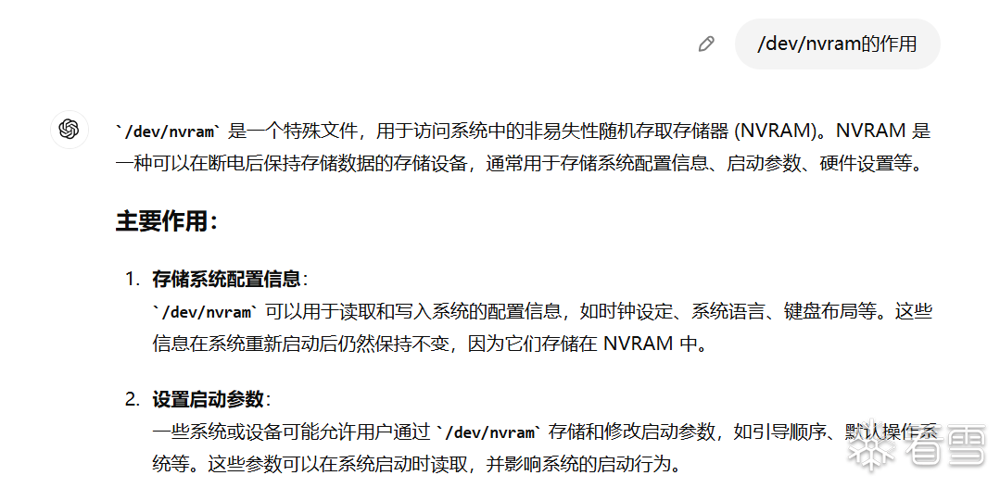  
  
  
这里的解决方案：  
  
  
1.  
RT-AX55环境搭建 | ioo0s's blog  
  
（https://ioo0s.art/2023/02/20/RT-AX55%E7%8E%AF%E5%A2%83%E6%90%AD%E5%BB%BA/）  
  
  
2.  
pr0v3rbs/FirmAE：面向物联网固件的大规模仿真，用于动态分析 --- pr0v3rbs/FirmAE: Towards Large-Scale Emulation of IoT Firmware for Dynamic Analysis (github.com)  
  
（https://github.com/pr0v3rbs/FirmAE）  
  
  
还有其他解决方案：  
  
1.**解劫持动态链接库**  
  
2.**patch**原程序来实现  
  
### a. 使用LD_PRELOAD方式劫持动态链接库实现nvram设备的模拟（实现失败原因未知）  
  
  
由于报错函数是nvram_bufget所以我们只需要劫持这个函数所在的so文件我们就可以实现正常的ip地址获取了！  
  
FirmAE提供的libnvram库源码：  
FirmAE/sources/libnvram/config.h at master · pr0v3rbs/FirmAE (https://github.com/pr0v3rbs/FirmAE/blob/master/sources/libnvram/config.h)  
  
为了适配环境做一些相应的修改：  
  
  
1.修改config.h的挂载路径  
  
  

```
// Mount point of the base NVRAM implementation.
#define MOUNT_POINT         "/mnt/libnvram/"
// Location of NVRAM override values that are copied into the base NVRAM implementation.
#define OVERRIDE_POINT      "/mnt/libnvram.override/"
```  
  
  
  
2.修改config.h中启动web页面的ip地址  
  
  

```
ENTRY("lan_ipaddr", nvram_set, "192.168.126.130") \
ENTRY("lan_bipaddr", nvram_set, "192.168.126.255") \
```  
  
  
  
接下来成功编译：  
  
  

```
mipsel-linux-gnu-gcc -c -O2 -fPIC -Wall nvram.c -o nvram.o
mipsel-linux-gnu-gcc -shared -nostdlib nvram.o -o libnvram.so
```  
  
  
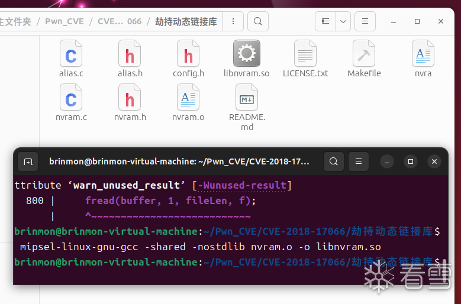  
  
  
经过上面的步骤发现网卡不对，在ubnutu上网卡为ens33，还是切换到kali进行实现步骤如上：  
  
  

```
┌──(root㉿kali)-[/home/…/Pwn_CVE/CVE-2018-17066/_DIR-816A2_FWv1.10CNB05_R1B011D88210.img.extracted/squashfs-root]
└─# chroot . ./qemu-mipsel-static -E LD_PRELOAD="./libnvram.so" ./bin/goahead
```  
  
  
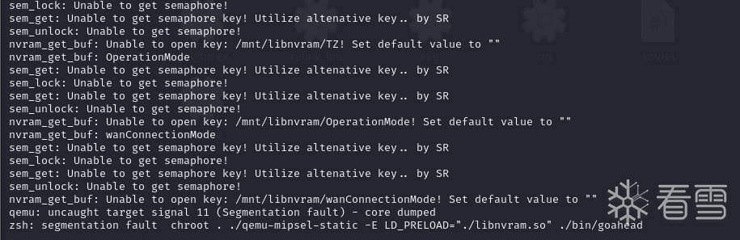  
###   
### b.patch 原程序来实现  
  
  
先ida动态调试一下手动修改值：  
  
  

```
┌──(root㉿kali)-[/home/…/Pwn_CVE/CVE-2018-17066/_DIR-816A2_FWv1.10CNB05_R1B011D88210.img.extracted/squashfs-root]
└─# chroot . ./qemu-mipsel-static -g 23946  ./bin/goahead
```  
  
  
  
IDA动态调试附加上这个端口！  
  
修改地址：0x45CDD4 （将v0的赋值修改为0，就不会报错了）  
  
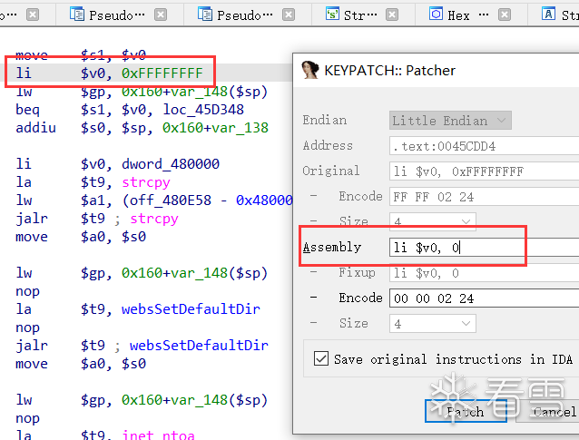  
  
  
成功运行之后就会出现登录页面，在浏览器访问ip地址后：  
  
  

```
http://192.168.126.131/dir_login.asp/
```  
  
  
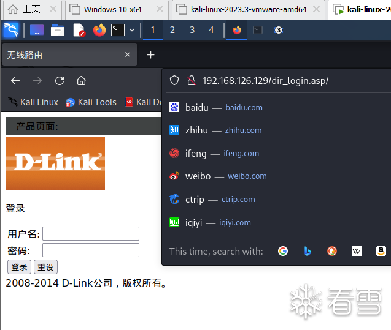  
  
  
成功！  
  
  
  

  
  
  
在这里需要绕过路由的账号和密码！  
  
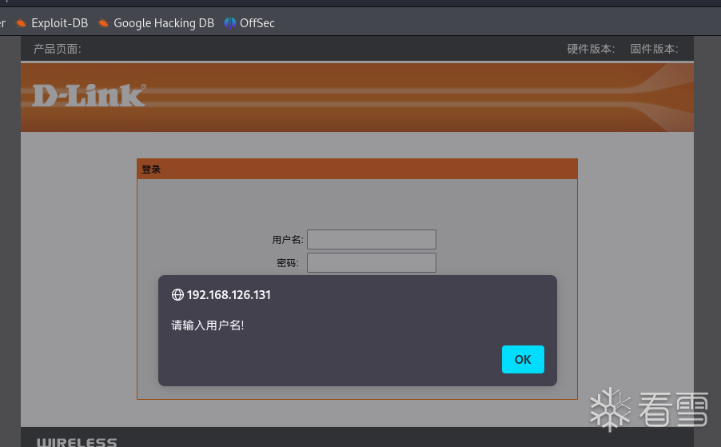  
  
  
有两种方式可以绕过：  
  
## 1.修改前端的asp页面的js代码  
  

```
/home/kali/Pwn_CVE/CVE-2018-17066/_DIR-816A2_FWv1.10CNB05_R1B011D88210.img.extracted/squashfs-root/etc_ro/web/dir_login.asp
```  
  
  
  
找到这个页面并且修改里面的前端检验逻辑，将非空检查这些代码去除：  
  
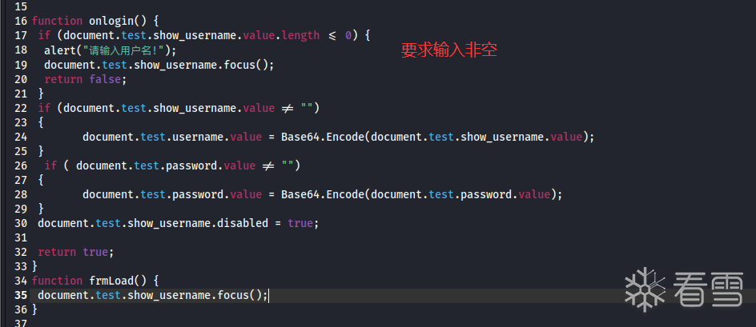  
  

```
function onlogin() {
/*
 if (document.test.show_username.value.length <= 0) {
  alert("请输入用户名!");
  document.test.show_username.focus();
  return false;
 }
 if (document.test.show_username.value != "")
 {
    document.test.username.value = Base64.Encode(document.test.show_username.value);
 }
  if ( document.test.password.value != "")
 {
    document.test.password.value = Base64.Encode(document.test.password.value);
 }
 document.test.show_username.disabled = true;
 */
 return true;
}
```  
  
  
  
这样就可以成功绕过！将账号密码都置空，从而绕过strcmp的对比！  
  
## 2.动态调试修改strcmp的比对结果  
  
  
成功锁定函数：  
  
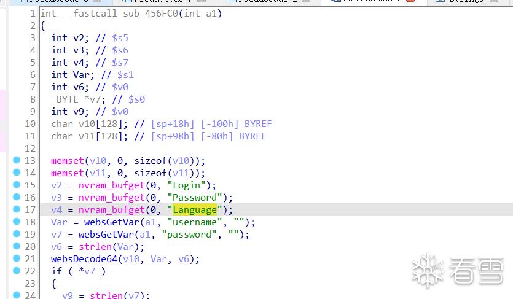  
  
  
在该位置下断点并且修改v0为0。  
  
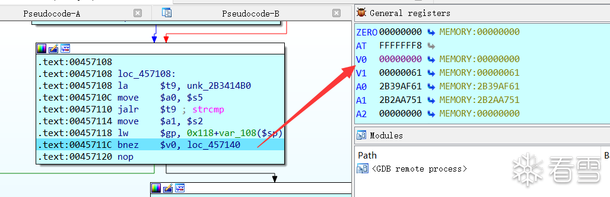  
##   
## 3.登录界面前后端通信原理  
  
  
（1）前端js代码通过submit提交post请求将参数传给后端来处理。  
  
  
（2）后端通过websOpenListen函数持续监听前端发送过来的post请求并进行处理。  
  
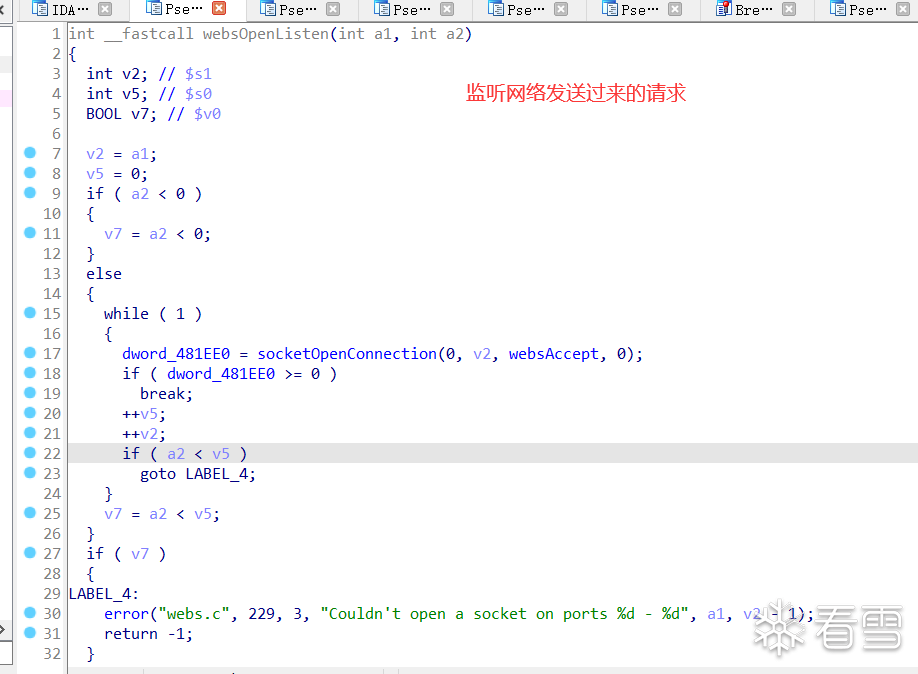  
  
  
（3）成功处理后，后端会发送新的页面信息给前端，实现前端页面跳转！  
  
  
  

  
  
  
成功登入之后就可以访问访问：  
  
  

```
http://192.168.126.131/d_wizard_step1_start.asp
```  
  
  
  
由于kali2023自带bp，所以可以直接使用bp拦截实现命令注入：  
  
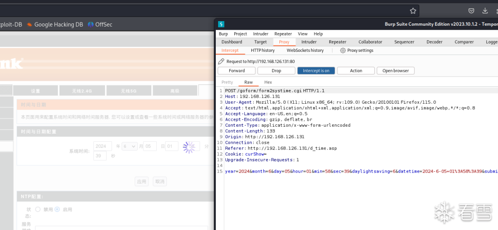  
  
  
将ls  
写入date数据段，实现命令注入成功！  
  
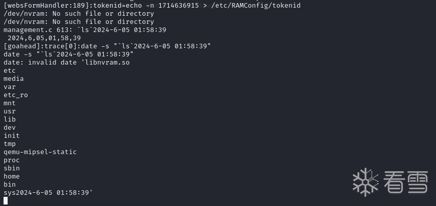  
#   
  
  

  
  
  
通过拼接字符串将ls嵌入命令中实现任意命令执行！  
  
linux知识点：  
  

```
┌──(kali㉿kali)-[~/tools/BurpSuite V2024.3.1.2]
└─$ date -s "`ls`2024-6-05 01:58:39"
date: 无效的日期 "清除许可证和数据.batn使用说明.txtnBurpSuitenCNBurp(无CMD窗口).VBSnCN-JRE Burp.batnENBurp(无CMD窗口).VBSnEN-JRE Burp.batnjrenLinuxnStart.batnStart.VBS2024-6-05 01:58:39"
┌──(kali㉿kali)-[~/tools/BurpSuite V2024.3.1.2]
└─$ "`ls`"
清除许可证和数据.bat
使用说明.txt
BurpSuite
CNBurp(无CMD窗口).VBS
CN-JRE Burp.bat
ENBurp(无CMD窗口).VBS
EN-JRE Burp.bat
jre
Linux
Start.bat
Start.VBS：未找到命令
```  
  
  
  
反引号用于命令替换，即在反引号内的命令会先执行，其输出结果会替换反引号的内容。现代脚本中，推荐使用$()  
形式，因为它更易读且支持嵌套。  
  
  

  
  
  
利用链：  
前端发送post请求将时间数据发送给后端-》websOpenListen监听请求-》收到请求后使用sub_4572A4函数进行时间设置-》由于未进行任何过滤导致doSystem("date -s \"%s\"", Var);  
会直接将传入的参数作为system的参数-》从而实现命令注入！  
  
  
  
  
**借鉴复现笔记：**  
  
  
1.cve-2018-17066复现 | 1uckyc's blog  
  
（https://1uckyc.github.io/2023/11/24/cve-2018-17066%E5%A4%8D%E7%8E%B0/）  
  
  
2.DIR-816 模拟执行与命令注入漏洞分析 - IOTsec-Zone  
  
（https://www.iotsec-zone.com/article/213）  
  
  
3.VulInfo/D-Link/DIR-816/cmd_injection_0/README.md at master · PAGalaxyLab/VulInfo (github.com)  
  
（https://github.com/PAGalaxyLab/VulInfo/blob/master/D-Link/DIR-816/cmd_injection_0/README.md）  
  
  
4.物联网终端安全入门与实践之玩转物联网固件（中） - SecPulse.COM | 安全脉搏  
  
（https://www.secpulse.com/archives/188250.html）  
  
  
5.Debugging D-Link: Emulating firmware and hacking hardware (greynoise.io)  
  
（https://www.greynoise.io/blog/debugging-d-link-emulating-firmware-and-hacking-hardware）  
  
  
  
  
  
  
  
**看雪ID：Loserme**  
  
https://bbs.kanxue.com/user-home-970470.htm  
  
*本文为看雪论坛优秀文章，由 Loserme 原创，转载请注明来自看雪社区  
  
  
[](http://mp.weixin.qq.com/s?__biz=MjM5NTc2MDYxMw==&mid=2458553456&idx=3&sn=11b55ee464d5aecd37fb4c5bc4dab5da&chksm=b18dbcfa86fa35ecef07864a534f85924153d8b32a403a57e2f3f2d5c266ce199c02bbcb9434&scene=21#wechat_redirect)  
  
  
  
**# 往期推荐**  
  
1、[Windows主机入侵检测与防御内核技术深入解析](http://mp.weixin.qq.com/s?__biz=MjM5NTc2MDYxMw==&mid=2458555047&idx=1&sn=b7632036b11bc28f1e89204e8856079d&chksm=b18da22d86fa2b3bdd31bb0aaea1817551ba8b9cc1f10dd36dead922533bcf6d6552b6e09788&scene=21#wechat_redirect)  
  
  
2、[BFS Ekoparty 2022 Linux Kernel Exploitation Challenge](http://mp.weixin.qq.com/s?__biz=MjM5NTc2MDYxMw==&mid=2458554994&idx=1&sn=816559a8984c0ab9a1ab518c41660dcb&chksm=b18da2f886fa2bee97e29087abdc65fe2d4b725c29752b7bbf93f3555222d973c10075127d4b&scene=21#wechat_redirect)  
  
  
3、[银狐样本分析](http://mp.weixin.qq.com/s?__biz=MjM5NTc2MDYxMw==&mid=2458554906&idx=1&sn=271d52cc31bff5aadaba023dd2db8fe3&chksm=b18da29086fa2b861941c8eac1e53923a283cf1994b2814f0b8af5475d7e705df3c9d44c860b&scene=21#wechat_redirect)  
  
  
4、[使用pysqlcipher3操作Windows微信数据库](http://mp.weixin.qq.com/s?__biz=MjM5NTc2MDYxMw==&mid=2458554736&idx=1&sn=5a5cb13286a428dde51b17cfffd83312&chksm=b18da1fa86fa28ec7b7b4637e502485e2d6ed36b15e4a175313a5ee5614cda46a142b12419bd&scene=21#wechat_redirect)  
  
  
5、[XYCTF两道Unity IL2CPP题的出题思路与题解](http://mp.weixin.qq.com/s?__biz=MjM5NTc2MDYxMw==&mid=2458554671&idx=2&sn=5ef35adeb8c4c890e2763e1630c7d20c&chksm=b18da1a586fa28b38f6a6fa1aa064d0c4dbc9d884039aef8510f6c9c53627a4554f155f3c6f9&scene=21#wechat_redirect)  
  
  
  
  
  
  
  
  
**球分享**  
  
  
  
**球点赞**  
  
  
  
**球在看**  
  
  
  
  
  
点击阅读原文查看更多  
  


---

> 来源：gelusus/wxvl（微信公众号漏洞文章自动归档，原文见文首链接）
