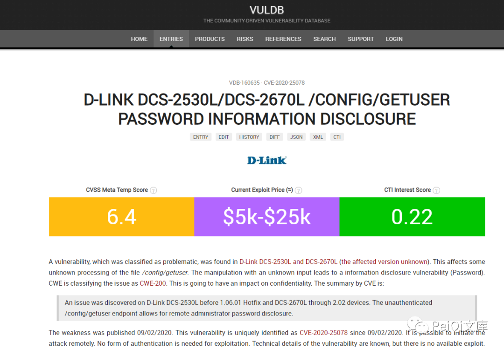
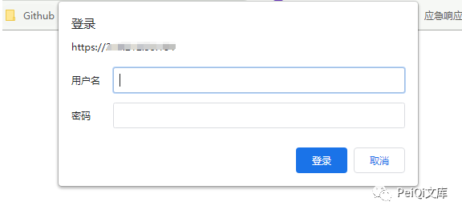
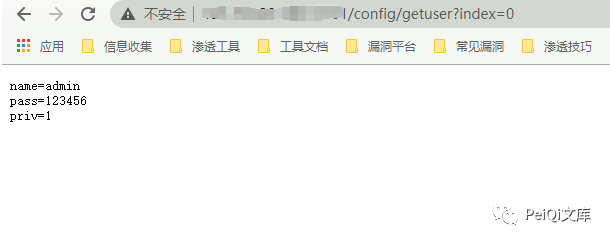
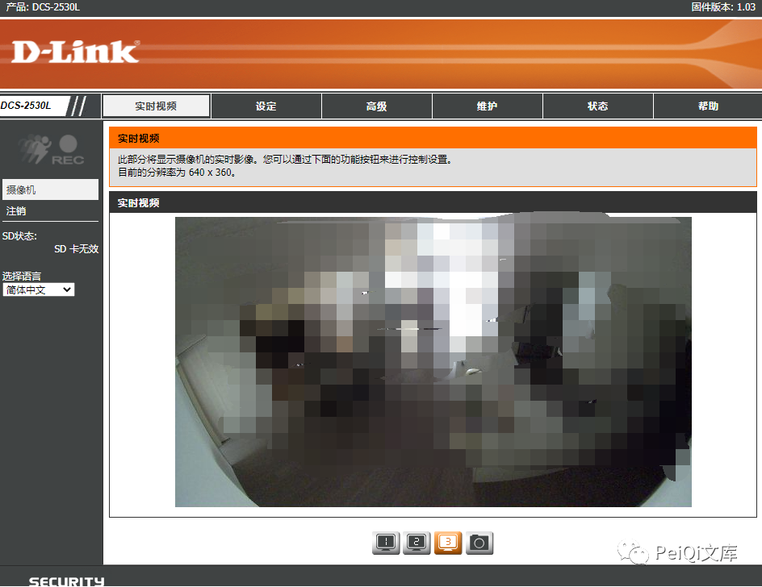
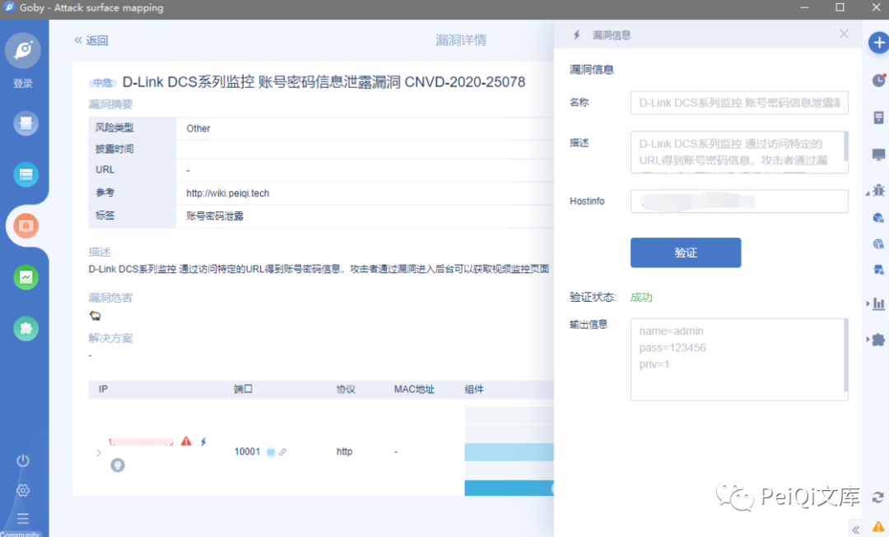
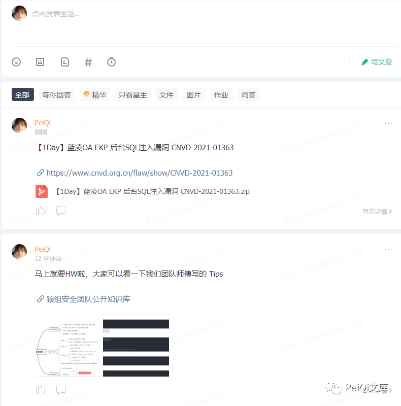

# D-Link DCS 系列监控 账号密码信息泄露漏洞 CVE-2020-25078

<!-- article-review:devices:begin -->
## 技术校订与证据边界（2026-10-02）

- 产品/组件：D-Link DCS摄像机
- 本文讨论：CVE-2020-25078
- 版本、权限与配置前提：DCS2530L/2670L，另声称4603/4622；无固件；未认证config/getuser
- 资料类型：短PoC转载；本次仅核对归档正文，未执行 PoC、未请求目标，未把原作者的“复现成功”继承为本库验证结果

### 逐项校订

- 扩大型号至4603/4622却引文只支持2530L/2670L
- version元数据存型号非版本；摄像头误归网络设备
- 响应字段和成功登录证据仅图片，缺官方修复

### 操作风险与恢复

- 本篇未提供足以确认无副作用的完整验证流程；应依正文所述配置、权限与交互前提评估，不能把通告或截图当成可直接运行的检测脚本

### 待核与来源

- 扩展型号/固件及图片证据待核验
- 引用图片未查看，截图内容及有效性待核验
- 文内原始链接和图片引用继续保留；未检查图片像素、未下载或执行外部附件。版本边界、修复/在野状态及厂商归属若缺一手依据，均不能视为本次已确认
- 下方保留原技术正文与载荷；其中历史时间表述和成功主张应按本节限定阅读
<!-- article-review:devices:end -->


<meta name="referrer" content="no-referrer"/>

> 本文由 [简悦 SimpRead](http://ksria.com/simpread/) 转码， 原文地址 [mp.weixin.qq.com](https://mp.weixin.qq.com/s/b7jyA5sylkDNauQbwZKvBg)


**一****：漏洞描述🐑**

**D-Link DCS 系列监控 通过访问特定的 URL 得到账号密码信息，攻击者通过漏洞进入后台可以获取视频监控页面**

**二:  漏洞影响🐇**

```
DCS-2530L
DCS-2670L
DCS-4603
DCS-4622
等多个DCS系列系统
```

**三:  漏洞复现🐋**

**复现找文章的时候发现，VULDB 半公开了某个漏洞的详情**

**https://vuldb.com/?id.160635**



```
A vulnerability,
which was classified as problematic, 
was found in D-Link DCS-2530L and DCS-2670L (the affected version unknown). 
This affects some unknown processing of the file /config/getuser. 
The manipulation with an unknown input leads to a information disclosure vulnerability (Password). 
CWE is classifying the issue as CWE-200. This is going to have an impact on confidentiality.

简单来说就是访问 http://xxx.xxx.xxx.xxx/config/getuser 造成用户的账号密码泄露
```

```
FOFA： app="D_Link-DCS-2530L"
```

**访问登录页面如下**  



**出现漏洞的 Url 为, 其中泄露了账号密码**

```
http://xxx.xxx.xxx.xxx/config/getuser?index=0
```



**使用泄露的账号密码登陆系统**  



 ****四:  Goby & POC🦉****

```
Goby & POC 已经同步到了 Github Goby & POC 目录中，导入Json文件即可检测
https://github.com/PeiQi0/PeiQi-WIKI-POC
```



 ****五:  关于文库🦉****

**在线文库：**

**http://wiki.peiqi.tech**

**Github：**

**https://github.com/PeiQi0/PeiQi-WIKI-POC**

最后
--

> 下面就是文库的公众号啦，更新的文章都会在第一时间推送在交流群和公众号
> 
> 想要加入交流群的师傅公众号点击交流群加我拉你啦~
> 
> 想要投稿的师傅加我 WX，一起建设文库啦~  
> 
> 别忘了 Github 下载完给个小星星⭐

公众号

**同时知识星球也开放运营啦，希望师傅们支持支持啦🐟**




---

> 来源：MrWQ/vulnerability-paper（https://github.com/MrWQ/vulnerability-paper）
