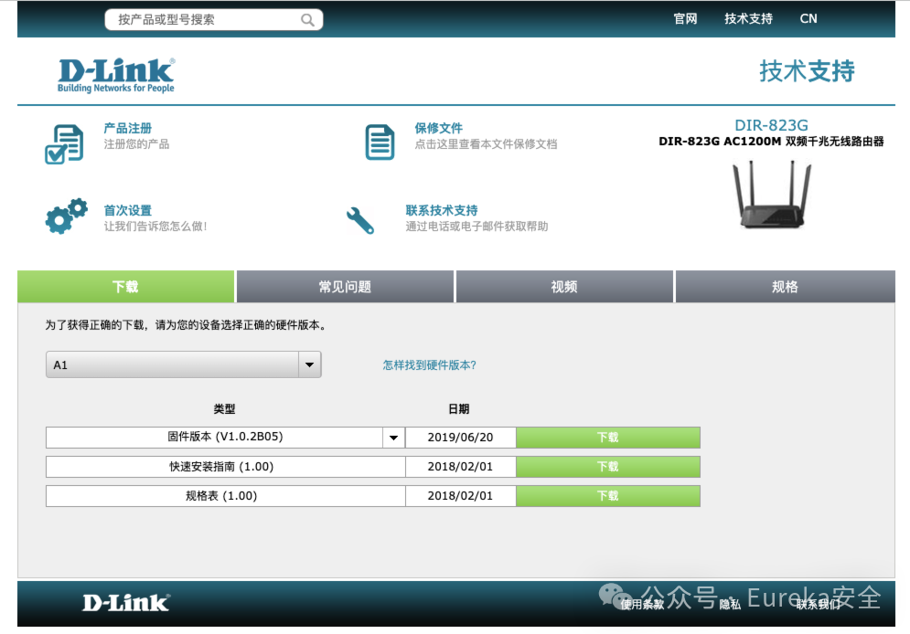

#  「1day」D-Link DIR 823G路由器存在未授权访问漏洞（CVE-2025-2360）   

<!-- article-review:devices:begin -->
## 技术校订与证据边界（2026-10-02）

- 产品/组件：D-Link DIR-823G
- 本文讨论：CVE-2025-2360
- 版本、权限与配置前提：DIR823G_V1.0.2B05_20181207；未授权开关UPnP
- 资料类型：残缺通告；本次仅核对归档正文，未执行 PoC、未请求目标，未把原作者的“复现成功”继承为本库验证结果

本篇作为 needs-review 的历史通告与机制说明保留；现有材料不能确认该设备的漏洞行为或 CVE 映射。

### 逐项校订

- 全文在Exp利用细节标题即结束，实际步骤/请求缺失
- 原文先称可控制 UPnP 开关，随后给出端口映射/内网渗透的一般风险说明；本文没有设备级请求或结果将二者连成已证实利用链。
- 只有产品下载页，无漏洞原始来源/修复说明

### 操作风险与恢复

- 本篇未提供足以确认无副作用的完整验证流程；应依正文所述配置、权限与交互前提评估，不能把通告或截图当成可直接运行的检测脚本

### 待核与来源

- 主漏洞请求、权限边界和危害链待核验
- 固件字符串为原文版本主张；来源 URL、修复信息及 CVE-2025-2360 与该产品的对应关系待核。
- 引用图片未查看，截图内容及有效性待核验
- 文内原始链接和图片引用继续保留；未检查图片像素、未下载或执行外部附件。版本边界、修复/在野状态及厂商归属若缺一手依据，均不能视为本次已确认
- 下方保留原技术正文与载荷；其中历史时间表述和成功主张应按本节限定阅读
<!-- article-review:devices:end -->

原创 zangcc  Eureka安全   2025-03-25 18:23  
  
  
  
  
  
    在2025年3月25日，在Eureka威胁情报平台监测到了一处新的漏洞预警。在发现这一预警后，  
我们的安全研究人员立即展开深入研究，力求全面了解该漏洞的性质、影响范围以及潜在的利用方  
式。  
需要明确的是，此次研究和分享基于技术研究和提升安全意识的目的。我们旨在通过对此漏洞的  
分析，帮助广大安全从业者更好地了解漏洞的成因、存在的风险，以及如何有效进行防范。  
  
    我们在  
此郑重声明，本文的读者应当是出于合法、合规的目的来阅读和使用这些信息。任何未经授权使用  
本文内容对其他系统进行攻击的行为，都与本公众号及作者本人无关。我们强烈谴责任何非法利用  
安全研究的行为，并呼吁所有安全从业者秉持道德和法律准则，共同维护网络安全环境的健康发  
展。  
  
## 0x01 影响版本  
  
受影响的D-Link对应产品的主页为：  
  
https://www.dlink.com.cn/techsupport/ProductInfo.aspx?m=DIR-823G  
  
  
  
完整版本号是：  
  
DIR823G_V1.0.2B05_20181207  
  
  
受影响的是路由器的  
UPnP（Universal Plug and Play，通用即插即用），是一种网络协议，旨在简化家庭网络和公司网络中各种设备之间的连接和通信。  
  
  
攻击者可以随意操控路由器的  
UPnP开启与关闭。为了方便大家理解，UPnP服务的应用场景举例：  
- **智能家居**  
：智能音箱、智能灯泡等设备可以通过UPnP协议互联和通信。  
  
- **多媒体设备**  
：支持UPnP的电视、音频/视频播放器等设备可以共享和播放多媒体内容。  
  
- **网络存储设备**  
：通过UPnP，用户可以方便地访问网络存储设备中的文件。  
  
存在的安全威胁：  
  
虽然UPnP简化了设备之间的连接和通信，但也存在一些安全风险。  
### 1. 内网渗透  
  
攻击者可以通过 UPnP 服务修改路由器的端口转发规则，将内网设备的服务暴露到互联网中。例如，攻击者可以将内网中存在漏洞的服务（如 SMB 服务）暴露出来，进而感染内部主机或进行持续渗透。  
### 2. 绕过安全防护  
  
攻击者可以利用 UPnP 服务的漏洞绕过防火墙等安全防护措施，直接访问内网设备。例如，通过 UPnP 服务的端口映射功能，黑客可以将外部流量直接转发到内网设备，绕过网络边界的安全防护。  
  
  
  
## 0x02 Exp利用细节  
  

---

> 来源：gelusus/wxvl（微信公众号漏洞文章自动归档，原文见文首链接）
