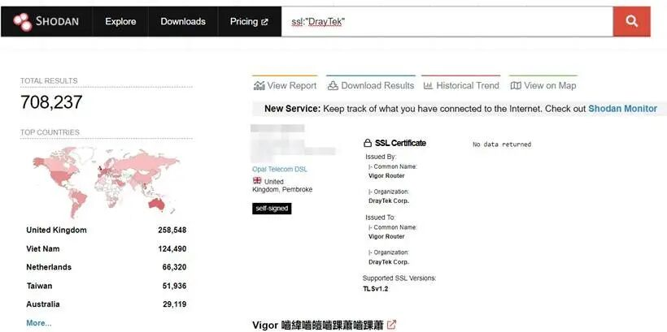

#  DrayTek 路由器爆远程代码执行漏洞   

<!-- article-review:devices:begin -->
## 技术校订与证据边界（2026-10-02）

- 产品/组件：DrayTek Vigor路由器
- 本文讨论：CVE-2022-32548
- 版本、权限与配置前提：未认证wlogin aa/ab溢出；LAN默认可达，WAN需远程Web管理；未列固件
- 资料类型：新闻/技术摘要；本次仅核对归档正文，未执行 PoC、未请求目标，未把原作者的“复现成功”继承为本库验证结果

### 逐项校订

- 零点几攻击明显翻译错误
- 缺多型号影响/修复固件表；20万设备受影响未说明识别与验证方法
- 保留Trellix一手研究链接，但PoC仅视频、未本地验证

### 操作风险与恢复

- 本篇未提供足以确认无副作用的完整验证流程；应依正文所述配置、权限与交互前提评估，不能把通告或截图当成可直接运行的检测脚本

### 待核与来源

- 型号范围、固件及统计待核验
- 引用图片未查看，截图内容及有效性待核验
- 文内原始链接和图片引用继续保留；未检查图片像素、未下载或执行外部附件。版本边界、修复/在野状态及厂商归属若缺一手依据，均不能视为本次已确认
- 下方保留原技术正文与载荷；其中历史时间表述和成功主张应按本节限定阅读
<!-- article-review:devices:end -->

 关键基础设施安全应急响应中心   2022-08-11 15:39  
  
DrayTek 路由器远程代码执行漏洞，CVSS评分10分。  
  
DrayTek是一家位于中国台湾的网络设备制造商，其生产的设备主要包括路由器、交换机、防火墙以及VPN设备等。Trellix Threat实验室研究人员在DrayTek Vigor 3910路由器中发现了一个非认证远程代码执行漏洞，漏洞CVE编号CVE-2022-32548，CVSS评分10分。该漏洞影响多款DrayTek路由器设备。如果设备管理接口被配置为Internet-facing(面向Internet)，那么该漏洞的利用就无需用户交互。此外，还可以在局域网内默认设备配置下进行零点几攻击。攻击可以完全控制设备，以及对内部资源的非授权访问。  
  
DrayTek的设备主要分布在英国、越南等地，如图1所示：  
  
  
  
图1. Shodan搜索得到的DrayTek设备分布情况  
  
**技术细节**  
  
受影响的DrayTek设备的web管理接口受到位于/cgi-bin/wlogin.cgi的登录页面缓存溢出漏洞的影响。攻击者在登录页面的aa和ab域内以base64编码的字符串输入伪造的用户名和密码，由于对编码的字符串的大小验证上存在安全漏洞，因此会触发一个缓存溢出。默认情况下，攻击可以在局域网内进行，也可以在启用了远程web管理的情况下通过互联网发起。  
  
成功发起攻击后可接管实现路由器功能的“DrayOS”。对于运行Linux系统的设备，可以建立设备与本地网络的可靠通信链路。对于运行DrayOS的设备，需要攻击者对DrayOS有进一步理解才可以进行其他操作。  
  
**PoC**  
  
PoC视频中，攻击者成功入侵了 Draytek路由器，并访问了网络中的内部资源。PoC视频参见https://youtu.be/9ZVaj8ETCU8  
  
**漏洞影响**  
  
成功利用该漏洞可以实现以下功能：  
  
泄露保存在路由器上的敏感数据，如密钥、管理员密码等；  
  
访问位于局域网的内部资源；  
  
发起网络流量中间人攻击；  
  
监控从本地局域网到路由器的DNS请求和其他未加密的流量；  
  
抓取经过路由器任意端口的包；  
  
未成功利用漏洞会也可以导致以下结果：  
  
设备重启；  
  
受影响设备的DoS；  
  
其他隐藏行为。  
  
研究人员发现有超过20万设备受到该漏洞的影响。还有大量内部设备受到局域网内部的潜在攻击。  
  
**参考及来源：**  
  
https://www.trellix.com/en-us/about/newsroom/stories/threat-labs/rce-in-dratyek-routers.html  
  
  
  
原文来源  
：嘶吼专业版  
  
“投稿联系方式：孙中豪 010-82992251   sunzhonghao@cert.org.cn”  
  
  

---

> 来源：gelusus/wxvl（微信公众号漏洞文章自动归档，原文见文首链接）
