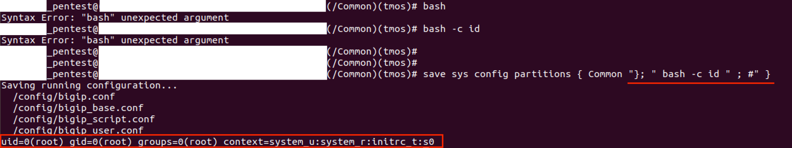

# （CVE-2025-20029）F5 BIG-IP iControl REST/tmsh命令注入漏洞

<!-- article-review:devices:begin -->
## 技术校订与证据边界（2026-10-02）

- 产品/组件：F5 BIG-IP iControl REST/tmsh
- 本文讨论：CVE-2025-20029
- 版本、权限与配置前提：低权限auditor可访问tmsh或REST；Common需有效；三分支修复号给出
- 资料类型：补库原理/PoC；本次仅核对归档正文，未执行 PoC、未请求目标，未把原作者的“复现成功”继承为本库验证结果

### 逐项校订

- 影响范围到15.1.10/16.1.5/17.1.2粗略，须明确维护构建排除
- REST举/mgmt/tm/util/bash却没解释低权限访问与save注入关系，不能把合法bash接口当此洞PoC
- 截图标成功但仅外部材料，未有本库验证环境

### 操作风险与恢复

- 本篇未提供足以确认无副作用的完整验证流程；应依正文所述配置、权限与交互前提评估，不能把通告或截图当成可直接运行的检测脚本

### 待核与来源

- 最低角色、REST路径/负载与精确版本待核验
- 引用图片未查看，截图内容及有效性待核验
- 文内原始链接和图片引用继续保留；未检查图片像素、未下载或执行外部附件。版本边界、修复/在野状态及厂商归属若缺一手依据，均不能视为本次已确认
- 下方保留原技术正文与载荷；其中历史时间表述和成功主张应按本节限定阅读
<!-- article-review:devices:end -->


一、漏洞简介
------------

2025 年 2 月 5 日，F5 发布安全公告，披露 BIG-IP 的 iControl REST 与
TMOS Shell（tmsh）`save` 命令存在命令注入漏洞 CVE-2025-20029。已认证的
攻击者（低权限用户即可）可通过注入 shell 元字符执行任意系统命令，最终
以 root 身份在设备上执行代码。公开 PoC 于 2025 年 2 月 23 日左右发布。

研究者原文（mbadanoiu/CVE-2025-20029）描述："A command injection
vulnerability exists in the F5 'tmsh' restricted CLI which allows an
authenticated attacker to leverage the commands accessible by a low
privilege user in order to bypass restrictions, inject arbitrary commands
and obtain remote code execution as the 'root' user on the target system."

CVSS 3.1 8.8（NVD；F5 官方评级 8.7）。影响 BIG-IP 15.1.0–15.1.10、
16.1.0–16.1.5、17.1.0–17.1.2（各分支修复版分别为 15.1.10.6、16.1.5.2、
17.1.2.1）。

二、漏洞影响
------------

-   产品：F5 BIG-IP（所有模块）
-   版本：**15.1.0–15.1.10、16.1.0–16.1.5、17.1.0–17.1.2**（修复版：
    15.1.10.6 / 16.1.5.2 / 17.1.2.1）
-   组件/攻击向量：iControl REST 接口、tmsh `save sys config` 命令
-   前提条件：需要有效用户凭证（低权限如 auditor 角色即可）；能访问
    iControl REST 或可执行 tmsh 命令



*上图：PoC 利用成功截图——注入命令以 `uid=0(root)` 执行（来源：公开
PoC 配套文档，已本地化保存）。*

三、复现过程
------------

### 漏洞分析

tmsh 的受限 CLI 本不允许低权限用户直接执行 `bash`、`tcpdump` 等危险命
令，但 `save` 命令本身是以 root 身份运行的"合法"命令。tmsh 命令解析器
对引号内特殊字符处理不当，攻击者可在 `save sys config partitions`
的参数中用 `"}; "` 提前终结原命令，再拼接任意命令：

```
save sys config partitions { Common "}; " bash -c id " ; #" }
```

该命令可通过 tmsh 解析器校验，但实际被拆成两条命令执行：

```
save sys config partitions { Common };
bash -c id ;
```

注意：`Common` 必须是有效的 F5 partition，否则命令提前终止、注入部分
不执行；且注入发生在 tmsh 解析器层面，只能执行已知命令（如 bash、
tcpdump、netstat 等）。研究者用 pspy 观察到原始 tmsh 命令被 `};` 分隔
符成功拆成两条独立命令。

### PoC（来源：https://github.com/mbadanoiu/CVE-2025-20029，仅限授权测试）

复现步骤（研究报告原文）：

1.  以低权限用户（如 auditor 角色）经 SSH 连接 F5 设备。该用户不能直
    接执行 `bash` 等危险命令（会报 `Syntax Error: "bash" unexpected
    argument`）。
2.  在 tmsh 提示符下执行：
    ```
    save sys config partitions { Common "}; " bash -c id " ; #" }
    ```
3.  观察到配置保存过程后输出 `uid=0(root) gid=0(root)`，确认以 root 执
    行了注入命令。

同仓库 README 指出，利用还可经 iControl REST 组件发起（`/mgmt/tm/util/bash`
等端点），PoC 细节见仓库内配套 PDF（`F5 - CVE-2025-20029.pdf`）。

四、修复建议
------------

-   升级到修复版本：15.1.10.6、16.1.5.2、17.1.2.1（按所在分支）。
-   限制 iControl REST 管理接口仅可信用户访问；限制 SSH 访问管理接口与
    self IP。
-   审计 tmsh 日志中的异常 `save` 命令与 partition 变更；对低权限账户启
    用多因素认证。

附录/参考链接
------------

-   F5 官方公告：https://my.f5.com/manage/s/article/K000148587
-   PoC 仓库（含完整利用过程 PDF）：https://github.com/mbadanoiu/CVE-2025-20029
-   NVD：https://nvd.nist.gov/vuln/detail/CVE-2025-20029
