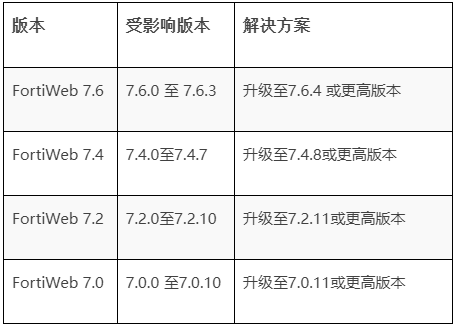

#  Fortinet 修复FortiWeb 中的严重SQL注入漏洞  

<!-- article-review:devices:begin -->
## 技术校订与证据边界（2026-10-02）

- 产品/组件：FortiWeb
- 本文讨论：CVE-2025-25257
- 版本、权限与配置前提：未认证HTTP/S SQL注入；版本表仅图
- 资料类型：新闻通告；本次仅核对归档正文，未执行 PoC、未请求目标，未把原作者的“复现成功”继承为本库验证结果

### 逐项校订

- 无文本版本/修复矩阵和一手公告，仅SecurityOnline链接
- 与112/122同CVE互补，不能把本文概述当RCE完整证据

### 操作风险与恢复

- 本篇未提供足以确认无副作用的完整验证流程；应依正文所述配置、权限与交互前提评估，不能把通告或截图当成可直接运行的检测脚本

### 待核与来源

- 图中版本与9.6评级来源待核验
- 引用图片未查看，截图内容及有效性待核验
- 文内原始链接和图片引用继续保留；未检查图片像素、未下载或执行外部附件。版本边界、修复/在野状态及厂商归属若缺一手依据，均不能视为本次已确认
- 下方保留原技术正文与载荷；其中历史时间表述和成功主张应按本节限定阅读
<!-- article-review:devices:end -->

Ddos  代码卫士   2025-07-09 10:21  
  
  
    
聚焦源代码安全，网罗国内外最新资讯！  
  
**编译：代码卫士**  
  
  
  
**Fortinet 修复位于FortiWeb 产品中的一个严重漏洞CVE-2025-25257。它是一个高危的未认证SQL注入漏洞，远程攻击者仅通过发送一个构造的HTTP或HTTPS请求，就能执行未授权的SQL命令。**  
  
  
FortiWeb 是广泛部署于企业环境中的一款 web 应用防火墙。CVE-2025-25257的CVSS评分为9.6，属于“严重”级别的漏洞，加上无需认证即可遭利用，因此是寻求轻松入侵受保护环境的威胁人员的香饽饽。该漏洞影响多个主要发布线中FortiWeb 的多个版本：  
  
  
  
  
该漏洞可导致攻击者访问敏感数据、修改数据库内容或攻陷后端系统。如组织机构无法立即升级，Fortinet 建议禁用 HTTP/HTTPS 管理接口作为临时缓解措施。然而，禁用GUI接口可能限制可管理型且并非永久性解决方案强烈建议组织机构应用厂商提供的补丁。  
  
  
  
代码卫士试用地址：  
https://codesafe.qianxin.com  
  
开源卫士试用地址：https://oss.qianxin.com  
  
  
  
  
  
  
  
  
  
  
  
  
  
**推荐阅读**  
  
[Fortinet修复已遭利用的严重0day](https://mp.weixin.qq.com/s?__biz=MzI2NTg4OTc5Nw==&mid=2247523008&idx=2&sn=4dc3d8241d26767577bbed984b1b88b2&scene=21#wechat_redirect)  
  
  
[Fortinet：通过符号链接仍可访问已修复的 FortiGate VPN](https://mp.weixin.qq.com/s?__biz=MzI2NTg4OTc5Nw==&mid=2247522719&idx=2&sn=90b7383d8382773b4919bac86f159006&scene=21#wechat_redirect)  
  
  
[Fortinet：注意这个认证绕过0day漏洞可用于劫持防火墙](https://mp.weixin.qq.com/s?__biz=MzI2NTg4OTc5Nw==&mid=2247522078&idx=2&sn=a6a418ea6abb9635205b06203e061801&scene=21#wechat_redirect)  
  
  
[Fortinet：注意FortiWLM漏洞，黑客可获得管理员权限](https://mp.weixin.qq.com/s?__biz=MzI2NTg4OTc5Nw==&mid=2247521859&idx=1&sn=6aade83438190800942638166b046757&scene=21#wechat_redirect)  
  
  
[黑客称窃取 440GB 文件，Fortinet 证实数据遭泄露](https://mp.weixin.qq.com/s?__biz=MzI2NTg4OTc5Nw==&mid=2247520799&idx=2&sn=d02acbabe690ef64658cea5df0e53131&scene=21#wechat_redirect)  
  
  
  
  
  
**原文链接**  
  
https://securityonline.info/fortinet-fixes-critical-sql-injection-flaw-in-fortiweb-cve-2025-25257-cvss-9-6/  
  
  
题图：  
Pixabay Licen  
se  
  
****  
**本文由奇安信编译，不代表奇安信观点。转载请注明“转自奇安信代码卫士 https://codesafe.qianxin.com”。**  
  
  
  
  
  
  
  
  
**奇安信代码卫士 (codesafe)**  
  
国内首个专注于软件开发安全的产品线。  
  
     
  
   
觉得不错，就点个 “  
在看  
” 或 "  
赞  
” 吧~  
  

---

> 来源：gelusus/wxvl（微信公众号漏洞文章自动归档，原文见文首链接）
