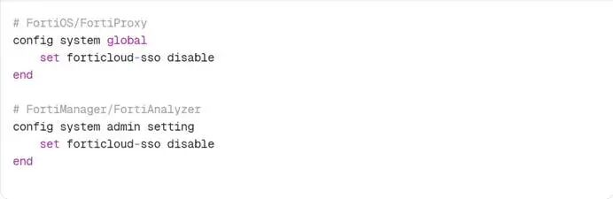

#  Fortinet 多款产品身份认证绕过漏洞风险提示  

<!-- article-review:devices:begin -->
## 技术校订与证据边界（2026-10-02）

- 产品/组件：FortiOS/FortiManager/FortiAnalyzer/FortiProxy FortiCloud SSO
- 本文讨论：CVE-2026-24858
- 版本、权限与配置前提：攻击者合法FortiCloud账号+注册设备，目标启SSO（出厂关但注册可启）；有各分支范围
- 资料类型：风险通告；本次仅核对归档正文，未执行 PoC、未请求目标，未把原作者的“复现成功”继承为本库验证结果

### 逐项校订

- 无任何官方/CISA来源URL，十万设备影响缺依据
- 修复与云服务时间线为1月29快照，不能当当前状态
- GUI/CLI缓解全图化；不能把无目标凭据误写为攻击者无需账户

### 操作风险与恢复

- 本篇未提供足以确认无副作用的完整验证流程；应依正文所述配置、权限与交互前提评估，不能把通告或截图当成可直接运行的检测脚本

### 待核与来源

- 评分来源、云端措施和各产品修复时间待核验
- 引用图片未查看，截图内容及有效性待核验
- 文内原始链接和图片引用继续保留；未检查图片像素、未下载或执行外部附件。版本边界、修复/在野状态及厂商归属若缺一手依据，均不能视为本次已确认
- 下方保留原技术正文与载荷；其中历史时间表述和成功主张应按本节限定阅读
<!-- article-review:devices:end -->

安融技术
                    安融技术  安融技术   2026-01-29 03:38  
  
FortiOS   
是  
Fortinet   
公司推出的下一代防火墙操作系统，提供深度包检测、入侵防御、  
SSL  
解密、零信任网络访问等高级安全功能，广泛应用于企业边界防护。  
FortiManager   
是集中管理平台，用于统一配置和监控多台  
 Fortinet   
安全设备。  
FortiAnalyzer   
则是日志收集与分析系统，支持安全事件关联、合规审计和威胁可视化。  
FortiProxy   
是安全  
 Web   
网关解决方案，提供  
 URL   
过滤、应用控制和恶意软件防护能力。这些产品共同构成  
 Fortinet Security Fabric   
的核心组件。  
  
近期，Fortinet 多款产品身份认证绕过漏洞(CVE-2026-24858)  
在野利用，  
CVSS  
评分高达  
9.8  
分（奇安信）  
/9.4  
分（  
NVD  
），已被  
CISA  
列入《已知被利用漏洞目录》（  
KEV  
）。该漏洞允许攻击者利用合法的  
FortiCloud  
账户，绕过身份验证机制直接登录其他用户注册的设备。  
  
  
  
  
一、漏洞概述  
  
漏洞编号：  
CVE-2026-24858  
  
漏洞类型：  
CWE-288  
（通过替代路径绕过身份认证）  
  
威胁等级：高危  
  
利用状态：已发现在野利用，  
POC  
未公开但  
EXP  
可能性高  
  
影响范围：十万级设备  
  
二、漏洞影响产品  
  
1. FortiOS  
（下一代防火墙操作系统）  
  
7.0  
系列：  
7.0.0 - 7.0.18  
  
7.2  
系列：  
7.2.0 - 7.2.12  
  
7.4  
系列：  
7.4.0 - 7.4.10  
  
7.6  
系列：  
7.6.0 - 7.6.5  
  
2. FortiManager  
（集中管理平台）  
  
7.0  
系列：  
7.0.0 - 7.0.15  
  
7.2  
系列：  
7.2.0 - 7.2.11  
  
7.4  
系列：  
7.4.0 - 7.4.9  
  
7.6  
系列：  
7.6.0 - 7.6.5  
  
3. FortiAnalyzer  
（日志分析与报告系统）  
  
7.0  
系列：  
7.0.0 - 7.0.15  
  
7.2  
系列：  
7.2.0 - 7.2.11  
  
7.4  
系列：  
7.4.0 - 7.4.9  
  
7.6  
系列：  
7.6.0 - 7.6.5  
  
4. FortiProxy  
（安全  
Web  
网关）  
  
7.0/7.2  
系列：所有版本  
  
7.4  
系列：  
7.4.0 - 7.4.12  
  
7.6  
系列：  
7.6.0 - 7.6.4  
  
三、漏洞原理  
  
核心缺陷  
  
漏洞源于  
FortiCloud  
单点登录  
(SSO)  
功能的身份验证逻辑缺陷。当设备启用了  
FortiCloud SSO  
认证时，攻击者可利用自身合法账户及已注册设备，绕过正常认证流程，直接登录其他  
FortiCloud  
账户下注册的设备。  
  
关键利用前提  
  
1.   
必须启用  
FortiCloud SSO  
认证（默认出厂关闭）。  
  
2.   
重要触发场景：管理员通过设备  
GUI  
注册  
FortiCare  
服务时，如未手动禁用  
"Allow administrative login using FortiCloud SSO"  
选项，该功能将自动启用。  
  
攻击后果  
  
获取目标设备完整管理员权限  
  
下载设备配置文件  
  
创建本地管理员账号  
  
修改防火墙规则、启用  
VPN  
  
实现内网深度渗透  
  
四、在野利用  
  
已确认的攻击活动  
  
2026  
年  
1  
月  
20  
日：多名客户报告，即使运行最新版  
FortiOS  
，攻击者仍能入侵  
FortiGate  
防火墙并创建本地管理员账户。  
  
恶意账户：  
Fortinet  
确认两个恶意  
FortiCloud  
账户正在利用此漏洞，已于  
1  
月  
22  
日锁定。  
  
攻击规模：客户最初误以为是  
CVE-2025-59718  
修复不完整，实则为全新漏洞。  
  
Fortinet  
应急响应时间线  
  
1  
月  
22  
日：锁定恶意  
FortiCloud  
账户  
  
1  
月  
26  
日：临时禁用  
FortiCloud SSO  
服务以阻止攻击  
  
1  
月  
27  
日：恢复  
SSO  
服务，但强制阻止易受攻击版本的登录请求  
  
五、修复与缓解方案  
  
1.   
官方修复版本  
  
已发布：  
FortiOS 7.4.11  
（修复  
CVE-2026-24858  
）  
  
待发布：其他  
FortiOS  
、  
FortiManager  
、  
FortiAnalyzer  
修复版本将陆续推出  
  
2.   
临时缓解措施（至关重要）  
  
GUI  
方式（推荐）  
  
  
  
  
CLI  
方式  
  
  
  
  
3. Fortinet  
云端缓解  
  
Fortinet  
已部署云端控制措施：  
FortiCloud SSO  
不再允许运行易受攻击版本的设备登录，强制用户升级至安全版本。  
  

---

> 来源：gelusus/wxvl（微信公众号漏洞文章自动归档，原文见文首链接）
